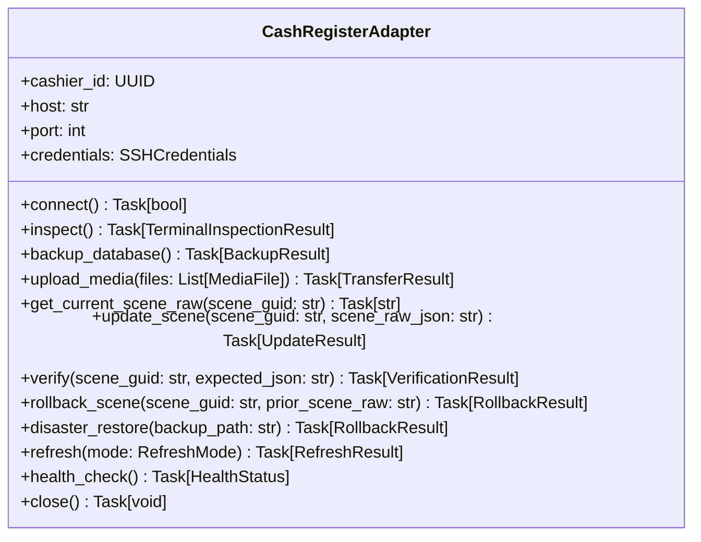

# Contract Specification: CashRegisterAdapter

**Feature**: GS Control Center (`001-gs-control-center`)  
**Scope**: Server-to-Cashier SSH Orchestration Abstraction  
**Content Model**: `Advertising Block` → `Area` → `Display Mode` → `Playlist Items`  
**Status**: Revised Post-Clarification  

---

## 1. Architectural Concept

The `CashRegisterAdapter` is a central server-side Python async abstraction. It represents an on-demand orchestration session with a single Windows POS monoblock over SSH.
- It executes entirely on the central server (`10.0.0.111`).
- It initiates outbound SSH/SFTP sessions to the Windows POS monoblock on demand.
- **NO AGENT RUNS ON THE CASHIER**.



---

## 2. Area to Scene GUID Mapping Contract

The adapter encapsulates all low-level Guest Screen scene GUIDs. Administrators and Web UI operators interact only with **Area** and **Display Mode**:

| Area | Display Mode | Target Mode | Resolved Scene GUID | Target Dimensions | Vue Component / JSON `type` |
| :--- | :--- | :--- | :--- | :--- | :--- |
| **`FULL_SCREEN`** | `STATIC` | `mode1` (Standby) | `2509359c-2d71-4344-9be4-7d90dd453083` | 1024×768 | `type: "image"` (`image-scene`) |
| **`FULL_SCREEN`** | `SLIDESHOW` | `mode1` (Standby) | `2509359c-2d71-4344-9be4-7d90dd453083` | 1024×768 | `type: "gallery"` (`gallery-scene`) |
| **`FULL_SCREEN`** | `VIDEO` | `mode1` (Standby) | `2509359c-2d71-4344-9be4-7d90dd453083` | 1024×768 | `type: "video"` (`video-scene`) |
| **`MODE32_PROMO`** | `STATIC` | `mode32` (Order split) | `68906ed2-49a3-4dc3-bb8a-6fa7943f39c3` | 512×768 | `type: "image"` (`image-scene`) |
| **`MODE32_PROMO`** | `SLIDESHOW` | `mode32` (Order split) | `68906ed2-49a3-4dc3-bb8a-6fa7943f39c3` | 512×768 | `type: "gallery"` (`gallery-scene`) |
| **`MODE32_PROMO`** | `VIDEO` | `mode32` (Order split) | `68906ed2-49a3-4dc3-bb8a-6fa7943f39c3` | 512×768 | `type: "video"` (`video-scene`) |

> **Inviolable Mapping Rules**:
> 1. `FULL_SCREEN` is strictly bound to GUID `2509359c-2d71-4344-9be4-7d90dd453083`.
> 2. `MODE32_PROMO` is strictly bound to GUID `68906ed2-49a3-4dc3-bb8a-6fa7943f39c3`.
> 3. `fad6349b-3aaa-43e2-82c7-ba12abfc1463` is an orphan scene and MUST NEVER be written to (**0 writes**).
> 4. Content switching between `STATIC` and `SLIDESHOW` is achieved dynamically via Vue component switching (`type: "image"` vs `type: "gallery"`), not by changing GUIDs.
> 5. Left-side receipt check scenes (`255dc54c-70ea-465d-8b2c-d9d8b0ad63a4`) and tables `licenses`, `screens`, `settings` are **100% immutable**.

---

## 3. Method Contracts & Protocol Sequence

### 3.1 `inspect()`
Verifies terminal prerequisites before attempting file transfer or database mutation.
- **Commands Executed over SSH**:
  ```powershell
  powershell -NoProfile -ExecutionPolicy Bypass -Command "
    $drive = Get-PSDrive C;
    $gs = Test-Path 'C:\UCS\GuestScreen\gs.db';
    $media = Test-Path 'C:\UCS\GuestScreen\Front\media\uploads';
    $sqlite = Test-Path 'C:\UCS\GuestScreen\sqlite3.exe';
    [PSCustomObject]@{
      FreeSpaceMB = [math]::Round($drive.Free / 1MB);
      GsDbExists = $gs;
      MediaDirExists = $media;
      SqliteExeExists = $sqlite;
    } | ConvertTo-Json -Compress
  "
  ```
- **Error Guards**:
  - `FreeSpaceMB < 200` $\rightarrow$ Return error `INSUFFICIENT_DISK_SPACE`.
  - `GsDbExists == false` $\rightarrow$ Return error `GS_DB_NOT_FOUND`.

---

### 3.2 `backup_database()`
Creates an isolated local timestamped snapshot of `gs.db` prior to any SQL mutation.
- **Target Path**: `C:\UCS\GuestScreen\gs.db.bak_YYYYMMDD_HHMMSS`
- **Commands Executed over SSH**:
  ```powershell
  powershell -NoProfile -ExecutionPolicy Bypass -Command "
    $ts = Get-Date -Format 'yyyyMMdd_HHmmss';
    $bak = \"C:\UCS\GuestScreen\gs.db.bak_$ts\";
    Copy-Item -Path 'C:\UCS\GuestScreen\gs.db' -Destination $bak -Force;
    if (Test-Path $bak) { Write-Output \"OK:$bak\" } else { Write-Output \"FAIL\" }
  "
  ```

---

### 3.3 `get_current_scene_raw(scene_guid)`
**Critical Safety Step for Surgical Rollback**:
Before modifying anything, the adapter reads and preserves the existing JSON string of the scene in working memory:
```powershell
powershell -NoProfile -ExecutionPolicy Bypass -Command "
  & 'C:\UCS\GuestScreen\sqlite3.exe' 'file:///C:/UCS/GuestScreen/gs.db?mode=ro' \"SELECT Raw FROM scenes WHERE Guid = '<GUID>';\"
"
```

---

### 3.4 `upload_media(files)`
Delivers media files using unique SHA-256 hash names to prevent CefSharp browser cache staleness:
- **Remote Destination**: `C:\UCS\GuestScreen\Front\media\uploads\<sha256>.<ext>`
- **Pre-transfer Checksum Verification**: If remote file exists and `Get-FileHash` matches, transfer is skipped (bandwidth optimization).
- **Post-transfer Checksum Verification**: Remote hash is confirmed against central MinIO hash.

---

### 3.5 `update_scene(scene_guid, scene_raw_json)`
Executes surgical SQL `UPDATE` exclusively against the `scenes` table.
- **Absolute Guard**: Under no circumstances shall the adapter query, modify, or touch tables `licenses`, `screens`, or `settings`.
- **Concurrency Parameters (Experimental Hypotheses)**:
  - `PRAGMA busy_timeout = 10000;`
  - `PRAGMA journal_mode = WAL;` (Subject to laboratory verification on `10.0.0.241`).

---

### 3.6 `verify(scene_guid, expected_json)`
Queries back `scenes.Raw` from `gs.db` in read-only mode to confirm exact byte/JSON match.

---

### 3.7 Non-Destructive Rollback Protocol

#### Primary Rollback: `rollback_scene(scene_guid, prior_scene_raw)`
If verification or update fails, the adapter performs a **surgical in-database rollback**:
```powershell
powershell -NoProfile -ExecutionPolicy Bypass -Command "
  $sql = @'
  PRAGMA busy_timeout = 10000;
  UPDATE scenes SET Raw = @RAW@ WHERE Guid = '@GUID@';
  '@ -replace '@RAW@', '<ESCAPED_PRIOR_RAW>' -replace '@GUID@', '<GUID>';
  $sql | & 'C:\UCS\GuestScreen\sqlite3.exe' 'C:\UCS\GuestScreen\gs.db'
"
```
> **Safety Advantage**: Unlike restoring the entire `gs.db` file from `.bak`, surgical rollback **NEVER overwrites r_keeper order checks, fiscal records, or terminal session data** that might have been written to other tables in `gs.db` during the brief update interval.

#### Secondary Rollback: `disaster_restore(backup_path)`
Used **only** in the catastrophic event that `gs.db` suffers fatal file-level corruption (e.g. invalid SQLite header or process crash mid-write). Restores from `gs.db.bak_<timestamp>` and executes `PRAGMA quick_check;`.

---

### 3.8 `refresh(mode)`
- **`HOT_TRIGGER` (Experimental Hypothesis)**: Updates timestamp in `C:\UCS\GuestScreen\Front\sync_version.txt`.
- **`PUBLISHED_AWAITING_RESTART` (Fallback Protocol)**:
  - If hot-update is unconfirmed or fails, the adapter terminates the SSH session without killing any process.
  - The cashier state is recorded in PostgreSQL as `PUBLISHED_AWAITING_RESTART`.
  - The controlled restart is deferred until the central scheduler reaches the branch's off-hours **Maintenance Window**.
- **Prohibition**: Killing `GuestScreen.exe` or `CefSharp.BrowserSubprocess.exe` via `taskkill` during active operating shifts is **STRICTLY FORBIDDEN**.
