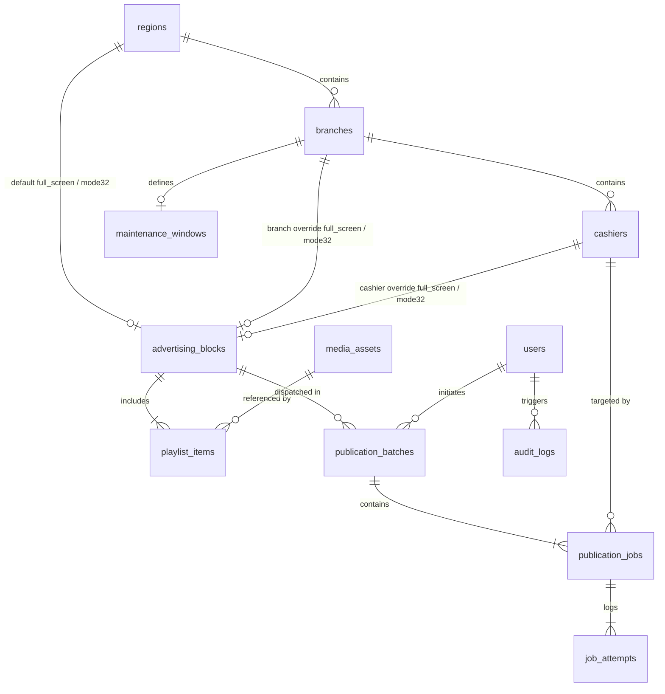

# Phase 1 Data Model: GS Control Center

**Feature**: GS Control Center (`001-gs-control-center`)  
**Database**: PostgreSQL 16 (Central Server `10.0.0.111`)  
**Content Model**: `Advertising Block` → `Area` → `Display Mode` → `Media Items (Playlist)`  
**Status**: Revised Post-Clarification  

---

## 1. Relational Schema Overview



---

## 2. Entity Definitions & DDL Specifications

### 2.1 Topology & Hierarchy

#### `regions`
Geographical groupings of branches (e.g. "Ташкент", "Самаркандская область").
- `id`: `UUID PRIMARY KEY DEFAULT gen_random_uuid()`
- `name`: `VARCHAR(100) NOT NULL UNIQUE`
- `code`: `VARCHAR(50) NOT NULL UNIQUE` (e.g. `TAS`, `SAM`)
- `default_full_screen_block_id`: `UUID REFERENCES advertising_blocks(id) ON DELETE SET NULL`
- `default_mode32_block_id`: `UUID REFERENCES advertising_blocks(id) ON DELETE SET NULL`
- `created_at`: `TIMESTAMPTZ NOT NULL DEFAULT NOW()`
- `updated_at`: `TIMESTAMPTZ NOT NULL DEFAULT NOW()`

#### `branches`
Physical restaurants/locations within a region.
- `id`: `UUID PRIMARY KEY DEFAULT gen_random_uuid()`
- `region_id`: `UUID NOT NULL REFERENCES regions(id) ON DELETE RESTRICT`
- `name`: `VARCHAR(150) NOT NULL`
- `code`: `VARCHAR(50) NOT NULL UNIQUE` (e.g. `NOVZA`, `CHORSU`)
- `override_full_screen_block_id`: `UUID REFERENCES advertising_blocks(id) ON DELETE SET NULL`
- `override_mode32_block_id`: `UUID REFERENCES advertising_blocks(id) ON DELETE SET NULL`
- `address`: `TEXT`
- `created_at`: `TIMESTAMPTZ NOT NULL DEFAULT NOW()`
- `updated_at`: `TIMESTAMPTZ NOT NULL DEFAULT NOW()`
- *Indexes*: `CREATE INDEX idx_branches_region ON branches(region_id);`

#### `cashiers`
Individual POS monoblocks running UCS Guest Screen.
- `id`: `UUID PRIMARY KEY DEFAULT gen_random_uuid()`
- `branch_id`: `UUID NOT NULL REFERENCES branches(id) ON DELETE RESTRICT`
- `name`: `VARCHAR(100) NOT NULL` (e.g. `Касса 1 Novza`)
- `ip_address`: `INET NOT NULL UNIQUE`
- `ssh_port`: `INTEGER NOT NULL DEFAULT 22`
- `ssh_credential_id`: `UUID REFERENCES ssh_credentials(id) ON DELETE SET NULL`
- `ssh_password_encrypted`: `BYTEA` (AES-256-GCM / Fernet encrypted via `cryptography` with master key `GS_MASTER_KEY` from Docker env; NEVER returned in API, exposed strictly as `has_ssh_password: bool`)
- `enabled`: `BOOLEAN NOT NULL DEFAULT TRUE`
- `override_full_screen_block_id`: `UUID REFERENCES advertising_blocks(id) ON DELETE SET NULL`
- `override_mode32_block_id`: `UUID REFERENCES advertising_blocks(id) ON DELETE SET NULL`
- `current_full_screen_block_id`: `UUID REFERENCES advertising_blocks(id) ON DELETE SET NULL`
- `current_mode32_block_id`: `UUID REFERENCES advertising_blocks(id) ON DELETE SET NULL`
- `current_content_version`: `VARCHAR(64)`
- `last_seen_at`: `TIMESTAMPTZ`
- `last_sync_status`: `VARCHAR(30) DEFAULT 'UNKNOWN'` (`SUCCESS`, `PUBLISHED_AWAITING_RESTART`, `FAILED`, `OFFLINE`, `UNKNOWN`)
- `guest_screen_version`: `VARCHAR(20)`
- `created_at`: `TIMESTAMPTZ NOT NULL DEFAULT NOW()`
- `updated_at`: `TIMESTAMPTZ NOT NULL DEFAULT NOW()`
- *Indexes*: 
  - `CREATE INDEX idx_cashiers_branch ON cashiers(branch_id);`
  - `CREATE INDEX idx_cashiers_ip ON cashiers(ip_address);`
  - `CREATE INDEX idx_cashiers_status ON cashiers(last_sync_status);`

#### `maintenance_windows`
Permitted off-hours time intervals for controlled restarts if hot-update is unsupported.
- `id`: `UUID PRIMARY KEY DEFAULT gen_random_uuid()`
- `branch_id`: `UUID UNIQUE REFERENCES branches(id) ON DELETE CASCADE`
- `timezone`: `VARCHAR(50) NOT NULL DEFAULT 'Asia/Tashkent'`
- `start_time`: `TIME NOT NULL` (e.g. `02:00:00`)
- `end_time`: `TIME NOT NULL` (e.g. `05:00:00`)
- `enabled`: `BOOLEAN NOT NULL DEFAULT TRUE`
- `created_at`: `TIMESTAMPTZ NOT NULL DEFAULT NOW()`

---

### 2.2 Security & Credentials

#### `ssh_credentials`
References to SSH authentication material. (Corporate key is passed via environment; per-cashier fallback secrets are stored encrypted with AES-256-GCM).
- `id`: `UUID PRIMARY KEY DEFAULT gen_random_uuid()`
- `name`: `VARCHAR(100) NOT NULL`
- `auth_type`: `VARCHAR(20) NOT NULL` (`CORPORATE_KEY`, `CUSTOM_KEY`, `ENCRYPTED_PASSWORD`)
- `username`: `VARCHAR(100) NOT NULL DEFAULT 'Administrator'`
- `encrypted_secret`: `BYTEA` (AES-256-GCM encrypted payload, nullable)
- `key_fingerprint`: `VARCHAR(100)`
- `created_at`: `TIMESTAMPTZ NOT NULL DEFAULT NOW()`

#### `users` & `roles`
- `id`: `UUID PRIMARY KEY DEFAULT gen_random_uuid()`
- `username`: `VARCHAR(100) NOT NULL UNIQUE`
- `password_hash`: `VARCHAR(255) NOT NULL` (Argon2id or bcrypt)
- `full_name`: `VARCHAR(150)`
- `role`: `VARCHAR(20) NOT NULL` (`ADMINISTRATOR`, `OPERATOR`, `AUDITOR`)
- `is_active`: `BOOLEAN NOT NULL DEFAULT TRUE`
- `created_at`: `TIMESTAMPTZ NOT NULL DEFAULT NOW()`

---

### 2.3 Media & Content Model

#### `media_assets`
Central catalog of files stored in MinIO.
- `id`: `UUID PRIMARY KEY DEFAULT gen_random_uuid()`
- `original_name`: `VARCHAR(255) NOT NULL`
- `stored_name`: `VARCHAR(100) NOT NULL UNIQUE` (`<sha256>.<ext>`)
- `sha256`: `VARCHAR(64) NOT NULL UNIQUE`
- `mime_type`: `VARCHAR(100) NOT NULL`
- `media_type`: `VARCHAR(20) NOT NULL` (`IMAGE`, `VIDEO`)
- `file_size_bytes`: `BIGINT NOT NULL`
- `width`: `INTEGER` (nullable for video without fixed dimensions)
- `height`: `INTEGER`
- `s3_bucket`: `VARCHAR(100) NOT NULL DEFAULT 'media'`
- `s3_key`: `VARCHAR(255) NOT NULL`
- `uploaded_by_user_id`: `UUID REFERENCES users(id)`
- `version`: `INTEGER NOT NULL DEFAULT 1` (Optimistic concurrency control version counter)
- `is_deleted`: `BOOLEAN NOT NULL DEFAULT FALSE` (Soft delete)
- `created_at`: `TIMESTAMPTZ NOT NULL DEFAULT NOW()`
- `updated_at`: `TIMESTAMPTZ NOT NULL DEFAULT NOW()`
- *Indexes*: `CREATE INDEX idx_media_sha256 ON media_assets(sha256);`

#### `advertising_blocks` (Advertising Templates)
Replaces hardcoded packages. Supports arbitrary scaling (1..500+ templates) with full CRUD, 1-click duplication, and decoupled cashier operation.
- `id`: `UUID PRIMARY KEY DEFAULT gen_random_uuid()`
- `name`: `VARCHAR(150) NOT NULL`
- `description`: `TEXT`
- `area`: `VARCHAR(30) NOT NULL` (`FULL_SCREEN`, `MODE32_PROMO`)
- `display_mode`: `VARCHAR(30) NOT NULL` (`STATIC`, `SLIDESHOW`, `VIDEO`)
- `is_active`: `BOOLEAN NOT NULL DEFAULT TRUE`
- `version`: `INTEGER NOT NULL DEFAULT 1` (Optimistic concurrency control version counter)
- `valid_from`: `TIMESTAMPTZ`
- `valid_to`: `TIMESTAMPTZ`
- `created_by_user_id`: `UUID REFERENCES users(id)`
- `created_at`: `TIMESTAMPTZ NOT NULL DEFAULT NOW()`
- `updated_at`: `TIMESTAMPTZ NOT NULL DEFAULT NOW()`

> **Business Model Constraints**:
> - `area = 'FULL_SCREEN'`: Renders in Mode 1 (standby screen, 1024×768). Resolved strictly to GUID `2509359c-2d71-4344-9be4-7d90dd453083`. Supported modes: `STATIC`, `SLIDESHOW`, `VIDEO`.
> - `area = 'MODE32_PROMO'`: Renders in Mode 32 right-hand promotional section (512×768). Resolved strictly to GUID `68906ed2-49a3-4dc3-bb8a-6fa7943f39c3`. Supported modes: `STATIC`, `SLIDESHOW`, `VIDEO`.
> - `display_mode = 'STATIC'`: Conceptually a playlist containing exactly **one** `playlist_items` record (type: `IMAGE`).
> - `display_mode = 'SLIDESHOW'`: Playlist containing $\ge 2$ ordered `playlist_items` records (type: `IMAGE`) with per-item `duration_seconds`.
> - *Rule on Mixed Media*: In V1, a slideshow consists strictly of images. Mixing video and images in a single slideshow is marked `VALIDATION REQUIRED / TBD` pending empirical testing on `10.0.0.241`.
> - *Forbidden GUID*: `fad6349b-3aaa-43e2-82c7-ba12abfc1463` is an orphan scene and MUST NEVER be written to.

#### `playlist_items`
Ordered media items within an Advertising Block.
- `id`: `UUID PRIMARY KEY DEFAULT gen_random_uuid()`
- `advertising_block_id`: `UUID NOT NULL REFERENCES advertising_blocks(id) ON DELETE CASCADE`
- `media_asset_id`: `UUID NOT NULL REFERENCES media_assets(id) ON DELETE RESTRICT`
- `order_index`: `INTEGER NOT NULL DEFAULT 0`
- `duration_seconds`: `INTEGER DEFAULT 7` (display interval in seconds; ignored for STATIC)
- `created_at`: `TIMESTAMPTZ NOT NULL DEFAULT NOW()`
- *Constraints*: `UNIQUE(advertising_block_id, order_index)`
- *Indexes*: `CREATE INDEX idx_playlist_block_order ON playlist_items(advertising_block_id, order_index);`

---

### 2.4 Publication Orchestration & History

#### `publication_batches`
A high-level publication event initiated by an operator.
- `id`: `UUID PRIMARY KEY DEFAULT gen_random_uuid()`
- `advertising_block_id`: `UUID NOT NULL REFERENCES advertising_blocks(id) ON DELETE RESTRICT`
- `content_snapshot_json`: `JSONB NOT NULL` (Immutable snapshot of template metadata, ordered playlist, slide durations, and SHA-256 hashes captured at dispatch time)
- `scope_type`: `VARCHAR(20) NOT NULL` (`REGION`, `BRANCH`, `CUSTOM_CASHIERS`)
- `scope_target_ids`: `JSONB NOT NULL` (Array of targeted UUIDs)
- `status`: `VARCHAR(30) NOT NULL DEFAULT 'PENDING'` (`PENDING`, `RUNNING`, `SUCCESS`, `PARTIAL`, `FAILED`, `CANCELLED`)
- `total_cashiers`: `INTEGER NOT NULL DEFAULT 0`
- `success_count`: `INTEGER NOT NULL DEFAULT 0`
- `awaiting_restart_count`: `INTEGER NOT NULL DEFAULT 0`
- `failed_count`: `INTEGER NOT NULL DEFAULT 0`
- `offline_count`: `INTEGER NOT NULL DEFAULT 0`
- `initiated_by_user_id`: `UUID REFERENCES users(id)`
- `scheduled_at`: `TIMESTAMPTZ`
- `started_at`: `TIMESTAMPTZ`
- `finished_at`: `TIMESTAMPTZ`
- `created_at`: `TIMESTAMPTZ NOT NULL DEFAULT NOW()`

#### `publication_jobs`
One job per targeted cashier monoblock within a publication batch.
- `id`: `UUID PRIMARY KEY DEFAULT gen_random_uuid()`
- `batch_id`: `UUID NOT NULL REFERENCES publication_batches(id) ON DELETE CASCADE`
- `cashier_id`: `UUID NOT NULL REFERENCES cashiers(id) ON DELETE CASCADE`
- `advertising_block_id`: `UUID NOT NULL REFERENCES advertising_blocks(id) ON DELETE RESTRICT`
- `status`: `VARCHAR(30) NOT NULL DEFAULT 'PENDING'` (`PENDING`, `RUNNING`, `SUCCESS`, `PUBLISHED_AWAITING_RESTART`, `FAILED`, `OFFLINE`)
- `idempotency_key`: `VARCHAR(128) NOT NULL`
- `current_attempt`: `INTEGER NOT NULL DEFAULT 0`
- `max_attempts`: `INTEGER NOT NULL DEFAULT 3`
- `started_at`: `TIMESTAMPTZ`
- `finished_at`: `TIMESTAMPTZ`
- `error_message`: `TEXT`
- *Constraints*: `UNIQUE(batch_id, cashier_id)`
- *Indexes*: 
  - `CREATE INDEX idx_jobs_batch ON publication_jobs(batch_id);`
  - `CREATE INDEX idx_jobs_status ON publication_jobs(status);`

#### `job_attempts`
Detailed diagnostic logs and rollback tracking for each execution attempt.
- `id`: `UUID PRIMARY KEY DEFAULT gen_random_uuid()`
- `job_id`: `UUID NOT NULL REFERENCES publication_jobs(id) ON DELETE CASCADE`
- `attempt_number`: `INTEGER NOT NULL`
- `status`: `VARCHAR(30) NOT NULL` (`RUNNING`, `SUCCESS`, `PUBLISHED_AWAITING_RESTART`, `FAILED`, `OFFLINE`)
- `previous_scene_raw`: `TEXT` (Captures the exact prior JSON string from `scenes.Raw` for surgical non-destructive rollback)
- `remote_backup_path`: `VARCHAR(255)` (Path to local `gs.db.bak_timestamp` on cashier for disaster recovery)
- `execution_log`: `TEXT` (Step-by-step diagnostic trace)
- `duration_ms`: `INTEGER`
- `started_at`: `TIMESTAMPTZ NOT NULL DEFAULT NOW()`
- `finished_at`: `TIMESTAMPTZ`

---

### 2.5 Audit Logging

#### `audit_logs`
Immutable append-only audit trail.
- `id`: `BIGSERIAL PRIMARY KEY`
- `user_id`: `UUID REFERENCES users(id)`
- `action`: `VARCHAR(100) NOT NULL` (e.g. `AD_BLOCK_CREATED`, `PUBLICATION_DISPATCHED`, `PLAYLIST_REORDERED`)
- `entity_type`: `VARCHAR(50) NOT NULL` (e.g. `AdvertisingBlock`, `PublicationBatch`, `Cashier`)
- `entity_id`: `VARCHAR(64)`
- `payload_diff`: `JSONB` (Previous vs new state)
- `ip_address`: `INET`
- `timestamp`: `TIMESTAMPTZ NOT NULL DEFAULT NOW()`
- *Indexes*: 
  - `CREATE INDEX idx_audit_timestamp ON audit_logs(timestamp);`
  - `CREATE INDEX idx_audit_user ON audit_logs(user_id);`

---

## 3. Precedence & Inheritance Resolution Algorithm

When the system resolves the active Advertising Block for a Cashier Monoblock $C$ and target Area $A \in \{\text{FULL\_SCREEN}, \text{MODE32\_PROMO}\}$, it executes:

```sql
SELECT 
    CASE :target_area
        WHEN 'FULL_SCREEN' THEN COALESCE(
            c.override_full_screen_block_id,
            b.override_full_screen_block_id,
            r.default_full_screen_block_id
        )
        WHEN 'MODE32_PROMO' THEN COALESCE(
            c.override_mode32_block_id,
            b.override_mode32_block_id,
            r.default_mode32_block_id
        )
    END AS resolved_advertising_block_id
FROM cashiers c
JOIN branches b ON c.branch_id = b.id
JOIN regions r ON b.region_id = r.id
WHERE c.id = :cashier_id AND c.enabled = TRUE;
```

**Ad-Hoc Publication Override**: Direct publication to a designated list of cashiers generates explicit `publication_jobs` that supersede static inheritance for that specific batch without mutating the permanent hierarchy tables.
