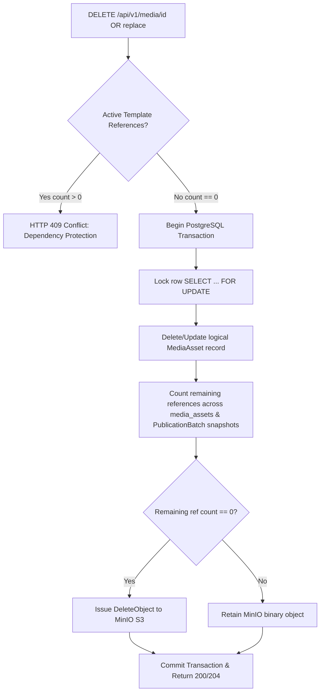

# Phase 0 Research & Technology Decisions: GS Control Center

**Feature**: GS Control Center (`001-gs-control-center`)  
**Date**: 2026-09-04  
**Target Environment**: Dedicated Docker host `10.0.0.111`  
**Content Model**: `Advertising Block` → `Area` → `Display Mode` → `Media Items (Playlist)`  
**Status**: Revised Post-Clarification  

---

## 1. Technology Stack Selection

### 1.1 Backend Runtime & Framework
- **Decision**: **Python 3.12 with FastAPI + AsyncIO + AsyncSSH + SQLAlchemy 2.0 (asyncpg)**.
- **Rationale**:
  1. **Native Async SSH Orchestration**: `asyncssh` provides high-performance, non-blocking asynchronous SSHv2 and SFTP client implementations natively integrated with Python's event loop (`asyncio`). Unlike CLI wrappers (e.g. subprocess `ssh.exe` or `paramiko` threads), `asyncssh` can maintain hundreds of concurrent SSH connections in a single lightweight event loop with $< 100$ MB RAM footprint.
  2. **Data Validation & Typing**: Pydantic v2 ensures strict schema validation for complex Guest Screen scene JSON payloads, r_keeper metadata, and MinIO S3 structures.
  3. **High-Velocity Development**: Rich ecosystem for async PostgreSQL (`asyncpg`), connection pooling, and job scheduling.
- **Alternative Evaluated**:
  - *Go (1.23) with `golang.org/x/crypto/ssh`*: Unmatched binary performance and low memory, but slower iteration for complex UI schema builders and dynamic scene JSON payload templating. Selected as the Tier-2 compiled alternative.

### 1.2 Queue & Worker Architecture
- **Decision**: **Redis 7 (Alpine) + ARQ (AsyncIO Job Queue)**.
- **Rationale**:
  1. **Strict Concurrency & Backpressure**: ARQ runs directly in Python `asyncio`, enabling granular worker pool management (configurable range: 5–30, default: 15), per-job timeouts, and token-bucket rate limiting per branch network.
  2. **Atomic State & Job Deduplication**: Redis provides atomic idempotency locking (`SET NX EX`) to prevent duplicate publications to the same cashier.
  3. **Delayed Scheduling & Jitter**: Native support for exponential backoff retries with full jitter, preventing "thundering herd" connection storms against branch VPN routers.
- **Alternative Evaluated**:
  - *PostgreSQL `FOR UPDATE SKIP LOCKED`*: Simple without Redis, but generates heavy database write churn under frequent heartbeat polling and high-frequency publication status updates across 200+ cashiers.

### 1.3 Web Frontend
- **Decision**: **React 18 + Vite + TypeScript + Tailwind CSS + TanStack Query + Lucide Icons**.
- **Rationale**:
  1. **Operational Dashboard UI**: TanStack Query provides automated background polling and optimistic UI updates for real-time cashier publication progress bars and status badges (`PENDING`, `RUNNING`, `SUCCESS`, `PUBLISHED_AWAITING_RESTART`, `FAILED`, `OFFLINE`).
  2. **Playlist Management**: Easy implementation of drag-and-drop slide reordering, interval sliders, and preview players for both `FULL_SCREEN` and `MODE32_PROMO`.
  3. **Static Assembly**: Bundles into pure static HTML/JS/CSS served directly by the Nginx reverse proxy container with zero Node.js host overhead.
- **Alternative Evaluated**:
  - *Server-Side Rendered (HTMX / Jinja2)*: Fast initial development, but poor user experience for complex multi-slide gallery drag-and-drop ordering, canvas media previews, and live per-cashier publication matrices.

### 1.4 Central Database & Object Storage
- **Decision**: **PostgreSQL 16 (Debian-based Docker image) + MinIO (RELEASE.2024+)**.
- **Rationale**:
  1. **PostgreSQL 16**: Mandatory per Constitution. Robust JSONB support for storing Guest Screen scene templates, audit diffs, and hierarchical override trees.
  2. **MinIO S3-Compatible**: Isolated, containerized binary object storage with persistent volume. Provides S3 API compatibility, SHA-256 content verification, pre-signed upload URLs, and clean separation from application database backups.

### 1.5 Reverse Proxy & Ingress
- **Decision**: **Nginx (Alpine)**.
- **Rationale**: Serves static React frontend assets, proxies `/api/v1/` to FastAPI backend, proxies `/media/` for media previews, enforces client upload size limits (up to 500 MB for video ads), and manages HTTP timeouts.

### 1.6 Security & Secrets Encryption
- **Decision**: **Python `cryptography` package (Fernet / AES-256-GCM authenticated encryption)**.
- **Rationale**:
  1. **Constitution Principle VIII Compliance**: Plaintext storage of sensitive SSH passwords in database columns, logs, or code is strictly prohibited.
  2. **Authenticated Encryption**: Ensures both confidentiality and cryptographic integrity verification, preventing tampering with encrypted credentials in `cashiers.ssh_password_encrypted`.
  3. **Master Key Injection**: The master encryption key (`GS_MASTER_KEY` / `SECRET_KEY`) is injected exclusively via Docker environment variables.
  4. **Zero Plaintext Leakage**: The API never returns decrypted passwords; endpoints return strictly boolean flags (`has_ssh_password: bool`) or masked strings.

---

## 2. Verified Physical Scene Mapping Topology

Empirical testing on live production cashier **`10.0.0.241`** established the verified physical scene mapping for Guest Screen 3.1.1:

```text
+-------------------------------------------------------------------------------+
|                      GUEST SCREEN 3.1.1 DISPLAY REGIONS                       |
+-------------------------------------------------------------------------------+
| Area: FULL_SCREEN (1024x768, 4:3)             | Area: MODE32_PROMO (512x768)  |
| Mode 1: Standby / Idle                        | Mode 32: Order split (Right)  |
| GUID: 2509359c-2d71-4344-9be4-7d90dd453083    | GUID: 68906ed2-49a3-4dc3-... |
|                                               |                               |
| Display Mode STATIC:                          | Display Mode STATIC:          |
|   type: "image" (renders image-scene)         |   type: "image" (image-scene) |
|                                               |                               |
| Display Mode SLIDESHOW:                       | Display Mode SLIDESHOW:       |
|   type: "gallery" (renders gallery-scene)     |   type: "gallery" (gallery)   |
+-----------------------------------------------+-------------------------------+
| INVARIANT: fad6349b-3aaa-43e2-82c7-ba12abfc1463 IS STRICTLY FORBIDDEN (0 WRITES) |
+-------------------------------------------------------------------------------+
```

### 2.1 Scene GUID Resolution Matrix
1. **`FULL_SCREEN` Area**:
   - Mapped strictly and exclusively to GUID `2509359c-2d71-4344-9be4-7d90dd453083`.
   - `STATIC` mode sets `type: "image"`, rendering CefSharp Vue component `image-scene`.
   - `SLIDESHOW` mode sets `type: "gallery"`, rendering CefSharp Vue component `gallery-scene`.
2. **`MODE32_PROMO` Area**:
   - Mapped strictly and exclusively to GUID `68906ed2-49a3-4dc3-bb8a-6fa7943f39c3`.
   - `STATIC` mode sets `type: "image"`, rendering CefSharp Vue component `image-scene`.
   - `SLIDESHOW` mode sets `type: "gallery"`, rendering CefSharp Vue component `gallery-scene`.
3. **Forbidden Scene GUID**:
   - `fad6349b-3aaa-43e2-82c7-ba12abfc1463` is an orphan scene that does NOT bind to any active Vue component in Guest Screen 3.1.1. Writing to this GUID is permanently prohibited.

### 2.2 Mixed Media Slideshows (VALIDATION REQUIRED / TBD)
- In V1, slideshows are strictly homogeneous (images only).
- Support for mixed image/video slideshows is marked **VALIDATION REQUIRED / TBD** until empirical testing on test node `10.0.0.241` determines whether the embedded Chromium renderer handles mixed frames without crashing.

---

## 3. SQLite Concurrency & Two-Tier Rollback Strategy

### 3.1 Known Invariants vs. Laboratory Hypotheses
- **Confirmed Invariants**:
  - SQLite database location: `C:\UCS\GuestScreen\gs.db`.
  - Media directory: `C:\UCS\GuestScreen\Front\media\uploads\`.
  - License data is in `licenses` (MUST NEVER be altered).
  - Screen geometry is in `screens` (MUST NEVER be altered).
  - System settings are in `settings` (MUST NEVER be altered).
- **Laboratory Hypotheses to Validate on 10.0.0.241**:
  - **WAL Mode (`PRAGMA journal_mode = WAL;`)**: Must be tested to ensure concurrent check entry in r_keeper does not cause locks. If risk is detected, fallback to standard journal mode with updates executed during cashier idle pauses.
  - **Busy Timeout (`PRAGMA busy_timeout = 10000;`)**: Must be tested under concurrent write load.
  - **Front-End Reloading (`Front\sync_version.txt`)**: Must be tested to confirm if CefSharp reloads without window blink. If not, the cashier transitions to `PUBLISHED_AWAITING_RESTART`, and controlled restart occurs strictly during off-hours Maintenance Windows.

### 3.2 Two-Tier Rollback Semantics
- **Tier 1 (Surgical Rollback - Primary)**: Prior to `UPDATE scenes`, the adapter captures the existing JSON string of `scenes.Raw` into memory. If verification fails, it executes `UPDATE scenes SET Raw = @PRIOR_RAW@ WHERE Guid = ?`. This preserves all concurrent r_keeper check data, fiscal records, or session states.
- **Tier 2 (Disaster Recovery - Secondary)**: Restoring the full `.bak` file is reserved solely for fatal SQLite database file corruption and requires validation to guarantee no terminal data is lost.

---

## 4. Media Deduplication & S3 Object Reference Counting

### 4.1 Content-Addressed Storage
- Files uploaded to MinIO are keyed strictly by their SHA-256 hash: `media/<sha256>.<ext>`.
- If an identical file is uploaded multiple times, the backend detects the existing hash in `media_assets` and returns the existing asset record without storing duplicate binaries in MinIO.

### 4.2 S3 Physical Reference Counting Protocol


- Deletion of a physical MinIO object is permitted **ONLY IF** the reference count across all `media_assets` and all historical `PublicationBatch.content_snapshot_json` records drops strictly to zero (`COUNT == 0`).
- Transactions are serialized with row-level locks (`SELECT ... FOR UPDATE`) to prevent race conditions during concurrent delete/replace requests.

---

## 5. Optimistic Concurrency Control (OCC) Architecture

To prevent conflicting overwrites when multiple marketing operators edit templates or media simultaneously:
1. `media_assets` and `advertising_blocks` maintain a monotonically increasing integer column `version: int DEFAULT 1`.
2. Mutation requests (`PATCH /api/v1/media/{id}`, `POST /api/v1/media/{id}/replace`, `PUT /api/v1/templates/{id}`, `PATCH /api/v1/templates/{id}`) require the client to supply the expected `version`.
3. The SQL update uses conditional increment:
   ```sql
   UPDATE advertising_blocks
   SET name = :name, ..., version = version + 1, updated_at = NOW()
   WHERE id = :id AND version = :expected_version;
   ```
4. If no rows are affected (`stored_version != expected_version`), the backend aborts and returns `HTTP 409 Conflict` with human-readable error message: `"Объект был изменен другим пользователем. Обновите страницу перед сохранением"`.

---

## 6. Immutable Publication Snapshots & Resilient Retries

### 6.1 Snapshot Isolation
- At publication dispatch, the `PublicationOrchestrator` compiles all template details (playlist items, media asset metadata, slide durations, SHA-256 hashes) into a standalone, immutable JSON document: `PublicationBatch.content_snapshot_json`.
- All asynchronous ARQ workers read **strictly and exclusively** from this snapshot.
- Any subsequent modifications or deletions of templates or media in the CMS do not affect the execution of in-flight or completed publication batches.

### 6.2 Decoupled Cashier Lifecycle
- Editing or deleting a template in the CMS **NEVER** sends tasks to cashiers.
- Cashiers operate autonomously, displaying their last successfully written local `gs.db` content until an explicit new publication batch is dispatched by an operator.
- Deleting a default or override template assignment simply nullifies the reference in PostgreSQL without touching the cashier's hardware screen. Auto-purge and screen-blanking are strictly prohibited.

### 6.3 Batch Status & Retry Failed Only
- If a batch succeeds on 198 cashiers and fails on 2 (e.g. offline/timeout), the batch status transitions to `PARTIAL`.
- Cashiers that achieved `SUCCESS` are **never rolled back**.
- Operators can trigger **"Retry Failed Only"** (`POST /api/v1/publications/{id}/retry-failed`). The system enqueues jobs strictly for `FAILED` or `OFFLINE` cashiers using the exact original immutable snapshot. Successful cashiers are untouched.

---

## 7. Summary of Architecture Decisions

| Component | Selected Technology / Pattern | Rationale | Alternatives Evaluated & Rejected |
| :--- | :--- | :--- | :--- |
| **Backend** | Python 3.12 / FastAPI | Native `asyncssh` event loop integration & Pydantic schema validation | Go / Fiber (slower UI templating) |
| **Frontend** | React 18 / TypeScript / Vite | Rich dashboard ecosystem and tabular publication progress rendering | HTMX (poor multi-slide drag-drop) |
| **Database** | PostgreSQL 16 | Mandatory per Constitution; superior JSONB handling for snapshots | MariaDB / MySQL |
| **Queue** | Redis 7 + ARQ | In-memory atomic locking, low latency, native backpressure & jitter | Postgres SKIP LOCKED (heavy write churn) |
| **Object Store** | MinIO (Docker) | S3 API standardization, automated SHA-256 integrity, isolation | Local filesystem volume |
| **Secrets** | `cryptography` (AES-256-GCM / Fernet) | Authenticated encryption, master key in Docker env, zero plaintext in API | Plaintext DB columns (Violates Principle VIII) |
| **Scene Mapping** | `FULL_SCREEN` $\rightarrow$ `2509359c...`<br>`MODE32_PROMO` $\rightarrow$ `68906ed2...` | Verified on live cashier `10.0.0.241`. Dynamic Vue component switching via `type: "image"` vs `type: "gallery"`. | Using `fad6349b...` (Orphan scene, broken) |
| **Batch Delivery**| Immutable JSON Snapshot (`content_snapshot_json`) | Guaranteed worker isolation; template edits in CMS cannot break in-flight runs | Live foreign key queries during worker execution |

