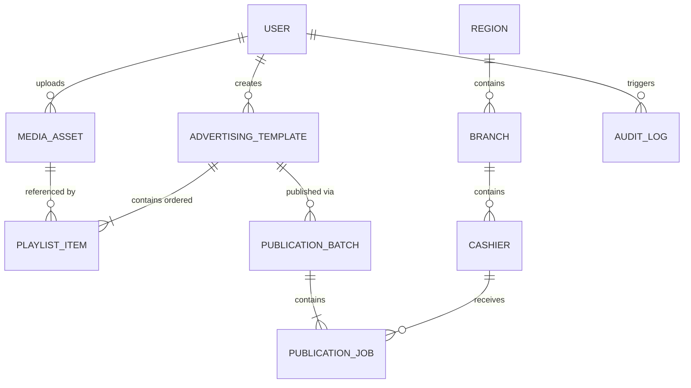

# Feature Specification: GS Control Center — Centralized Media Library & Advertising Template CMS for UCS Guest Screen

**Feature Identifier**: `001-gs-control-center`  
**Iteration**: 2.0 (Full CMS Architecture for Media Library & Dynamic Advertising Templates)  
**Created**: 2026-09-04  
**Last Amended**: 2026-09-04  
**Status**: Specified (Awaiting Clarify & Planning)  
**Target Host**: Dedicated On-Premise Host `10.0.0.111` (100% Docker / Docker Compose)  
**Central Database**: PostgreSQL 16 (Authoritative Entity Store)  
**Object Storage**: MinIO S3 (Centralized Media Binary Storage)  
**Fleet Target**: 200+ Windows POS Monoblocks running UCS Guest Screen (Dedicated Test Cashier: `10.0.0.241`)  

---

## 1. Problem Statement & Evolution

In Fast-Food restaurant networks operating UCS/r_keeper POS systems, customer-facing secondary monitors powered by UCS Guest Screen (`GuestScreen.exe`, CefSharp Chromium, local SQLite `C:\UCS\GuestScreen\gs.db`) are critical marketing channels. 

The initial iteration of GS Control Center successfully solved the low-level infrastructure challenges:
1. Delivered an **agentless SSH push engine** requiring zero background services or daemons on POS registers.
2. Guaranteed **absolute safety of hardware licenses** (`licenses` table) and multi-display geometry (`screens` table), strictly rejecting full `gs.db` replication.
3. Empirically resolved and verified physical **Scene Mapping** on live cashier `10.0.0.241`:
   - `FULL_SCREEN` area mapped strictly to GUID `2509359c-2d71-4344-9be4-7d90dd453083`.
   - `MODE32_PROMO` area mapped strictly to GUID `68906ed2-49a3-4dc3-bb8a-6fa7943f39c3`.
   - Dynamic Vue component switching in CefSharp (`gallery-scene` vs `image-scene`) via `scene.type`.

**The Business Problem in Iteration 2.0:**  
While backend delivery is established, marketing managers and content operators cannot efficiently operate without a full-featured Content Management System (CMS). Currently:
- There is no unified **Media Library** supporting bulk drag-and-drop uploads, visual previews, in-place asset replacement, and deletion safety with dependency protection.
- Advertising content lacks a dynamic **Template Management System**: marketing teams must be able to create, edit, duplicate, and delete dozens or hundreds of promotional templates without hardcoded system presets or developer intervention.
- The user interface must present intuitive, human-centered business abstractions (**Media Assets**, **Advertising Templates**, **Playlists**) while completely concealing technical Guest Screen internals (`gs.db`, SQLite tables, Scene GUIDs, `scenes.Raw`, JSON schemas).

An enterprise-grade CMS layer is required to allow marketing teams to autonomously compose, preview, organize, and push content across hundreds of restaurants while maintaining 100% compliance with POS safety principles.

---

## 2. Core Architectural & UX Directives

### 2.1. Strict User-Facing Abstraction (No Technical Leakage)
The user interface and user-facing API contracts **MUST NEVER** expose internal UCS Guest Screen technical constructs. Specifically:
- **Hidden from Users**: SQLite database paths (`gs.db`), Scene GUIDs (`2509359c...`, `68906ed2...`), table names (`scenes`, `licenses`, `screens`), raw SQL queries, `scenes.Raw` JSON structures, internal CefSharp communication parameters, and Windows terminal paths (`C:\UCS\...`).
- **Exposed to Users**: Pure business entities:
  - **📁 Медиатека (Media Library)**: Name, thumbnail, dimensions, file size, MIME type, upload date, usage list.
  - **📋 Шаблоны (Advertising Templates)**: Name, description, display area (Full Screen vs Right Promo Block), display mode (Single Banner vs Slideshow vs Video), playlist items with duration slider and drag-and-drop reordering.
  - **🎯 Публикации (Publications)**: Target scope (Regions, Branches, Cashier groups), real-time progress, publication status badges.

### 2.2. Dynamic Entity Management (No Hardcoded Templates / No Technical Packages)
- The system **MUST NOT** restrict users to fixed, pre-defined templates (e.g. "Template #1", "Template #2").
- The concept of mandatory technical "packages" is removed from the user domain model.
- Users must be able to create 1, 10, 50, 100, or 500+ templates dynamically via the UI/API. All templates are persisted dynamically in PostgreSQL 16.
- Users can duplicate existing templates in one click (`"<Template Name> — копия"`), modify several slides, and produce customized promotional variations in seconds.

### 2.3. Preservation of Physical Scene Mapping & Safe Delivery
All new CMS capabilities must seamlessly interface with the established, verified delivery pipeline:
- **`FULL_SCREEN`** area:
  - Target Scene GUID: strictly **`2509359c-2d71-4344-9be4-7d90dd453083`**.
  - `STATIC` mode → `type: "image"` (width: 1024, height: 768).
  - `SLIDESHOW` mode → `type: "gallery"` (width: 1024, height: 768).
- **`MODE32_PROMO`** area (50/50 split check mode):
  - Target Scene GUID: strictly **`68906ed2-49a3-4dc3-bb8a-6fa7943f39c3`**.
  - `STATIC` mode → `type: "image"` (width: 512, height: 768).
  - `SLIDESHOW` mode → `type: "gallery"` (width: 512, height: 768).
- **Forbidden**: GUID `fad6349b-3aaa-43e2-82c7-ba12abfc1463` is an orphan scene and **MUST NEVER** be targeted.
- **Delivery Flow**: The Web Frontend sends only `template_id` and `scope` to the backend. The backend resolves the Template and its Playlist from PostgreSQL, fetches media from MinIO, constructs the exact Guest Screen SQLite payload using `SceneBuilder`, and executes atomic delivery over SSH via `CashRegisterAdapter`. The frontend never constructs Guest Screen JSON directly.

---

## 3. Clarifications & Business Invariants

### Session 2026-09-04
- **Q: Каким должно быть поведение уже опубликованных касс при последующем редактировании или удалении рекламного шаблона в CMS?** → **A: Кассы абсолютно автономны (Decoupled Local State).** Редактирование шаблона в CMS не меняет автоматически уже работающие кассы. Удаление шаблона не отправляет никаких задач на очистку касс. Касса непрерывно показывает последний успешно опубликованный контент из своего `gs.db`. Изменения попадают на кассы только после явной новой публикации оператором. Если удаляется шаблон, который был назначен как default/override для региона, филиала или касс, назначение в PostgreSQL снимается (nullify), но локальный показ на кассах не трогается. Никакого Auto-Purge и автоматического сброса рекламы.
- **Q: Каким образом должен фиксироваться снимок (snapshot) контента при старте публикации, и каково поведение системы при частично успешном завершении батча на 200+ касс?** → **A: Неизменяемый снимок батча + статус PARTIAL (Immutable Batch Snapshot + PARTIAL).** В момент запуска публикации создается неизменяемый снимок (snapshot) шаблона: playlist, media, durations и SHA-256 хэши. Все воркеры используют только этот snapshot, даже если шаблон в CMS позже изменили или удалили. Успешно обновленные кассы не откатываются из-за ошибок на других кассах. При частичном результате батч получает статус `PARTIAL`. Для каждой кассы отдельно сохраняется результат `SUCCESS` / `FAILED` / `OFFLINE`. Функция "Retry Failed Only" повторяет публикацию только на проблемных кассах и использует тот же исходный snapshot. Уже успешные кассы повторно не затрагиваются. Редактирование шаблона во время публикации не влияет на текущий батч; новая версия попадет на кассы только при следующей явной публикации.
- **Q: Какова политика управления физическими объектами в MinIO при дедупликации (одинаковый SHA-256) и операции замены файла (POST /media/{id}/replace)?** → **A: Подсчет ссылок в PostgreSQL (S3 Object Reference Check).** Физический объект в MinIO определяется по SHA-256 (`media/<sha256>.<ext>`) и не хранится повторно при одинаковом содержимом. Разные записи `MediaAsset` могут ссылаться на один физический объект. При `DELETE` или `replace` логической записи физический объект MinIO удаляется ТОЛЬКО в том случае, если после операции `COUNT` ссылок на него в базе данных равен 0 (проверяются как `media_assets`, так и `PublicationBatch.content_snapshot_json`). Физические объекты, требуемые историческими снимками публикаций, не удаляются. Операции удаления и замены выполняются атомарно с блокировками для предотвращения гонок (race conditions).
- **Q: Какую стратегию разрешения конфликтов следует использовать при одновременном редактировании одного шаблона или медиа-ассета двумя пользователями?** → **A: Оптимистическая блокировка версий (Optimistic Locking).** В сущности `advertising_blocks` и `media_assets` добавляется целочисленное поле версии (`version: int`). При отправке изменений клиент передает текущую версию объекта. Если версия в базе данных изменилась другим пользователем, сервер отклоняет запрос с **HTTP 409 Conflict** (`"Объект был изменен другим пользователем. Обновите страницу перед сохранением"`), предотвращая случайное затирание данных.

---

## 4. Goals & Non-Goals

### Goals
- **Full Media Library CRUD**: Upload, bulk upload, search, filter, sort, view metadata, preview, rename, replace in-place, and safe deletion.
- **Media Dependency Protection**: Absolute protection against deleting media assets currently referenced in one or more advertising templates. API returns HTTP 409 Conflict with the exact list of dependent templates.
- **Full Advertising Template CRUD**: Create, edit, preview, duplicate, and delete advertising templates with dynamic playlists.
- **Interactive Template Preview**: High-fidelity viewport preview modal for both `FULL_SCREEN` (1024×768 / 4:3) and `MODE32_PROMO` (512×768 / 2:3) with slideshow manual navigation (Next/Prev) and auto-play playback simulation.
- **Many-to-Many Media Reusability**: A single uploaded media file can be referenced across any number of advertising templates simultaneously without data duplication.
- **Zero-Touch Safety Invariants**: Full compliance with Constitution Principles I–IX (`licenses`, `screens`, and `settings` remain strictly immutable; zero cashier agents; continuous operation of `GuestScreen.exe`).

### Non-Goals
- **NO Mixed Media Slideshows in V1**: Slideshows support strictly homogeneous images (JPEG, PNG, WebP). Mixing video clips into image slideshows remains out of scope for V1.
- **NO Dynamic r_keeper Menu/Dish Category Rules in V1**: No conditional rule evaluation based on `lastCode` or active receipt items in V1.
- **NO Direct In-Browser Image Editing**: The CMS provides management, metadata inspection, and preview; image manipulation (crop, color grading, filters) is performed in external design tools prior to upload.
- **NO Client-Side Agents or Polling Services**: Cash registers remain 100% passive, agentless Windows monoblocks managed on-demand via SSH.

---

## 4. User Roles & Personas

- **Marketing Operator / Content Manager**:
  - Uploads campaign creatives (banners, photos, promo videos) into the Media Library.
  - Composes and previews Advertising Templates for Full Screen and Mode32 displays.
  - Reorders playlist slides and tunes presentation timing.
  - Duplicates existing templates to quickly launch seasonal or regional promotions.
  - Dispatches templates to target regions, branches, or specific cash registers.
- **System Administrator**:
  - Manages cashier inventory, network parameters, and SSH credentials.
  - Configures system concurrency limits and maintenance windows.
  - Inspects fleet connectivity and audit logs.
- **Auditor**:
  - Reviews immutable audit records detailing who uploaded, edited, deleted, or published content.

---

## 5. Domain Model & Key Entities



### Entity Schemas & Relationships

#### 1. MediaAsset (`media_assets`)
Centralized storage of media files decoupled from cash registers:
- `id` (UUID, Primary Key): Unique internal identifier.
- `original_name` (String, max 255): Display name assigned by user or original file name.
- `stored_name` (String, max 100, Unique): Content-addressed file name in MinIO (`<sha256>.<ext>`).
- `sha256` (String, 64 chars, Unique): Cryptographic checksum of file contents.
- `mime_type` (String, max 100): `image/jpeg`, `image/png`, `image/webp`, `video/mp4`.
- `media_type` (Enum): `IMAGE` or `VIDEO`.
- `file_size_bytes` (Integer): Exact size in bytes.
- `width` (Integer, Optional): Resolution width in pixels.
- `height` (Integer, Optional): Resolution height in pixels.
- `s3_bucket` (String): MinIO bucket name (default: `media`).
- `s3_key` (String): Path inside MinIO (`media/<stored_name>`).
- `uploaded_by_user_id` (UUID, Foreign Key): Reference to User.
- `version` (Integer, Default: 1): Monotonically increasing version counter for optimistic concurrency control.
- `is_deleted` (Boolean, Default: False): Soft-delete flag.
- `created_at` (DateTime with timezone): Upload timestamp.
- `updated_at` (DateTime with timezone): Last modification timestamp.

#### 2. AdvertisingTemplate (`advertising_blocks`)
Configurable marketing template:
- `id` (UUID, Primary Key): Unique template identifier.
- `name` (String, max 150): Human-readable name (e.g. "Летнее меню 2026", "Cola Promo").
- `description` (Text, Optional): Marketing campaign notes.
- `area` (Enum):
  - `FULL_SCREEN` (1024×768 standby / payment scenarios).
  - `MODE32_PROMO` (512×768 right-half check mode promo).
- `display_mode` (Enum):
  - `STATIC` (Single banner).
  - `SLIDESHOW` (Multi-image rotating carousel).
  - `VIDEO` (Standalone looping MP4 video).
- `is_active` (Boolean, Default: True): Availability flag.
- `created_by_user_id` (UUID, Foreign Key): Reference to User.
- `version` (Integer, Default: 1): Monotonically increasing version counter for optimistic concurrency control.
- `created_at` (DateTime with timezone): Creation timestamp.
- `updated_at` (DateTime with timezone): Modification timestamp.

#### 3. PlaylistItem (`playlist_items`)
Ordered sequence of media items inside a template:
- `id` (UUID, Primary Key): Unique playlist entry identifier.
- `advertising_block_id` (UUID, Foreign Key): Reference to `advertising_blocks.id`.
- `media_asset_id` (UUID, Foreign Key): Reference to `media_assets.id`.
- `order_index` (Integer): Position in sequence (0-indexed). Unique per template: `(advertising_block_id, order_index)`.
- `duration_seconds` (Integer, Default: 7): Display duration for slideshow frames (range: 1–60 seconds).
- `created_at` (DateTime with timezone): Timestamp added.

---

## 6. Functional Requirements

### 6.1. Media Library Management (📁 Медиатека)

- **FR-MED-001 (Multi-Format Upload)**: System MUST support uploading files in formats: `JPEG`, `JPG`, `PNG`, `WebP`, and `MP4`.
- **FR-MED-002 (Integrity & Metadata Extraction)**: Upon receiving an uploaded file, the system MUST:
  1. Validate the MIME type and header magic bytes.
  2. Compute the cryptographic SHA-256 hash.
  3. Extract image/video dimensions (`width`, `height`), duration (for video), and exact file size.
  4. Save the file into MinIO S3 under `media/<sha256>.<ext>`.
  5. Store complete metadata record in PostgreSQL `media_assets`.
- **FR-MED-003 (Deduplication on Upload)**: If a file with an identical SHA-256 hash has already been uploaded, the system MUST return the existing media asset reference without creating duplicate objects in MinIO.
- **FR-MED-004 (Batch Multi-Upload)**: System MUST support dragging and dropping multiple files simultaneously, processing uploads concurrently, and reporting progress per file.
- **FR-MED-005 (List, Search & Filter)**: System MUST provide an API endpoint (`GET /api/v1/media`) with:
  - Full-text search by media name.
  - Filtering by type: `ALL`, `IMAGE`, `VIDEO`.
  - Filtering by target resolution match (e.g. `1024x768`, `512x768`).
  - Sorting by `created_at` (DESC/ASC), `name` (ASC/DESC), `file_size_bytes` (DESC/ASC).
  - Pagination (page, page_size).
- **FR-MED-006 (Media Renaming)**: System MUST allow operators to rename the display name of a media asset (`PATCH /api/v1/media/{id}`) without modifying the physical storage key or breaking template references.
- **FR-MED-007 (In-Place Media Replacement)**: System MUST allow operators to replace the content of an existing media asset with a new file (`POST /api/v1/media/{id}/replace`). The system MUST upload the new binary to MinIO, recompute SHA-256, update dimensions and file size in PostgreSQL, and maintain all existing template playlist relationships.
- **FR-MED-008 (Usage Inspection)**: System MUST provide an endpoint (`GET /api/v1/media/{id}/usage`) returning the count and list of all Advertising Templates currently referencing this media asset (Template ID, Template Name, Area, Mode).
- **FR-MED-009 (Safe Deletion with Dependency Protection)**:
  - If a media asset has **zero** active template references, deleting it (`DELETE /api/v1/media/{id}`) MUST remove the record from PostgreSQL, evaluate S3 reference count, and return HTTP 200/204.
  - If a media asset is referenced by **one or more** templates, the system **MUST REJECT** deletion with **HTTP 409 Conflict**, returning the full list of dependent templates.
  - The UI MUST display a clear modal warning: `"Файл используется в шаблонах: [список]. Удаление заблокировано. Сначала удалите файл из указанных шаблонов"`.
- **FR-MED-010 (Physical S3 Reference Counting & Atomicity)**:
  1. The physical object in MinIO is strictly keyed by SHA-256 (`media/<sha256>.<ext>`). Multiple `MediaAsset` records can reference the same physical object.
  2. Upon deletion of a `MediaAsset` record or replacement of its content (`POST /api/v1/media/{id}/replace`), the system MUST verify whether any other records in `media_assets` OR any historical `PublicationBatch.content_snapshot_json` reference the given `stored_name`.
  3. The physical object in MinIO MUST be deleted ONLY IF the total reference count across all entities equals zero (`COUNT == 0`).
  4. Deletion and replacement operations MUST be executed within an atomic transaction with locking (`SELECT ... FOR UPDATE`) to prevent race conditions during concurrent requests.
- **FR-MED-011 (Optimistic Concurrency Control for Media)**: All update and replace operations on media assets (`PATCH /api/v1/media/{id}`, `POST /api/v1/media/{id}/replace`) MUST accept the expected `version` integer. If the version in PostgreSQL differs from the submitted value, the backend MUST reject the mutation with HTTP 409 Conflict (`"Медиафайл был изменен другим пользователем. Пожалуйста, обновите страницу перед сохранением"`). On successful update, `version` MUST be incremented atomically.

### 6.2. Advertising Templates Management (📋 Шаблоны)

- **FR-TPL-001 (Dynamic Scalability)**: System MUST support dynamic creation of arbitrary numbers of templates (1 to 500+). No hardcoded templates or predefined ID ranges are permitted in backend or frontend code.
- **FR-TPL-002 (Template Creation)**: System MUST support creating a template (`POST /api/v1/templates`) specifying:
  - `name` (String, required).
  - `description` (String, optional).
  - `area`: `FULL_SCREEN` or `MODE32_PROMO`.
  - `display_mode`: `STATIC`, `SLIDESHOW`, `VIDEO`.
  - `playlist`: Array of `{ media_asset_id, duration_seconds }`.
- **FR-TPL-003 (Display Mode Constraints - V1 Rules)**:
  - **`STATIC`**: MUST contain **exactly one** media asset of type `IMAGE`. If more or fewer than 1 item is provided, return HTTP 422 Unprocessable Entity.
  - **`SLIDESHOW`**: MUST contain **2 to 20** media assets of type `IMAGE`. If any item is a `VIDEO`, or if count is $< 2$, return HTTP 422 Unprocessable Entity.
  - **`VIDEO`**: MUST contain **exactly one** media asset of type `VIDEO`.
- **FR-TPL-004 (Playlist Reordering & Duration Tuning)**: System MUST allow operators to:
  - Reorder slides dynamically (updating `order_index`).
  - Set individual slide duration in seconds (slider or numeric input, range: 1 to 60s, default: 7s).
  - Remove individual slides from the playlist.
  - Add new media items from the Media Library into the playlist.
- **FR-TPL-005 (Template Duplication)**: System MUST provide a one-click duplication endpoint (`POST /api/v1/templates/{id}/duplicate`). The system MUST clone the template record with a new UUID, set name to `"<Original Name> — копия"`, duplicate all playlist items with identical order and durations, and persist the new template immediately.
- **FR-TPL-006 (Template Deletion)**: System MUST allow deleting a template (`DELETE /api/v1/templates/{id}`). Deletion MUST cascade to `playlist_items`, but MUST NOT delete the underlying `media_assets` from the Media Library.
- **FR-TPL-007 (Interactive Preview Modal)**:
  - For `FULL_SCREEN`: System MUST render a simulated 4:3 (1024×768) customer screen viewport.
  - For `MODE32_PROMO`: System MUST render a simulated 2:3 (512×768) right-half customer screen viewport, showing how the promo banner fits adjacent to the guest check.
  - For `SLIDESHOW`: Preview MUST support interactive Previous / Next navigation buttons, slide indicators (e.g. `2 / 5`), and an animated auto-play toggle respecting configured slide durations.
- **FR-TPL-008 (Decoupled Template & Cashier Lifecycle)**: Editing or deleting a template in the CMS MUST NOT trigger any automated remote tasks on cash registers. Cash registers operate decoupled, continuing to display the last successfully published content from their local `gs.db` until a new publication is explicitly triggered by an operator. Deleting a template that is assigned as a default/override on Region, Branch, or Cashier levels MUST automatically nullify the assignment reference in PostgreSQL without affecting the display on cashier hardware. Auto-purge and automatic blanking of cashier displays are strictly prohibited.
- **FR-TPL-009 (Optimistic Concurrency Control for Templates)**: All update operations on templates (`PUT /api/v1/templates/{id}`, `PATCH /api/v1/templates/{id}`) MUST accept the expected `version` integer. If the record has been modified concurrently by another operator (`stored_version != client_version`), the backend MUST reject the mutation with HTTP 409 Conflict (`"Шаблон был изменен другим пользователем. Обновите страницу перед сохранением"`). On successful update, `version` MUST be incremented atomically.

### 6.3. Template-Driven Publication Workflow

- **FR-PUB-001 (Template-Driven Orchestration)**: Publication requests from the UI MUST provide `template_id` and `target_scope` (Region, Branch, or explicit Cashier IDs). The frontend MUST NOT transmit raw JSON or scene strings.
- **FR-PUB-002 (Backend Payload Compilation)**: The backend `PublicationOrchestrator` MUST:
  1. Load the template and ordered playlist from PostgreSQL.
  2. Map template `area` strictly to physical Scene GUID:
     - `FULL_SCREEN` → `2509359c-2d71-4344-9be4-7d90dd453083`.
     - `MODE32_PROMO` → `68906ed2-49a3-4dc3-bb8a-6fa7943f39c3`.
  3. Compile JSON payload based on `display_mode`:
     - `STATIC` → `type: "image"`, `params.fileName = stored_name`, `src = "media/uploads/..."`.
     - `SLIDESHOW` → `type: "gallery"`, `slides: [...]`, `params.frame: [...]`, `params.interval`.
  4. Ensure zero leakage of stale keys between `image` and `gallery` modes.
- **FR-PUB-003 (Surgical Push via SSH)**: Worker pool delivers media files to `C:\UCS\GuestScreen\Front\media\uploads\` via SFTP, updates `scenes.Raw` in `gs.db` atomically, touches `sync_version.txt`, and verifies the written record.
- **FR-PUB-004 (Immutable System Tables Invariant)**: In all publication operations, the tables `licenses`, `screens`, and `settings` in `gs.db` **MUST NEVER** be modified.
- **FR-PUB-005 (Immutable Batch Snapshot & Partial Execution Handling)**:
  1. At the moment of publication dispatch, the system MUST compile and serialize an immutable snapshot of the advertising template (playlist items, media asset metadata, slide durations, SHA-256 checksums) directly into `PublicationBatch.content_snapshot_json`.
  2. All asynchronous workers MUST read exclusively from this immutable snapshot during execution. Any subsequent edit, rename, or deletion of the template or its media in the CMS MUST NOT alter the contents delivered by the in-flight or completed batch.
  3. If publication succeeds on a subset of cashiers and fails on others (e.g. 198/200 success, 2 offline), the batch status MUST transition to `PARTIAL`. Cashiers that achieved `SUCCESS` MUST NOT be rolled back due to failures on other cashiers.
  4. The system MUST provide a "Retry Failed Only" action that targets strictly cashiers in `FAILED` or `OFFLINE` status within the batch, using the exact original immutable snapshot. Cashiers already in `SUCCESS` MUST NOT be re-processed.

### 6.4. Security & Secrets Management (Защита учетных данных и секретов)

- **FR-SEC-001 (Authenticated Secrets Encryption)**: All sensitive cashier connection credentials (specifically SSH passwords stored in `cashiers.ssh_password_encrypted`) MUST be encrypted at rest using industry-standard authenticated symmetric encryption (`AES-256-GCM` or `Fernet` via the Python `cryptography` package). Plaintext storage of passwords or tokens in PostgreSQL columns, logs, or backups is strictly prohibited.
- **FR-SEC-002 (Master Key Delivery via Environment)**: The cryptographic master key (`GS_MASTER_KEY` / `SECRET_KEY`) MUST be supplied strictly via Docker environment variables to backend and worker containers. The key MUST NEVER be hardcoded into codebase, repository commits, or unencrypted database tables.
- **FR-SEC-003 (Zero Plaintext Secrets in API)**: Backend API responses MUST NEVER expose decrypted SSH passwords to the frontend or API clients. Cashier endpoints MUST return strictly boolean status flags (e.g. `has_ssh_password: bool`) or masked values (`••••••••`).

---

## 7. User Scenarios & Acceptance Criteria

### User Scenario 1: Media Library Upload and Metadata Inspection
- **Given** an operator navigating to the **📁 Медиатека** section in the Web UI.
- **When** the operator drags and drops 3 images (`summer1.jpg`, `summer2.png`, `summer3.webp`) into the upload dropzone.
- **Then**:
  1. Each file is validated for format, dimensions, and size.
  2. Unique SHA-256 checksums are generated.
  3. Files are stored in MinIO bucket `media`.
  4. Media cards appear in the gallery showing thumbnail preview, dimensions (e.g. `1024×768`), file size, and upload date.
  5. The operator can use the search bar to find `summer` or filter by `Изображения`.

### User Scenario 2: Template Creation with Slideshow and Reordering
- **Given** uploaded images in the Media Library.
- **When** the operator navigates to **📋 Шаблоны** and clicks `+ Создать шаблон`:
  1. Enters Name: `"Летнее меню 2026"`.
  2. Selects Area: `● Полный экран (FULL_SCREEN)`.
  3. Selects Mode: `● Слайд-шоу (SLIDESHOW)`.
  4. Selects 3 images from the Media Library picker.
  5. Adjusts duration for Slide 1 to 5s, Slide 2 to 7s, Slide 3 to 10s.
  6. Drags Slide 3 to the first position.
  7. Clicks `👁 Предпросмотр` and sees the slideshow rotating in a 1024×768 frame.
  8. Clicks `[Сохранить]`.
- **Then** the template is saved in PostgreSQL with 3 ordered playlist items. No hardcoded template slots are used.

### User Scenario 3: Template Duplication
- **Given** an existing template `"Летнее меню 2026"`.
- **When** the operator clicks `Дублировать` on the template card.
- **Then**:
  1. A new template named `"Летнее меню 2026 — копия"` is instantly created in PostgreSQL.
  2. All playlist items, order indexes, and duration settings are duplicated.
  3. The operator can edit the copy, swap 1 image, and save it as `"Летнее меню Самарканд"`.

### User Scenario 4: Deletion Protection for Referenced Media
- **Given** the image `summer1.jpg` is used in `"Летнее меню 2026"` and `"Milly Standard"`.
- **When** an operator clicks the delete icon (🗑️) on `summer1.jpg` in the Media Library.
- **Then**:
  1. The API responds with `409 Conflict`.
  2. The UI opens a modal listing:
     ```
     Файл используется в следующих шаблонах:
     • Летнее меню 2026
     • Milly Standard
     Удаление невозможно до исключения файла из указанных шаблонов.
     ```
  3. The file remains intact in MinIO and PostgreSQL.

### User Scenario 5: Successful Media Deletion After Dependency Removal
- **Given** a media asset `old_banner.jpg` not referenced in any template (`usage == 0`).
- **When** the operator confirms deletion.
- **Then**:
  1. The backend deletes `media/old_banner.jpg` from MinIO.
  2. The record in PostgreSQL `media_assets` is removed.
  3. The media card disappears from the UI immediately.

### User Scenario 6: End-to-End Publication of Full-Screen and Mode32 Templates
- **Given** a `FULL_SCREEN` slideshow template and a `MODE32_PROMO` static template.
- **When** the operator publishes both templates to cashier `10.0.0.241`.
- **Then**:
  1. `2509359c...` receives the full-screen gallery (1024×768).
  2. `68906ed2...` receives the promo image (512×768).
  3. Neither publication overwrites or corrupts the other.
  4. CefSharp reloads smoothly via `sync_version.txt` without terminating `GuestScreen.exe`.
  5. `licenses` and `screens` tables remain 100% untouched.

---

## 8. User Interface Specifications (Wireframe Concepts)

### 8.1. Media Library View (📁 Медиатека)
```
┌────────────────────────────────────────────────────────────────────────┐
│ GS Control Center    [Топология]  [Медиатека]  [Шаблоны]  [Публикации] │
├────────────────────────────────────────────────────────────────────────┤
│ 📁 Медиатека                                        [+ Загрузить медиа]│
│                                                                        │
│ 🔍 [Поиск по названию...      ]  Тип: [Все | Изображения | Видео]      │
│ Сортировка: [По дате (сначала новые) ▼]                                │
│                                                                        │
│ ┌────────────────┐  ┌────────────────┐  ┌────────────────┐             │
│ │ ┌────────────┐ │  │ ┌────────────┐ │  │ ┌────────────┐ │             │
│ │ │  PREVIEW   │ │  │ │  PREVIEW   │ │  │ │  PREVIEW   │ │             │
│ │ └────────────┘ │  │ └────────────┘ │  │ └────────────┘ │             │
│ │ summer01.jpg   │  │ burger_xl.png  │  │ skillet_vid.mp4│             │
│ │ 1024x768 (JPEG)│  │ 512x768 (PNG)  │  │ 1024x768 (MP4) │             │
│ │ 2.4 MB         │  │ 850 KB         │  │ 14.2 MB        │             │
│ │ В 3 шаблонах   │  │ В 1 шаблоне    │  │ Не используется│             │
│ │ [👁] [✏️] [🗑️]   │  │ [👁] [✏️] [🗑️]   │  │ [👁] [✏️] [🗑️]   │             │
│ └────────────────┘  └────────────────┘  └────────────────┘             │
└────────────────────────────────────────────────────────────────────────┘
```

### 8.2. Template Composer View (Редактор шаблона)
```
┌────────────────────────────────────────────────────────────────────────┐
│ Редактирование шаблона: Летняя акция 2026                              │
├────────────────────────────────────────────────────────────────────────┤
│ Название шаблона: [Летняя акция 2026___________________]               │
│ Описание:         [Сезонная акция для сети ресторанов__]               │
│                                                                        │
│ Область экрана:                                                        │
│ (•) Полный экран (1024 × 768)       ( ) Правый блок кассы (512 × 768)  │
│                                                                        │
│ Режим отображения:                                                     │
│ ( ) Одиночный баннер (STATIC)                                          │
│ (•) Слайд-шоу (SLIDESHOW)                                              │
│ ( ) Видеоролик (VIDEO)                                                 │
│                                                                        │
│ Содержимое плейлиста (3 слайда):                                       │
│ ┌────────────────────────────────────────────────────────────────────┐ │
│ │ ≡ [Превью] summer01.jpg (1024x768)     Длительность: [7 ] сек [🗑️]│ │
│ ├────────────────────────────────────────────────────────────────────┤ │
│ │ ≡ [Превью] summer02.jpg (1024x768)     Длительность: [5 ] сек [🗑️]│ │
│ ├────────────────────────────────────────────────────────────────────┤ │
│ │ ≡ [Превью] summer03.jpg (1024x768)     Длительность: [10] сек [🗑️]│ │
│ └────────────────────────────────────────────────────────────────────┘ │
│                                                                        │
│ [+ Добавить слайд из медиатеки]                                        │
│                                                                        │
│ [Отмена]              [👁 Предпросмотр]            [Сохранить шаблон]  │
└────────────────────────────────────────────────────────────────────────┘
```

---

## 9. Constitution Compliance Verification

| Конституционный принцип | Требование Конституции | Статус в текущей спецификации |
| :--- | :--- | :---: |
| **Principle I: License & Screen Immutability** | `licenses` и `screens` никогда не изменяются и не перезаписываются; запрет на копирование `gs.db`. | **COMPLIANT**: Прямо зафиксировано в FR-PUB-004 и разделе 2.3. |
| **Principle II: Dedicated Target Host 10.0.0.111** | Все сервисы и базы исполняются исключительно на сервере `10.0.0.111`. | **COMPLIANT**: Сервер `10.0.0.111` зафиксирован как единственный целевой хост. |
| **Principle III: 100% Docker-Only** | Никаких установок на хостовую ОС. Все компоненты в контейнерах Docker Compose. | **COMPLIANT**: Backend, Worker Pool, MinIO, PostgreSQL, Frontend в Docker. |
| **Principle IV: Agentless Push via SSH** | Кассы не содержат агентов, служб или задач автозагрузки. Взаимодействие только push по SSH. | **COMPLIANT**: Сохраняется проверенная безагентная архитектура SSH. |
| **Principle V: Surgical & Atomic Updates** | Обновления только в `Front\media\uploads` и `scenes.Raw`; двухэтапный откат; не убивать `GuestScreen.exe`. | **COMPLIANT**: FR-PUB-003, двухэтапный хирургический откат сохранен. |
| **Principle VI: Concurrency & Scalability** | Ограничение параллелизма (15 воркеров, макс 2 на филиал), отказоустойчивость при офлайн-нодах. | **COMPLIANT**: Существующий пул воркеров ARQ и лимитер сохраняются без изменений. |
| **Principle VII: Centralized Repository** | PostgreSQL 16 — единственный источник правды; MinIO — хранилище медиа; управление через Web UI. | **COMPLIANT**: Полный CRUD для Media и Templates реализован в PostgreSQL и MinIO. |
| **Principle VIII: Defense-in-Depth Security** | Аутентифицированное шифрование секретов (AES-256-GCM / Fernet через `cryptography`), мастер-ключ строго из переменных окружения Docker, аудит всех действий пользователей в `audit_logs`, нулевая выдача паролей в API. | **COMPLIANT**: FR-SEC-001, FR-SEC-002, FR-SEC-003. Все пароли касс шифруются, мастер-ключ поставляется через Docker env, пароли маскируются в API, все CRUD-операции логируются. |
| **Principle IX: Empirical Validation** | Обязательная проверка на реальной кассе `10.0.0.241` перед масштабированием. | **COMPLIANT**: Протокол верификации и тесты E2E на `10.0.0.241` закреплены как обязательные. |

---

## 10. Summary of Changes in Iteration 2.0

1. **Специфицирована полноценная Медиатека (Media Library)**:
   - Поддержка форматов JPG, JPEG, PNG, WebP, MP4.
   - Автоматический расчет SHA-256, извлечение метаданных (разрешение, размер, MIME-тип).
   - Поддержка одиночной и пакетной (drag & drop) загрузки.
   - Полноценный CRUD (Upload, List/Search/Filter, Rename, In-Place Replace, Safe Delete).
   - Механизм строгой защиты зависимостей: блокировка удаления при наличии связей с возвратом HTTP 409 и списка шаблонов.
2. **Специфицирована система Шаблонов (Advertising Templates)**:
   - Полный отказ от фиксированных жестко зашитых шаблонов (Template #1, #2...).
   - Неограниченное масштабирование (1..500+ пользовательских шаблонов из PostgreSQL).
   - Разделение по областям (`FULL_SCREEN`, `MODE32_PROMO`) и режимам (`STATIC`, `SLIDESHOW`, `VIDEO`).
   - Динамический плейлист с интерактивным изменением порядка и индивидуальными таймингами слайдов.
   - Функция дублирования шаблонов в один клик.
3. **Интерактивный Предпросмотр (Preview)**:
   - Симуляция пропорций экранов 4:3 (1024×768) и 2:3 (512×768).
   - Интерактивное переключение слайдов (Next/Prev) и симуляция автопроигрывания.
4. **Устранение утечки технических абстракций**:
   - Пользовательский UI и контракты CMS оперируют исключительно понятиями маркетингового контента.
   - Внутренние технические сущности (`gs.db`, Scene GUIDs, `scenes.Raw`, JSON) полностью инкапсулированы на уровне backend-адаптера.
5. **Фиксация исправленного Scene Mapping**:
   - `FULL_SCREEN` жестко привязан к `2509359c-2d71-4344-9be4-7d90dd453083`.
   - `MODE32_PROMO` жестко привязан к `68906ed2-49a3-4dc3-bb8a-6fa7943f39c3`.
   - Orphan-сцена `fad6349b...` исключена навсегда.

---

## 11. Clarifications & Architectural Decisions (Session 2026-09-04)

During the `/speckit-clarify` phase, the following architectural and domain ambiguities were resolved:

1. **Template Lifecycle & Cashier Decoupling (Q1)**:
   - Editing or deleting a template in the CMS **NEVER** sends automated tasks or mutations to cashiers.
   - Cashiers maintain uninterrupted operation displaying their local `gs.db` content until an explicit new publication is dispatched.
   - Deleting a template assigned to a Region/Branch/Cashier nullifies the reference in PostgreSQL, but leaves the cashier's physical screen running. Auto-purge / screen-blanking is strictly forbidden. (Codified in `FR-TPL-008`).

2. **Publication Semantics & Snapshot Isolation (Q2)**:
   - At dispatch time, the backend captures an **Immutable Batch Snapshot** (`PublicationBatch.content_snapshot_json`) containing all playlist items, media metadata, durations, and SHA-256 hashes.
   - All asynchronous workers execute exclusively against this snapshot; CMS changes or deletions during in-flight jobs do not affect execution.
   - Partial delivery across cashiers (e.g. 198/200 OK, 2 offline) results in batch status `PARTIAL`. Successful cashiers are never rolled back.
   - "Retry Failed Only" triggers workers strictly for failed/offline nodes using the original snapshot. (Codified in `FR-PUB-005`).

3. **Media Lifecycle, Deduplication & S3 Object Reference Counting (Q3)**:
   - Physical MinIO storage is content-addressed by SHA-256 (`media/<sha256>.<ext>`). Identical files are stored physically only once, while multiple `MediaAsset` records can point to the same object.
   - Deletion of a `MediaAsset` or replacement of its content (`POST /api/v1/media/{id}/replace`) removes the logical link, but deletes the physical MinIO object **ONLY IF** the reference count in PostgreSQL drops to zero (`COUNT == 0`), checking both `media_assets` and historical `PublicationBatch.content_snapshot_json`.
   - Executed under atomic transactions with pessimistic row locking (`SELECT ... FOR UPDATE`). (Codified in `FR-MED-010`).

4. **Concurrent Editing & Race Condition Prevention (Q4)**:
   - Optimistic concurrency control (OCC) is enforced via monotonically increasing integer `version` field on `advertising_blocks` and `media_assets`.
   - Clients must send the expected version on update (`PATCH`, `PUT`, `replace`).
   - If version in DB is higher than submitted, backend rejects with `HTTP 409 Conflict`: `"Объект был изменен другим пользователем. Обновите страницу перед сохранением"`. (Codified in `FR-MED-011`, `FR-TPL-009`).

5. **Security & Secrets Encryption Alignment with Constitution (Q5)**:
   - In accordance with Principle VIII of the Constitution, plaintext storage of sensitive SSH credentials in PostgreSQL columns, code, or logs is strictly prohibited.
   - Authenticated symmetric encryption (`AES-256-GCM` or `Fernet` via Python `cryptography`) is enforced for `cashiers.ssh_password_encrypted`.
   - The master encryption key (`GS_MASTER_KEY` / `SECRET_KEY`) is supplied strictly via Docker environment variables to container processes.
   - The Web UI and API never return decrypted passwords, returning strictly a boolean flag (`has_ssh_password: bool`) or masked representation. (Codified in `FR-SEC-001`, `FR-SEC-002`, `FR-SEC-003`).

