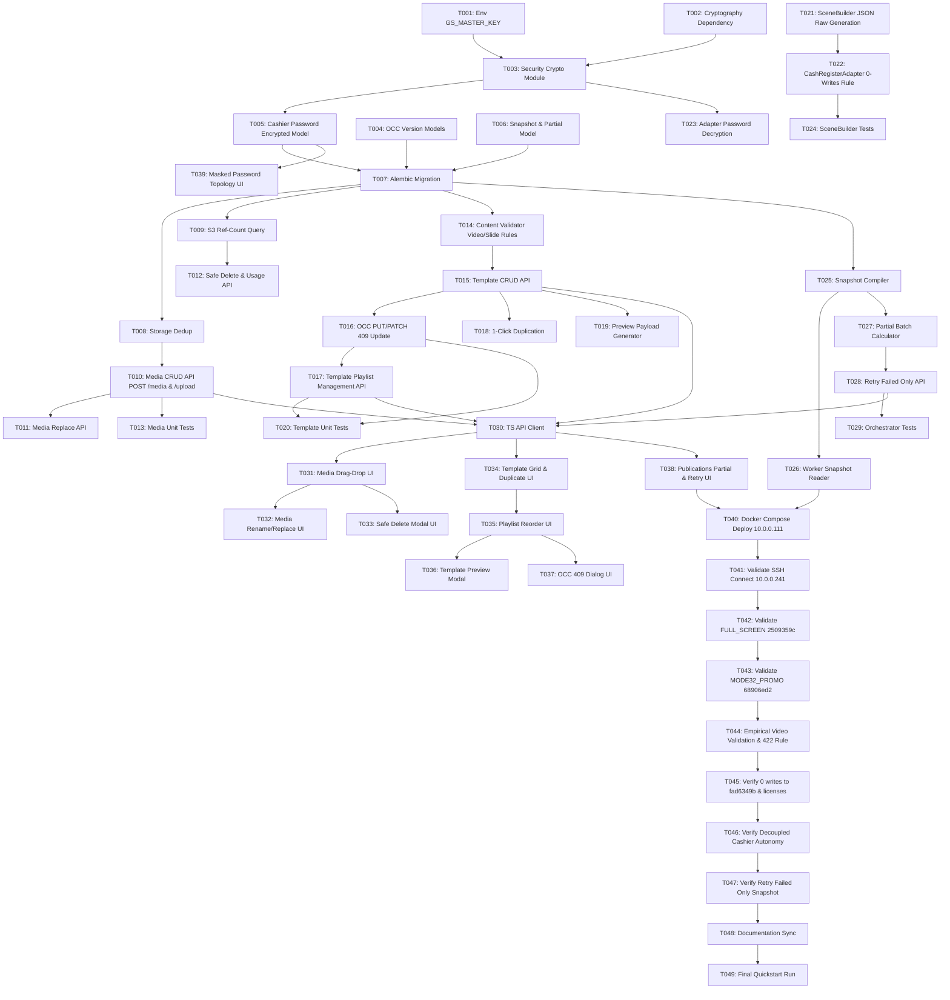

# Tasks: GS Control Center (Iteration 2.0 CMS)

**Feature**: GS Control Center (`001-gs-control-center`)  
**Feature Directory**: `specs/001-gs-control-center`  
**Target Environment**: Dedicated On-Premise Host `10.0.0.111` (100% Docker Compose)  
**Content Model**: `Advertising Template` → `Area` → `Display Mode` → `Playlist Items`  
**Spec References**: [spec.md](./spec.md) | [plan.md](./plan.md) | [data-model.md](./data-model.md) | [contracts/cashier-adapter.md](./contracts/cashier-adapter.md) | [contracts/api.yaml](./contracts/api.yaml) | [constitution.md](../../.specify/memory/constitution.md)  
**Status**: Ready for Review & Execution Planning  

---

## 1. Executive Summary & Task Metrics

| Metric | Value |
| :--- | :--- |
| **Total Tasks** | **49** |
| **Setup Tasks (Phase 1)** | **2** (T001–T002) |
| **Foundational Tasks (Phase 2)** | **5** (T003–T007) |
| **User Story 1: Media Library & S3 Ref-Count (Phase 3)** | **6** (T008–T013) |
| **User Story 2: Scalable Templates & OCC (Phase 4)** | **7** (T014–T020) |
| **User Story 3: Verified Physical Scene Mapping (Phase 5)** | **4** (T021–T024) |
| **User Story 4: Publication Snapshot & Retries (Phase 6)** | **5** (T025–T029) |
| **User Story 5: Frontend CMS Console (Phase 7)** | **10** (T030–T039) |
| **Empirical Validation on 10.0.0.241 (Phase 8)** | **8** (T040–T047) |
| **Polish & Documentation (Phase 9)** | **2** (T048–T049) |
| **Parallelizable Tasks marked `[P]`** | **23** |

---

## 2. Categorization by Architectural Dimension

### 2.1 Media Library & MinIO Deduplication & Ref-Count
- **Tasks**: `T008`, `T009`, `T010`, `T011`, `T012`, `T013`, `T031`, `T032`, `T033`.
- **Scope**: Multi-format upload (JPG/PNG/WebP/MP4), canonical endpoint `POST /api/v1/media` and backwards-compatible alias `POST /api/v1/media/upload`, content-addressed storage (`media/<sha256>.<ext>`), upload deduplication, in-place rename, in-place binary replace, usage inspection (`GET /api/v1/media/{id}/usage`), safe deletion blocking on dependent templates (`HTTP 409 Conflict`), and physical MinIO deletion strictly when PostgreSQL `COUNT == 0` across `media_assets` and `publication_batches.content_snapshot_json`.

### 2.2 Advertising Templates & Playlist Management (Dynamic Scalability)
- **Tasks**: `T004`, `T014`, `T015`, `T016`, `T017`, `T018`, `T019`, `T020`, `T034`, `T035`, `T036`.
- **Scope**: Dynamic scaling (1..500+ templates in PostgreSQL, zero hardcoded packages), display mode validation (`STATIC`: 1 image, `SLIDESHOW`: 2-20 images, `VIDEO`: 1 video), full Template Playlist API (add, remove, transactional reorder with position normalization 0..N-1, per-slide duration 1–60s), 1-click duplication (`POST /api/v1/advertising_blocks/{id}/duplicate`), and interactive preview modal (4:3 and 2:3 viewports with autoplay).

### 2.3 Optimistic Concurrency Control (OCC)
- **Tasks**: `T004`, `T010`, `T011`, `T016`, `T017`, `T020`, `T037`.
- **Scope**: Monotonically increasing `version: int` column on `media_assets` and `advertising_blocks`. Mutation endpoints (`PUT` and `PATCH /api/v1/advertising_blocks/{id}`, playlist mutation `PUT /items`, media rename/replace) verify client version and return `HTTP 409 Conflict` on concurrent overwrite attempts with human-readable error messages.

### 2.4 Publication Snapshot, Decoupled Cashiers & Retries
- **Tasks**: `T006`, `T025`, `T026`, `T027`, `T028`, `T029`, `T038`, `T046`, `T047`.
- **Scope**: Immutable batch snapshot (`content_snapshot_json`) serialized at launch time. Decoupled cashier operation: editing/deleting templates in CMS sends 0 tasks to cashiers; local `gs.db` content continues uninterrupted. Batch status transitions to `PARTIAL` on mixed outcomes with zero rollbacks. "Retry Failed Only" re-runs strictly failed/offline nodes using the original snapshot.

### 2.5 Security & Authenticated Secrets Encryption (Principle VIII)
- **Tasks**: `T001`, `T002`, `T003`, `T005`, `T023`, `T030`, `T039`, `T041`.
- **Scope**: Authenticated symmetric encryption (`AES-256-GCM` / `Fernet` via `cryptography`) for `cashiers.ssh_password_encrypted`. Master encryption key `GS_MASTER_KEY` passed strictly through Docker environment. Cashier endpoints return strictly `has_ssh_password: bool` without exposing plaintext passwords.

### 2.6 Verified Physical Scene Mapping (Guest Screen 3.1.1)
- **Tasks**: `T021`, `T022`, `T024`, `T042`, `T043`, `T044`, `T045`.
- **Scope**: Strict adherence to verified topology:
  - `FULL_SCREEN` $\rightarrow$ `2509359c-2d71-4344-9be4-7d90dd453083` (both `STATIC` and `SLIDESHOW`, dynamically switching `image-scene` vs `gallery-scene`).
  - `MODE32_PROMO` $\rightarrow$ `68906ed2-49a3-4dc3-bb8a-6fa7943f39c3` (both `STATIC` and `SLIDESHOW`, dynamically switching `image-scene` vs `gallery-scene`).
  - `SceneBuilder` constructs low-level `scenes.Raw` JSON with explicit `type` (`image`, `gallery`, `video`), verified empirically on CefSharp runtime.
  - Orphan GUID `fad6349b...` is strictly forbidden (**0 writes**, byte-for-byte identical).
  - Tables `licenses`, `screens`, and `settings` in `gs.db` have **zero row-count changes, zero byte modifications, and zero write queries**.

### 2.7 User Interface (UI)
- **Tasks**: `T030`, `T031`, `T032`, `T033`, `T034`, `T035`, `T036`, `T037`, `T038`, `T039`.
- **Scope**: React 18 + Vite SPA interface: Media Library card grid, drag-and-drop batch upload, rename/replace modals, dependency-protected delete modal, Template Composer with draggable playlist, duration sliders, high-fidelity Preview modal, and Publications progress dashboard.

---

## 3. Detailed Task Checklist

### Phase 1: Setup & Environment (Shared Infrastructure)
**Purpose**: Prepare runtime dependencies and secrets configuration on host `10.0.0.111`.

- [x] T001 Configure environment secret `GS_MASTER_KEY` in `deploy/.env.example` and `src/backend/app/core/config.py`
- [x] T002 [P] Add `cryptography` dependency in `src/backend/requirements.txt`

---

### Phase 2: Foundational Prerequisites (Database & Security)
**Purpose**: Core database schema mutations and encryption services (BLOCKS all user stories).

- [x] T003 Implement authenticated encryption utility (`encrypt_secret`, `decrypt_secret`) using `cryptography` in `src/backend/app/core/security.py`
- [x] T004 [P] Add `version: int = 1` column to `MediaAsset` and `AdvertisingBlock` models in `src/backend/app/models/content.py`
- [x] T005 [P] Add `ssh_password_encrypted: LargeBinary` column to `Cashier` model in `src/backend/app/models/topology.py`
- [x] T006 [P] Add `content_snapshot_json: JSONB` and `PARTIAL` status enum to `PublicationBatch` model in `src/backend/app/models/publication.py`
- [x] T007 Generate and apply Alembic migration `002_iteration2_cms_schema.py` in `src/backend/migrations/versions/002_iteration2_cms_schema.py`

**Checkpoint**: Foundation ready. Database schema, encryption primitives, and models are fully aligned.

---

### Phase 3: User Story 1 — Media Library & S3 Ref-Count (Priority: P1)
**Goal**: Deliver full Media Library management with SHA-256 deduplication, in-place replace, usage inspection, and ref-count safe deletion.

- [x] T008 [P] [US1] Implement content-addressed storage (`media/<sha256>.<ext>`) and upload deduplication in `src/backend/app/services/storage_service.py`
- [x] T009 [P] [US1] Implement transactional S3 reference counting query (`COUNT == 0`) with row-level locks `SELECT ... FOR UPDATE` in `src/backend/app/services/media_gc.py`
- [x] T010 [US1] Implement Media CRUD API: canonical `POST /api/v1/media` and alias `POST /api/v1/media/upload`, `GET /api/v1/media`, `PATCH /api/v1/media/{id}` (OCC version-protected) in `src/backend/app/api/v1/media.py`
- [x] T011 [US1] Implement in-place binary replace endpoint `POST /api/v1/media/{id}/replace` (OCC protected) in `src/backend/app/api/v1/media.py`
- [x] T012 [US1] Implement usage inspection `GET /api/v1/media/{id}/usage` and dependency-protected `DELETE /api/v1/media/{id}` (returns HTTP 409 Conflict if in use) in `src/backend/app/api/v1/media.py`
- [x] T013 [P] [US1] Unit and integration tests for media deduplication, replace, and S3 refcount safe deletion in `src/backend/tests/test_media_service.py`

**Checkpoint**: Media Library backend complete and verified with automated tests.

---

### Phase 4: User Story 2 — Scalable Advertising Templates & OCC (Priority: P1)
**Goal**: Deliver dynamic template management (1..500+ templates), display mode validation, OCC conflict prevention, full playlist manipulation API, and 1-click duplication.

- [x] T014 [P] [US2] Implement display mode constraint validation (`STATIC`: 1 image; `SLIDESHOW`: 2-20 images; `VIDEO`: 1 video; reject mixed video in slideshow with HTTP 422) in `src/backend/app/domain/content_validator.py`
- [x] T015 [US2] Implement Template CRUD API endpoints (`POST /api/v1/advertising_blocks/`, `GET /api/v1/advertising_blocks/`, `GET /api/v1/advertising_blocks/{id}`, `DELETE /api/v1/advertising_blocks/{id}`) in `src/backend/app/api/v1/advertising_blocks.py`
- [x] T016 [US2] Implement OCC conditional version update (`WHERE id = :id AND version = :version`) supporting both `PUT` and `PATCH /api/v1/advertising_blocks/{id}` returning `HTTP 409 Conflict` on version mismatch in `src/backend/app/api/v1/advertising_blocks.py`
- [x] T017 [US2] Implement Template Playlist Management API (`PUT /api/v1/advertising_blocks/{id}/items`: add/remove/transactional reorder playlist items, per-item duration 1–60s, position normalization 0..N-1, OCC version increment and check) in `src/backend/app/api/v1/advertising_blocks.py`
- [x] T018 [US2] Implement 1-click template duplication endpoint `POST /api/v1/advertising_blocks/{id}/duplicate` in `src/backend/app/api/v1/advertising_blocks.py`
- [x] T019 [P] [US2] Implement preview payload generator `GET /api/v1/advertising_blocks/{id}/preview` in `src/backend/app/api/v1/advertising_blocks.py`
- [x] T020 [P] [US2] Unit tests for template CRUD, playlist item reordering, display mode rules, duplication, and OCC conflict in `src/backend/tests/test_template_service.py`

**Checkpoint**: Template backend complete with dynamic scaling, OCC, playlist management, and duplication.

---

### Phase 5: User Story 3 — Verified Physical Scene Mapping & Cashier Adapter (Priority: P1)
**Goal**: Align low-level scene compiler and cashier adapter with verified Guest Screen 3.1.1 physical topology.

- [x] T021 [P] [US3] Update `SceneBuilder` to generate low-level `scenes.Raw` JSON with explicit `type` (`image`, `gallery`, `video`) for confirmed physical topology (`FULL_SCREEN` $\rightarrow$ `2509359c...`, `MODE32_PROMO` $\rightarrow$ `68906ed2...`, eliminate `fad6349b...`) in `src/backend/app/domain/scene_builder.py`
- [x] T022 [P] [US3] Update `CashRegisterAdapter` area-to-scene resolution and enforce 0 write queries to `licenses`, `screens`, `settings` in `src/backend/app/adapters/cashier_adapter.py`
- [x] T023 [US3] Implement in-memory decryption of `cashiers.ssh_password_encrypted` for SSH session authentication in `src/backend/app/adapters/cashier_adapter.py`
- [x] T024 [P] [US3] Unit tests for `SceneBuilder` verifying JSON payloads (`type: image/gallery/video`), correct scene GUID mapping, and zero writes to orphan GUIDs in `src/backend/tests/test_scene_builder.py`

**Checkpoint**: Low-level Guest Screen adapter verified; orphan GUID permanently eliminated.

---

### Phase 6: User Story 4 — Publication Orchestration with Immutable Snapshots & Retries (Priority: P2)
**Goal**: Ensure worker isolation via immutable snapshots, handle partial batch results, and enable resilient retries.

- [x] T025 [US4] Implement template serialization into immutable `content_snapshot_json` at dispatch in `src/backend/app/services/orchestrator.py`
- [x] T026 [US4] Update worker payload parsing in `src/workers/main.py` to read exclusively from `content_snapshot_json`
- [x] T027 [US4] Implement batch outcome transition to `PARTIAL` on mixed cashier results without rolling back successful cashiers in `src/backend/app/services/orchestrator.py`
- [x] T028 [US4] Implement "Retry Failed Only" endpoint `POST /api/v1/publications/{id}/retry-failed` dispatching jobs from original snapshot in `src/backend/app/api/v1/publications.py`
- [x] T029 [P] [US4] Unit tests for publication snapshot isolation and retry-failed in `src/backend/tests/test_orchestrator.py`

**Checkpoint**: Publication engine is 100% resilient to CMS edits/deletions during dispatch and execution.

---

### Phase 7: User Story 5 — Frontend CMS Console (Media Library, Template Composer, Preview) (Priority: P2)
**Goal**: Build modern, operator-friendly Web UI for marketing managers without technical jargon.

- [x] T030 [P] [US5] Update TypeScript API client bindings for media replace, usage, template duplicate, playlist items reorder, retry-failed, and masked cashier passwords in `src/frontend/src/api/client.ts`
- [x] T031 [US5] Implement multi-file drag-and-drop upload zone, search bar, resolution filters, and usage badges in `src/frontend/src/pages/MediaLibrary.tsx`
- [x] T032 [US5] Implement in-place rename modal and in-place replace modal in `src/frontend/src/pages/MediaLibrary.tsx`
- [x] T033 [US5] Implement safe deletion modal displaying list of active dependent templates on HTTP 409 in `src/frontend/src/pages/MediaLibrary.tsx`
- [x] T034 [US5] Implement template card list (1..500+ scalable grid) with 1-click "Duplicate" button in `src/frontend/src/pages/AdvertisingBlocks.tsx`
- [x] T035 [US5] Implement drag-and-drop playlist reordering and per-slide duration sliders (1–60s) in `src/frontend/src/pages/AdvertisingBlockEditor.tsx`
- [x] T036 [US5] Implement high-fidelity Preview Modal (simulating 1024×768 and 512×768 frames with Next/Prev and autoplay) in `src/frontend/src/components/TemplatePreviewModal.tsx`
- [x] T037 [US5] Implement OCC conflict notification toast / dialog (`HTTP 409 Conflict`) prompting user to refresh in `src/frontend/src/pages/AdvertisingBlockEditor.tsx`
- [x] T038 [US5] Update publication dashboard with `PARTIAL` status badge and "Retry Failed Only" button in `src/frontend/src/pages/Publications.tsx`
- [x] T039 [P] [US5] Update Cashier topology UI to hide plaintext passwords, displaying `has_ssh_password` indicator in `src/frontend/src/pages/Topology.tsx`

**Checkpoint**: Complete Web UI CMS operational; technical UCS constructs (`gs.db`, Scene GUIDs) 100% hidden.

---

### Phase 8: Empirical Validation on Test Cashier `10.0.0.241` (Priority: P1 / Quality Gate)
**Goal**: Empirically prove end-to-end functionality on live POS hardware without rebooting `GuestScreen.exe`.

- [x] T040 [VAL] Deploy updated backend, workers, and migrations on `10.0.0.111` via `docker compose up -d --build`
- [x] T041 [VAL] Test SSH connection to `10.0.0.241` using encrypted password via `POST /api/v1/cashiers/{id}/test-connection`
- [x] T042 [VAL] Execute publication of `FULL_SCREEN` `STATIC` and `SLIDESHOW` to `10.0.0.241`, verifying GUID `2509359c...` and CefSharp Vue component switching (`image-scene` vs `gallery-scene`)
- [x] T043 [VAL] Execute publication of `MODE32_PROMO` `STATIC` and `SLIDESHOW` to `10.0.0.241`, verifying GUID `68906ed2...` and CefSharp Vue component switching (`image-scene` vs `gallery-scene`)
- [x] T044 [VAL] Empirical verification of standalone `VIDEO` banner on `10.0.0.241` for both `FULL_SCREEN` (`2509359c...`) and `MODE32_PROMO` (`68906ed2...`); verify CefSharp playback / `video-scene` compatibility; verify that video inside `SLIDESHOW` is strictly rejected with `HTTP 422`
- [x] T045 [VAL] Verify hardware integrity on `10.0.0.241`: orphan scene `fad6349b-3aaa-43e2-82c7-ba12abfc1463` has strictly 0 bytes modified; tables `licenses`, `screens`, `settings` in `gs.db` have strictly 0 row-count changes, 0 content alterations, and 0 write queries executed during publication
- [x] T046 [VAL] Validate decoupled cashier autonomy: edit/delete published template in CMS and confirm `10.0.0.241` continues uninterrupted playback from local `gs.db`
- [x] T047 [VAL] Validate "Retry Failed Only" action on simulated offline cashier using original immutable snapshot

**Checkpoint**: Real hardware verification confirmed on `10.0.0.241`.

---

### Phase 9: Polish & Operational Runbooks
**Purpose**: Final documentation, synchronization, and operational verification.

- [x] T048 [P] Sync updated operational documentation and quickstart runbooks to `/opt/gs-control-center/docs/` on `10.0.0.111`
- [x] T049 Verify end-to-end quickstart checklist passing 100% against `quickstart.md` test suites

---

## 4. Dependencies & Execution Graph

---

## 5. Parallel Execution Opportunities

The following task clusters can be executed simultaneously without code collisions:

### Cluster 1: Infrastructure & Data Modeling (Setup & Foundation)
- `T001` (Config secrets) & `T002` (`cryptography` dependency in `requirements.txt`).
- `T004` (OCC in `content.py`), `T005` (Password in `topology.py`), and `T006` (Snapshot in `publication.py`).

### Cluster 2: Backend Core Services (Post-Foundation)
- `T008` (Storage deduplication in `storage_service.py`).
- `T009` (S3 refcount in `media_gc.py`).
- `T014` (Display mode validation in `content_validator.py`).
- `T021` (Verified Scene Mapping in `scene_builder.py`).

### Cluster 3: Unit Testing
- `T013` (`test_media_service.py`), `T020` (`test_template_service.py`), `T024` (`test_scene_builder.py`), and `T029` (`test_orchestrator.py`).

### Cluster 4: Frontend Development
- `T031` (`MediaLibrary.tsx` drag-and-drop & filters).
- `T034` (`AdvertisingBlocks.tsx` template list & duplicate button).
- `T036` (`TemplatePreviewModal.tsx` 4:3 and 2:3 viewports).
- `T038` (`Publications.tsx` PARTIAL & Retry UI).
- `T039` (`Topology.tsx` masked password UI).

---

## 6. Files Planned to be Modified / Created

### Backend & Worker Files:
| File Path | Action | Description |
| :--- | :---: | :--- |
| `src/backend/requirements.txt` | MODIFY | Add `cryptography` package. |
| `deploy/.env.example` | MODIFY | Add `GS_MASTER_KEY` environment variable. |
| `src/backend/app/core/config.py` | MODIFY | Load `GS_MASTER_KEY` from environment. |
| `src/backend/app/core/security.py` | MODIFY | Implement `encrypt_secret()` and `decrypt_secret()`. |
| `src/backend/app/models/content.py` | MODIFY | Add `version: int = 1` to `MediaAsset` and `AdvertisingBlock`. |
| `src/backend/app/models/topology.py` | MODIFY | Add `ssh_password_encrypted` to `Cashier`. |
| `src/backend/app/models/publication.py` | MODIFY | Add `content_snapshot_json` and `PARTIAL` status to `PublicationBatch`. |
| `src/backend/migrations/versions/002_iteration2_cms_schema.py` | NEW | Alembic migration for schema changes. |
| `src/backend/app/services/storage_service.py` | MODIFY | SHA-256 deduplication and content-addressed upload. |
| `src/backend/app/services/media_gc.py` | MODIFY | Transactional S3 ref-count check (`COUNT == 0`) with row locks. |
| `src/backend/app/domain/content_validator.py` | MODIFY | Validate `STATIC` (1 img), `SLIDESHOW` (2-20 imgs), `VIDEO` (1 vid), reject mixed slideshow. |
| `src/backend/app/domain/scene_builder.py` | MODIFY | Generate `scenes.Raw` JSON with explicit `type`: `FULL_SCREEN` $\rightarrow$ `2509359c...`, `MODE32_PROMO` $\rightarrow$ `68906ed2...`, 0 writes to `fad6349b...`. |
| `src/backend/app/adapters/cashier_adapter.py` | MODIFY | Enforce 0 write queries to `licenses`, `screens`, `settings`. |
| `src/backend/app/services/orchestrator.py` | MODIFY | Compile `content_snapshot_json`, decoupled lifecycle, `PARTIAL` status. |
| `src/workers/main.py` | MODIFY | Read from `content_snapshot_json`, touch `sync_version.txt`. |
| `src/backend/app/api/v1/media.py` | MODIFY | Canonical `POST /api/v1/media` & alias `/upload`, replace, usage inspection, OCC rename, safe deletion with HTTP 409. |
| `src/backend/app/api/v1/advertising_blocks.py` | MODIFY | Template CRUD, dual PUT/PATCH OCC version check with HTTP 409, playlist items reorder API, 1-click duplication. |
| `src/backend/app/api/v1/publications.py` | MODIFY | Add `POST /{id}/retry-failed` endpoint. |
| `src/backend/app/api/v1/topology.py` | MODIFY | Mask SSH passwords, return `has_ssh_password`. |

### Frontend Files:
| File Path | Action | Description |
| :--- | :---: | :--- |
| `src/frontend/src/api/client.ts` | MODIFY | Add replace, usage, duplicate, playlist items reorder, retry-failed API client functions. |
| `src/frontend/src/pages/MediaLibrary.tsx` | MODIFY | Batch drag-drop upload, rename/replace modals, safe delete modal (409). |
| `src/frontend/src/pages/AdvertisingBlocks.tsx` | MODIFY | 1..500+ scalable template grid, 1-click duplicate button. |
| `src/frontend/src/pages/AdvertisingBlockEditor.tsx` | MODIFY | Draggable playlist reordering, duration sliders (1-60s), dual PUT/PATCH OCC 409 error handling. |
| `src/frontend/src/components/TemplatePreviewModal.tsx` | NEW | 4:3 (1024×768) and 2:3 (512×768) preview simulation with autoplay. |
| `src/frontend/src/pages/Publications.tsx` | MODIFY | `PARTIAL` status badge, "Retry Failed Only" button, live progress. |
| `src/frontend/src/pages/Topology.tsx` | MODIFY | Password input masked, display `has_ssh_password` indicator. |

---

## 7. What is Planned to be Tested on Cashier `10.0.0.241`

All hardware verification tests are scheduled for Phase 8 (`T040`–`T047`) on test cashier `10.0.0.241`:

1. **SSH Connectivity & Secrets (`T041`)**:
   - Verify agentless SSH connection using encrypted password stored in `cashiers.ssh_password_encrypted`.
   - Verify `has_ssh_password` returns `true` in API while plaintext password is never exposed.
2. **`FULL_SCREEN` Area (`2509359c-2d71-4344-9be4-7d90dd453083`) (`T042`)**:
   - `STATIC`: Verify single banner renders via Vue `image-scene` (`type: "image"`).
   - `SLIDESHOW`: Verify 3-slide gallery renders via Vue `gallery-scene` (`type: "gallery"`) with custom intervals (e.g. 5s) and smooth rotation.
3. **`MODE32_PROMO` Area (`68906ed2-49a3-4dc3-bb8a-6fa7943f39c3`) (`T043`)**:
   - `STATIC`: Verify 512×768 promo banner renders in right half via Vue `image-scene` (`type: "image"`).
   - `SLIDESHOW`: Verify 512×768 promo slideshow renders in right half via Vue `gallery-scene` (`type: "gallery"`).
   - Left-side receipt check (`255dc54c...`) remains 100% untouched.
4. **Empirical VIDEO Validation & Constraint Checking (`T044`)**:
   - Standalone `VIDEO` is treated as experimental until verified on real CefSharp runtime.
   - Publish standalone MP4 to `FULL_SCREEN` (`2509359c...`) and verify hardware rendering/audio-video sync (`type: "video"`).
   - Publish standalone MP4 to `MODE32_PROMO` (`68906ed2...`) and verify aspect ratio and scaling.
   - Validate that attempting to configure a mixed slideshow containing video is strictly rejected by backend validator with `HTTP 422 Unprocessable Entity`.
5. **Hardware & Scene Invariants Verification (`T045`)**:
   - Confirm orphan scene `fad6349b-3aaa-43e2-82c7-ba12abfc1463` has **strictly 0 bytes modified** (byte-for-byte identical before and after).
   - Confirm tables `licenses`, `screens`, and `settings` in `C:\UCS\GuestScreen\gs.db` have:
     - **0 changes in row count**.
     - **0 byte modifications / content alterations**.
     - **0 write queries (`INSERT`, `UPDATE`, `DELETE`) executed** during publication.
   - Confirm `GuestScreen.exe` process is **never killed or restarted**. Hot-update triggers smoothly via `Front\sync_version.txt`.
6. **Decoupled Cashier Autonomy (`T046`)**:
   - While `10.0.0.241` is actively displaying a published template, delete or edit the template in the CMS.
   - Verify that the cashier continues displaying the local content from `gs.db` with zero blinks, zero tasks, and zero screen-blanking.
7. **Immutable Snapshot & "Retry Failed Only" (`T047`)**:
   - Verify that publication delivery uses strictly the immutable `content_snapshot_json` captured at dispatch.
   - Simulate a failed/offline cashier, verify batch status is `PARTIAL`, and confirm "Retry Failed Only" pushes the original snapshot without affecting successful nodes.
