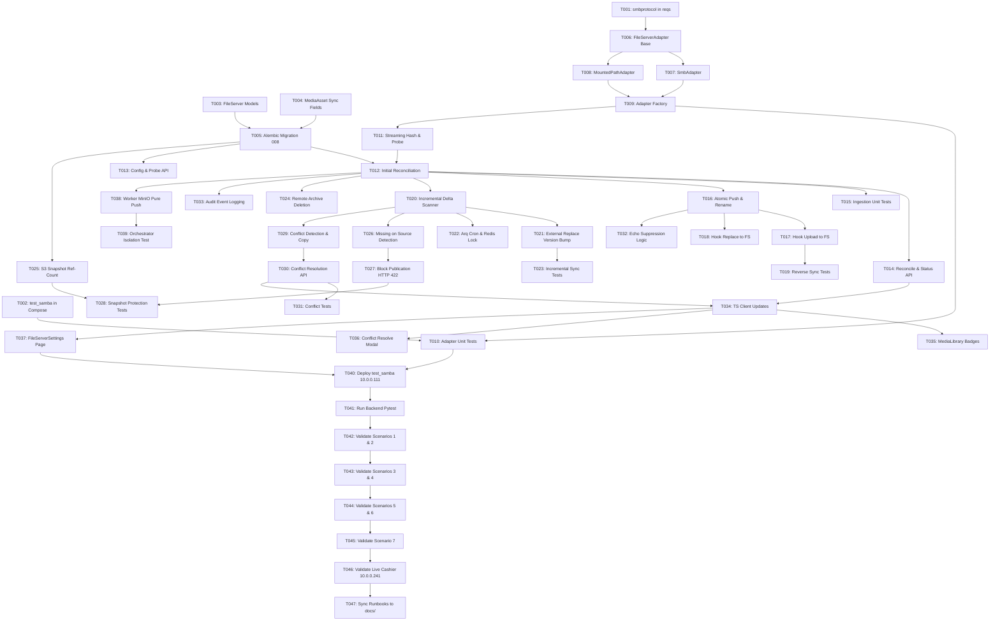

# Tasks: Bidirectional File Server <-> Central Control Media Synchronization

**Feature**: Media File Server Synchronization (`002-media-file-server-sync`)  
**Feature Directory**: `specs/002-media-file-server-sync`  
**Target Environment**: Dedicated On-Premise Host `10.0.0.111` (100% Docker Compose)  
**Spec References**: [spec.md](./spec.md) | [plan.md](./plan.md) | [data-model.md](./data-model.md) | [research.md](./research.md) | [contracts/api.yaml](./contracts/api.yaml) | [quickstart.md](./quickstart.md)  
**Status**: Ready for Execution Planning  

---

## 1. Executive Summary & Task Metrics

| Metric | Value |
| :--- | :--- |
| **Total Tasks** | **47** |
| **Setup Tasks (Phase 1)** | **2** (T001–T002) |
| **Foundational Tasks (Phase 2)** | **8** (T003–T010) |
| **User Story 1: Ingestion & Initial Reconciliation (Phase 3 - MVP)** | **5** (T011–T015) |
| **User Story 2: Reverse Sync to File Server (Phase 4)** | **4** (T016–T019) |
| **User Story 3: Incremental Sync & External Updates (Phase 5)** | **4** (T020–T023) |
| **User Story 4: Deletion Policies & POS Protection (Phase 6)** | **5** (T024–T028) |
| **User Story 5: Conflict Detection & Resolution (Phase 7)** | **3** (T029–T031) |
| **User Story 6: Monitoring, Badges, Loop Prevention & UI (Phase 8)** | **6** (T032–T037) |
| **User Story 7: Cashier Publication Isolation (Phase 9)** | **2** (T038–T039) |
| **Empirical Validation on 10.0.0.111 & 10.0.0.241 (Phase 10)** | **8** (T040–T047) |
| **Parallelizable Tasks marked `[P]`** | **18** |

---

## 2. Categorization by Architectural Dimension

### 2.1 Protocols, Adapters & Infrastructure
- **Tasks**: `T001`, `T002`, `T006`, `T007`, `T008`, `T009`, `T010`, `T040`.
- **Scope**: `smbprotocol>=1.15.0` integration, `gs_test_samba` container provisioning on `10.0.0.111`, `FileServerAdapter` abstract interface with `SmbAdapter` and `MountedPathAdapter` implementations, adapter factory, and session pooling.

### 2.2 Data Modeling & Schema Migrations
- **Tasks**: `T003`, `T004`, `T005`.
- **Scope**: `FileServerConfig` and `MediaSyncConflict` models, extended `MediaAsset` fields (`file_server_path`, `file_server_mtime`, `file_server_size`, `last_sync_sha256`, `sync_status`, `sync_error_message`, `source_origin`, `last_synced_at`), and Alembic migration `008_file_server_sync.py`.

### 2.3 Synchronization Engine, Streaming & Loop Prevention
- **Tasks**: `T011`, `T012`, `T016`, `T020`, `T021`, `T022`, `T032`.
- **Scope**: 4-way Initial Reconciliation, 8MB chunked streaming SHA-256 calculation, write-in-progress detection (2-probe size stability), atomic write (`.tmp_<uuid>` + rename), periodic incremental delta scanner, Arq worker cron under Redis mutex lock (`lock:file_server_sync`), and cryptographic echo suppression (`last_sync_sha256` matching).

### 2.4 Deletion Safety, Historical Snapshots & Conflict Resolution
- **Tasks**: `T024`, `T025`, `T026`, `T027`, `T029`, `T030`.
- **Scope**: Remote archive `.archive/<timestamp>_<filename>` (policy `ARCHIVE`), S3 ref-count check inspecting historical `publication_batches.content_snapshot_json`, external deletion status `MISSING_ON_SOURCE`, publication blocking with `HTTP 422`, dual-version conflict storage (`media/conflicts/`), and interactive resolution API (`KEEP_CENTRAL_CONTROL` / `ACCEPT_FILE_SERVER`).

### 2.5 REST API & User Interface
- **Tasks**: `T013`, `T014`, `T017`, `T018`, `T030`, `T034`, `T035`, `T036`, `T037`.
- **Scope**: File server config endpoints, test-connection probe, reconcile trigger, sync status metrics, conflict listing & resolution, TypeScript client updates, color-coded badges in `MediaLibrary.tsx`, conflict resolve modal, and `FileServerSettings.tsx`.

### 2.6 POS Cashier Safety & Empirical Validation
- **Tasks**: `T027`, `T038`, `T039`, `T041`, `T042`, `T043`, `T044`, `T045`, `T046`, `T047`.
- **Scope**: Worker publication isolation from File Server, immutable snapshot validation, pytest execution on `10.0.0.111`, validation scenarios 1–7 against `gs_test_samba`, and live hardware verification on cashier `10.0.0.241` preserving all Constitution invariants.

---

## 3. Detailed Task Checklist

### Phase 1: Setup (Shared Infrastructure)
**Purpose**: Prepare runtime dependencies and test Samba service on host `10.0.0.111`.

- [ ] T001 Add `smbprotocol>=1.15.0` to `src/backend/requirements.txt`
- [ ] T002 [P] Add `gs_test_samba` service and `deploy_test_smb_share` volume in `deploy/docker-compose.yml`

---

### Phase 2: Foundational (Blocking Prerequisites)
**Purpose**: Core data models, schema migration, and protocol adapters (BLOCKS all user stories).

- [ ] T003 Create `FileServerConfig` and `MediaSyncConflict` models in `src/backend/app/models/file_server.py`
- [ ] T004 [P] Add sync tracking columns (`file_server_path`, `file_server_mtime`, `file_server_size`, `last_sync_sha256`, `sync_status`, `sync_error_message`, `source_origin`, `last_synced_at`) to `MediaAsset` in `src/backend/app/models/content.py`
- [ ] T005 Generate and apply Alembic migration `008_file_server_sync.py` in `src/backend/migrations/versions/008_file_server_sync.py`
- [ ] T006 Implement abstract `FileServerAdapter` interface in `src/backend/app/adapters/file_server/base.py`
- [ ] T007 Implement `SmbAdapter` using `smbclient` with session registration and retry in `src/backend/app/adapters/file_server/smb_adapter.py`
- [ ] T008 [P] Implement `MountedPathAdapter` for container-mounted volumes in `src/backend/app/adapters/file_server/mount_adapter.py`
- [ ] T009 Implement `FileServerAdapterFactory` in `src/backend/app/adapters/file_server/factory.py`
- [ ] T010 [P] Implement unit tests for file server adapters in `src/backend/tests/test_file_server_adapter.py`

**Checkpoint**: Foundation ready. Database schema and file server protocol adapters are verified with unit tests.

---

### Phase 3: User Story 1 — External File Server Ingestion & Initial Full Reconciliation (Priority: P1) 🎯 MVP
**Goal**: Discover files on File Server, calculate streaming SHA-256, ingest unique binaries into MinIO, and establish `SYNCED` state without duplicates.  
**Independent Test**: Drop 50 images into test share, trigger reconcile, verify 50 `MediaAsset` records with status `SYNCED` and matching SHA-256 in MinIO.

- [ ] T011 [P] [US1] Implement streaming 8MB chunked SHA-256 calculation and write-in-progress probe in `src/backend/app/services/file_sync_service.py`
- [ ] T012 [US1] Implement Initial Full Reconciliation routine (4-way deterministic matching) in `src/backend/app/services/file_sync_service.py`
- [ ] T013 [P] [US1] Implement File Server config CRUD and connection probe endpoints (`GET`, `PUT /api/v1/file-server/config`, `POST /api/v1/file-server/test-connection`) in `src/backend/app/api/v1/file_server.py`
- [ ] T014 [US1] Implement manual reconciliation endpoint `POST /api/v1/media-sync/reconcile` and status endpoint `GET /api/v1/media-sync/status` in `src/backend/app/api/v1/media_sync.py`
- [ ] T015 [P] [US1] Unit and integration tests for ingestion and initial reconciliation in `src/backend/tests/test_file_sync_service.py`

**Checkpoint**: Initial reconciliation functional. External files ingest into Media Library with zero duplicate binaries.

---

### Phase 4: User Story 2 — Reverse Sync: Central Control Uploads & Replaces to File Server (Priority: P1)
**Goal**: Automatically push files uploaded or replaced in Central Control UI to File Server via atomic temporary files.  
**Independent Test**: Upload banner via UI/API, verify physical file appears on File Server with identical SHA-256.

- [ ] T016 [US2] Implement atomic write (`.tmp_<uuid>` + rename) and remote checksum verification in `src/backend/app/services/file_sync_service.py`
- [ ] T017 [US2] Hook reverse sync into `POST /api/v1/media` and `/upload` with offline `PENDING_UPLOAD` queuing in `src/backend/app/api/v1/media.py`
- [ ] T018 [US2] Hook reverse sync into in-place replace `POST /api/v1/media/{id}/replace` updating File Server binary in `src/backend/app/api/v1/media.py`
- [ ] T019 [P] [US2] Unit tests for reverse push and retry mechanism in `src/backend/tests/test_file_sync_service.py`

**Checkpoint**: Reverse synchronization operational. CMS uploads and replaces mirror to File Server.

---

### Phase 5: User Story 3 — Incremental Synchronization & External Change Detection (Priority: P1)
**Goal**: Periodic background scan detecting additions, modifications, and renames on File Server without auto-pushing to cashiers.  
**Independent Test**: Overwrite file on File Server, wait $\le 60$s, verify `MediaAsset` version increments and MinIO updates while cashiers continue playing old snapshot.

- [ ] T020 [US3] Implement incremental delta scanner (comparing mtime/size, detecting renames by SHA-256) in `src/backend/app/services/file_sync_service.py`
- [ ] T021 [US3] Implement external in-place update handler bumping OCC `version += 1` without cashier push in `src/backend/app/services/file_sync_service.py`
- [ ] T022 [US3] Implement Arq recurring cron task `sync_file_server_cron` with Redis distributed lock (`lock:file_server_sync`) in `src/backend/workers/main.py`
- [ ] T023 [P] [US3] Unit tests for incremental scanner, version increment, and rename detection in `src/backend/tests/test_file_sync_service.py`

**Checkpoint**: Incremental background synchronization operational under distributed lock.

---

### Phase 6: User Story 4 — Deletion Policies & POS Screen-Blanking Prevention (Priority: P2)
**Goal**: Safely handle deletions: protect active templates and historical snapshots; flag external deletions as `MISSING_ON_SOURCE` and block new publications with HTTP 422.  
**Independent Test**: Delete published file on File Server; verify status `MISSING_ON_SOURCE`, MinIO and cashier playback intact, new publication blocked with HTTP 422.

- [ ] T024 [US4] Implement safe deletion on File Server (move to `.archive/<timestamp>_<filename>` for `ARCHIVE` policy or unlink for `HARD_DELETE`) in `src/backend/app/services/file_sync_service.py`
- [ ] T025 [US4] Extend MinIO S3 ref-count in `src/backend/app/services/media_gc.py` to inspect `publication_batches.content_snapshot_json` before deleting physical objects
- [ ] T026 [US4] Implement external deletion detection (transition to `MISSING_ON_SOURCE` without deleting MinIO or POS files) in `src/backend/app/services/file_sync_service.py`
- [ ] T027 [US4] Update publication validation in `src/backend/app/api/v1/publications.py` to block assets with status `MISSING_ON_SOURCE`, `CONFLICT`, or `ERROR` with `HTTP 422 Unprocessable Entity`
- [ ] T028 [P] [US4] Unit tests for deletion policies, snapshot ref-count protection, and publication blocking in `src/backend/tests/test_s3_snapshot_protection.py`

**Checkpoint**: Deletion safety active. POS terminals 100% protected against accidental screen-blanking.

---

### Phase 7: User Story 5 — Conflict Detection & Resolution Without Silent Overwriting (Priority: P2)
**Goal**: Catch concurrent edits, isolate File Server version in `media/conflicts/`, and resolve via interactive API without data loss.  
**Independent Test**: Perform concurrent edit on both sides, verify status `CONFLICT`, resolve via API, verify selected binary active.

- [ ] T029 [US5] Implement concurrent edit conflict detector (saving incoming version to `media/conflicts/<sha256>.<ext>` and creating `MediaSyncConflict` record) in `src/backend/app/services/file_sync_service.py`
- [ ] T030 [US5] Implement conflict API endpoints (`GET /api/v1/media-sync/conflicts`, `POST /api/v1/media-sync/conflicts/{id}/resolve`) in `src/backend/app/api/v1/media_sync.py`
- [ ] T031 [P] [US5] Unit tests for conflict detection, dual-version preservation, and resolution logic in `src/backend/tests/test_file_sync_service.py`

**Checkpoint**: Non-destructive conflict resolution operational. Zero silent overwrites.

---

### Phase 8: User Story 6 — Operational Monitoring, Sync Badges, Loop Prevention & UI (Priority: P2)
**Goal**: Echo suppression preventing sync loops, structured audit logging, and modern Web UI management.  
**Independent Test**: Push file from CMS, verify zero reverse ingestion events; view Media Library badges and resolve conflict in UI.

- [ ] T032 [US6] Implement echo suppression using `last_sync_sha256` and remote `mtime`/`size` match in `src/backend/app/services/file_sync_service.py`
- [ ] T033 [US6] Integrate structured sync events (`SYNC_RECONCILE_START`, `SYNC_FILE_PUSH`, `SYNC_FILE_INGEST`, `SYNC_CONFLICT`) into `src/backend/app/services/audit_service.py`
- [ ] T034 [P] [US6] Update TypeScript API client for File Server configuration, sync triggers, and conflict resolution in `src/frontend/src/api/client.ts`
- [ ] T035 [US6] Add color-coded sync status badges (`SYNCED`, `PENDING`, `CONFLICT`, `ERROR`, `MISSING_ON_SOURCE`) and filter in `src/frontend/src/pages/MediaLibrary.tsx`
- [ ] T036 [US6] Implement interactive conflict resolution modal in `src/frontend/src/components/ConflictResolveModal.tsx`
- [ ] T037 [US6] Implement File Server connection configuration and health status page in `src/frontend/src/pages/FileServerSettings.tsx`

**Checkpoint**: Full visibility established. Operator UI displays sync statuses and handles conflicts in $\le 2$ clicks.

---

### Phase 9: User Story 7 — Cashier Publication Isolation & Zero POS Touch (Priority: P1)
**Goal**: Guarantee workers fetch binaries strictly from MinIO cache via SSH, completely decoupled from File Server availability.  
**Independent Test**: Disconnect File Server, publish template to cashier `10.0.0.241`, verify 100% success using MinIO cache and zero POS disruption.

- [ ] T038 [US7] Verify worker publication pipeline in `src/backend/workers/main.py` fetches binaries strictly from MinIO cache over SSH, with zero requests directed to File Server
- [ ] T039 [US7] Integration test validating in-flight publication resilience when File Server files are mutated concurrently in `src/backend/tests/test_orchestrator.py`

**Checkpoint**: Fleet rollout isolation confirmed. File Server network drops cannot affect cashier delivery.

---

### Phase 10: Empirical Hardware Validation & Runbooks (Target: `10.0.0.111` & `10.0.0.241`)
**Goal**: Prove end-to-end functionality against containerized Samba on `10.0.0.111` and live cashier `10.0.0.241`.

- [ ] T040 [VAL] Deploy updated stack with `gs_test_samba` container on `10.0.0.111` via `docker compose up -d --build`
- [ ] T041 [VAL] Run complete automated backend pytest suite (`pytest -v`) inside `gs_backend_api` on `10.0.0.111`
- [ ] T042 [VAL] Execute Scenario 1 & 2 (SMB test-connection and 50-file Initial Full Reconciliation) on `10.0.0.111`
- [ ] T043 [VAL] Execute Scenario 3 & 4 (Reverse sync from CMS and Echo Suppression loop prevention test) on `10.0.0.111`
- [ ] T044 [VAL] Execute Scenario 5 & 6 (External replace version bump and external delete `MISSING_ON_SOURCE` publication block) on `10.0.0.111`
- [ ] T045 [VAL] Execute Scenario 7 (Two-way conflict detection and interactive resolution via API) on `10.0.0.111`
- [ ] T046 [VAL] Execute Scenario 8 on live cashier `10.0.0.241` verifying zero touch to `licenses`, `screens`, `settings`, zero full `gs.db` copies, continuous PID `8824`, and pure MinIO push
- [ ] T047 [P] Sync operational documentation and runbooks to `/opt/gs-control-center/docs/` on `10.0.0.111`

---

## 4. Dependencies & Execution Graph

---

## 5. Parallel Execution Clusters

### Cluster 1: Foundational Models & Infrastructure
- `T002` (`deploy/docker-compose.yml` test Samba) in parallel with `T004` (`content.py` sync columns).
- `T007` (`smb_adapter.py`) in parallel with `T008` (`mount_adapter.py`).

### Cluster 2: API & Service Core
- `T011` (Streaming hash in `file_sync_service.py`) in parallel with `T013` (Config API in `file_server.py`).
- `T025` (S3 snapshot ref-count in `media_gc.py`) in parallel with `T020` (Delta scanner in `file_sync_service.py`).

### Cluster 3: Unit Testing
- `T010` (`test_file_server_adapter.py`), `T015` (`test_file_sync_service.py`), `T019` (Reverse sync tests), `T028` (`test_s3_snapshot_protection.py`), and `T031` (Conflict tests).

### Cluster 4: Frontend Components
- `T035` (`MediaLibrary.tsx` badges), `T036` (`ConflictResolveModal.tsx`), and `T037` (`FileServerSettings.tsx`).

---

## 6. Implementation Strategy: MVP First

1. **Step 1: Core Foundation**: Complete Phase 1 (Setup) and Phase 2 (Foundational models, migration 008, and adapters).
2. **Step 2: MVP Delivery (User Story 1)**: Implement Initial Full Reconciliation (T011–T015). Validate that dropping files into Samba share ingests them into MinIO and PostgreSQL with zero duplicate binaries.
3. **Step 3: Incremental Sync & Reverse Push (User Stories 2 & 3)**: Implement two-way synchronization and echo suppression loop prevention (T016–T023).
4. **Step 4: Deletion & Conflict Safety (User Stories 4 & 5)**: Implement archive deletion, snapshot protection, and conflict resolution (T024–T031).
5. **Step 5: Frontend Experience (User Story 6)**: Build UI badges, conflict resolve dialog, and settings console (T032–T037).
6. **Step 6: Empirical Validation (Phase 10)**: Execute full validation suite on `10.0.0.111` against `gs_test_samba` and verify cashier `10.0.0.241` remains 100% untouched.
