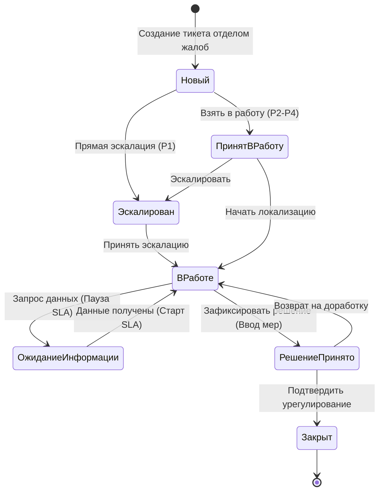

# Data Model & Schema Specification: Проект «Ургент линия»

**Feature**: [spec.md](file:///d:/Anti/specs/003-urgent-line-jira/spec.md) | **Date**: 2026-09-08

---

## 1. Сущности проекта (Project Architecture)

### 1.1 UrgentProject
| Атрибут | Значение | Описание |
| :--- | :--- | :--- |
| **Project Name** | `Ургент линия` | Официальное название в Jira |
| **Project Key** | `URG` | Префикс ключей задач (`URG-1`, `URG-2`, ...) |
| **Project Type** | `software` (Kanban) | Тип проекта в Jira Software |
| **Project Lead** | Руководитель отдела жалоб / Duty Lead | Ответственный за общую конфигурацию |
| **Permission Scheme** | `URG: Permission Scheme` | Закрытая схема доступа только для группы `Urgent Team` |
| **Workflow Scheme** | `URG: Workflow Scheme` | Кастомный рабочий процесс с прямой эскалацией P1 |
| **Issue Type Scheme**| `URG: Issue Type Scheme` | Тип задачи: `Ургентный инцидент` (Urgent Incident) |
| **Priority Scheme** | `URG: Priority Scheme` | Четырехуровневая шкала P1–P4 |

---

## 2. Сущность задачи (Urgent Ticket Entity)

### 2.1 Стандартные системные поля (Standard Fields)
* **`key`** (String, readonly): Уникальный идентификатор тикета в формате `URG-###`.
* **`summary`** (String, обязательное, max 255 символов): Краткая суть инцидента.
* **`description`** (Rich Text, обязательное): Детальное описание обстоятельств происшествия.
* **`priority`** (Enum: P1, P2, P3, P4, обязательное): Степень критичности ситуации.
* **`status`** (Enum, readonly при создании): Текущий статус жизненного цикла.
* **`reporter`** (User, обязательное, неизменяемое после создания): Персональный аккаунт автора.
* **`assignee`** (User, обязательное при взятии в работу): Персональный аккаунт ответственного ургентолога.
* **`created`** (DateTime, readonly): Метка времени создания в Jira (Asia/Tashkent UTC+5).
* **`attachment`** (Array of File): Загруженные медиафайлы (чеки, справки, скриншоты, фото).

### 2.2 Пользовательские поля (Custom Fields)
| Имя поля (UI) | Тип поля Jira | Обязательность | Допустимые значения / Формат |
| :--- | :--- | :---: | :--- |
| **Тип инцидента** | `Select List (single choice)` | Да | Справочник из 11 типов (см. ниже) |
| **Дата и время происшествия** | `Date Time Picker` | Да | `YYYY-MM-DD HH:mm` |
| **Торговая точка** | `Select List` / `Text Field` | Да | Наименование филиала / «Все точки» |
| **Город** | `Select List` / `Text Field` | Да | Город локализации происшествия |
| **Контакт клиента** | `Single-line Text` | Да | ФИО, телефон, ссылка на соцсеть |
| **Угроза обращения в госорганы** | `Radio Buttons` | Да | `Да`, `Нет` (по умолчанию `Нет`) |
| **Угроза публикации в СМИ/соцсетях** | `Radio Buttons` | Да | `Да`, `Нет` (по умолчанию `Нет`) |
| **Ссылка на публикацию** | `URL Field` | Условное | URL (обязательно при угрозе СМИ = `Да`) |
| **Количество пострадавших** | `Number Field` | Да | Целое число ≥ 0 (по умолчанию 1) |
| **Принятые меры / Резолюция** | `Multi-line Text` | Условное | Обязательно при переходе в «Решение принято» |

---

## 3. Справочники и перечисления (Enums)

### 3.1 Incident Type Enum (`customfield_incident_type`)
1. `INC_POISONING` — Отравление / подозрение на отравление
2. `INC_GOV_THREAT` — Угроза обращения в государственные органы
3. `INC_GOV_INSPECTION` — Обращение государственных органов
4. `INC_BLOGGER` — Жалоба блогера
5. `INC_MASS_MEDIA` — Жалоба СМИ
6. `INC_PUBLIC_THREAT` — Угроза публичной огласки
7. `INC_MASS_COMPLAINT` — Массовая жалоба
8. `INC_REPUTATION_RISK` — Репутационный риск
9. `INC_LEGAL_RISK` — Юридический риск
10. `INC_HEALTH_THREAT` — Угроза жизни или здоровью
11. `INC_OTHER_CRITICAL` — Другие критические ситуации

### 3.2 Priority Enum
* **`P1 — Критический`**: Цвет `#FF0000` (Красный). Немедленная опасность здоровью, проверка прокуратуры/СЭС, резонанс у миллионников.
* **`P2 — Высокий`**: Цвет `#FF8C00` (Оранжевый). Жалобы на качество продукта, угрозы судебных исков, локальные посты.
* **`P3 — Средний`**: Цвет `#FFD700` (Желтый). Острые конфликты сервиса, угрозы жалоб в контролирующие инстанции.
* **`P4 — Низкий`**: Цвет `#2E8B57` (Зеленый). Потенциальные риски для анализа, превентивные инциденты.

---

## 4. Конечно-автоматная модель жизненного цикла (Workflow State Machine)

### 4.1 Матрица переходов и валидаторов
| Исходный статус | Переход | Целевой статус | Валидаторы и условия | Экран перехода |
| :--- | :--- | :--- | :--- | :--- |
| *Начальный* | **Создать** | `Новый` | Все обязательные поля заполнены; автор = Reporter | Экран создания |
| `Новый` | **В работу** | `Принят в работу` | Назначение персонального Assignee | Без экрана |
| `Новый` | **Эскалировать P1**| `Эскалирован` | Приоритет = `P1 — Критический` | Экран подтверждения |
| `Принят в работу`| **Эскалировать** | `Эскалирован` | Обязательный комментарий причины эскалации | Экран эскалации |
| `Эскалирован` | **В работу** | `В работе` | Подтверждение ответственным / Incident Commander | Без экрана |
| `В работе` | **Ждать данные** | `Ожидание информации`| Указание стороны ожидания (клиент/точка/госорган) | Экран паузы SLA |
| `Ожидание` | **Возобновить** | `В работе` | Поступление запрошенных сведений | Без экрана |
| `В работе` | **Принять решение**| `Решение принято` | Обязательное поле «Принятые меры / Резолюция» | Экран резолюции |
| `Решение принято`| **Закрыть инцидент**| `Закрыт` | Только для роли `Urgent Managers` / старшего смены | Экран закрытия |
| `Решение принято`| **На доработку** | `В работе` | Обязательное обоснование возврата | Экран возврата |

---

## 5. Модель SLA и таймингов (SLA Metric Model)

| Метрика | Приоритет | Календарь | Целевое значение | Условие старта | Условие паузы | Условие завершения |
| :--- | :---: | :---: | :---: | :--- | :--- | :--- |
| **Time to First Response** | `P1` | 24/7/365 | **≤ 15 мин** | Создание тикета | — | Переход в любой статус != `Новый` ИЛИ первый комментарий ургентолога |
| **Time to Resolution** | `P1` | 24/7/365 | **≤ 2 часа** | Создание тикета | Статус `Ожидание информации` | Переход в статус `Решение принято` или `Закрыт` |
| **Time to First Response** | `P2` | Расширенный (08:00–22:00) | **≤ 30 мин** | Создание тикета | — | Переход в любой статус != `Новый` |
| **Time to Resolution** | `P2` | Расширенный (08:00–22:00) | **≤ 4 часа** | Создание тикета | Статус `Ожидание информации` | Переход в статус `Решение принято` или `Закрыт` |

---

## 6. Модель прав доступа и ролевая матрица

### 6.1 Группы пользователей
* **`Urgent Team`**: Члены рабочей группы по ургентным случаям и сотрудники отдела жалоб (персональные аккаунты).
* **`Urgent Managers`**: Руководитель отдела жалоб, операционный директор, дежурный Incident Commander.
* **`jira-administrators`**: Системные администраторы платформы.

### 6.2 Матрица привилегий
| Право Jira | `Urgent Team` | `Urgent Managers` | Остальные пользователи Jira |
| :--- | :---: | :---: | :---: |
| **Browse Projects** (Просмотр проекта) | Разрешено | Разрешено | **ЗАПРЕЩЕНО** (проект скрыт) |
| **Create Issues** (Регистрация тикета) | Разрешено | Разрешено | **ЗАПРЕЩЕНО** |
| **Edit Issues** (Редактирование полей) | Разрешено | Разрешено | **ЗАПРЕЩЕНО** |
| **Assign Issues** (Назначение ответственного)| Разрешено | Разрешено | **ЗАПРЕЩЕНО** |
| **Transition: Новый → Эскалирован** | Разрешено (P1) | Разрешено | **ЗАПРЕЩЕНО** |
| **Transition: Решение принято → Закрыт** | Запрещено | Разрешено | **ЗАПРЕЩЕНО** |
| **Delete Issues** (Удаление тикетов) | **ЗАПРЕЩЕНО** | **ЗАПРЕЩЕНО** | **ЗАПРЕЩЕНО** |
