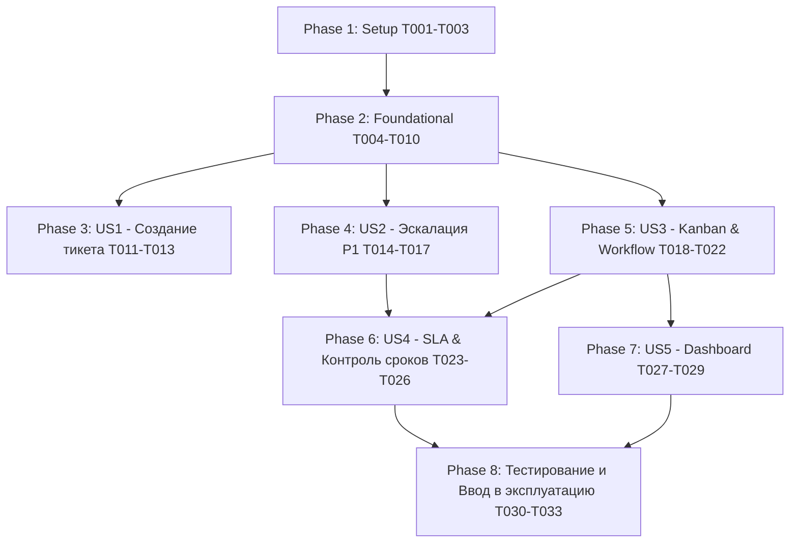

# Tasks: Проект «Ургент линия» в Jira Software

**Input**: [spec.md](file:///d:/Anti/specs/003-urgent-line-jira/spec.md), [plan.md](file:///d:/Anti/specs/003-urgent-line-jira/plan.md), [data-model.md](file:///d:/Anti/specs/003-urgent-line-jira/data-model.md), [contracts/](file:///d:/Anti/specs/003-urgent-line-jira/contracts/)

---

## Phase 1: Setup (Инициализация и базовая структура проекта)

**Purpose**: Создание проекта в Jira Software, привязка базовых схем и справочников.

- [ ] T001 [TASK-01] Создать проект Jira Software «Ургент линия» с ключом `URG` и назначить Project Lead в `specs/003-urgent-line-jira/plan.md`
- [ ] T002 [P] [TASK-05] Создать и привязать схему приоритетов `URG: Priority Scheme` (P1 — Критический, P2 — Высокий, P3 — Средний, P4 — Низкий) в соответствии со спецификацией [data-model.md](file:///d:/Anti/specs/003-urgent-line-jira/data-model.md)
- [ ] T003 [P] [TASK-03] Создать тип задачи `Ургентный инцидент` (Urgent Incident) и схему типов `URG: Issue Type Scheme` в соответствии со спецификацией [data-model.md](file:///d:/Anti/specs/003-urgent-line-jira/data-model.md)

---

## Phase 2: Foundational (Поля, Безопасность и Доступы)

**Purpose**: Настройка критической инфраструктуры данных, полей и разграничения доступа (блокирует работу всех пользовательских сценариев).

- [ ] T004 [TASK-04] Создать кастомное поле `Тип инцидента` (Single Select) со справочником из 11 критических категорий в соответствии со спецификацией [data-model.md](file:///d:/Anti/specs/003-urgent-line-jira/data-model.md)
- [ ] T005 [P] [TASK-04] Создать и сконфигурировать специализированные поля инцидента (Дата/время происшествия, Торговая точка, Город, Контакт клиента, Угроза госорганов, Угроза СМИ/соцсети, Ссылка на публикацию, Количество пострадавших, Резолюция) в соответствии со спецификацией [data-model.md](file:///d:/Anti/specs/003-urgent-line-jira/data-model.md)
- [ ] T006 [TASK-04] Сформировать экранную форму `URG: Incident Screen` с группировкой по 4 вкладкам (Основное, Локация/Контекст, Заявитель/Риски, Резолюция) и назначить на операции Create/Edit/View в [plan.md](file:///d:/Anti/specs/003-urgent-line-jira/plan.md)
- [ ] T007 [TASK-07] Создать системную группу пользователей `Urgent Team` и добавить персональные аккаунты сотрудников отдела жалоб и ургентологов в соответствии со спецификацией [data-model.md](file:///d:/Anti/specs/003-urgent-line-jira/data-model.md)
- [ ] T008 [P] [TASK-08] Создать проектную роль `Urgent Managers` и назначить в нее ответственных руководителей и дежурных Incident Commander в [data-model.md](file:///d:/Anti/specs/003-urgent-line-jira/data-model.md)
- [ ] T009 [TASK-08] Сконфигурировать схему прав `URG: Permission Scheme`, закрыв право `Browse Projects` от групп `Anyone` и `jira-software-users`, и заблокировать удаление тикетов (`Delete Issues = NONE`) в [plan.md](file:///d:/Anti/specs/003-urgent-line-jira/plan.md)
- [ ] T010 [TASK-09] Настроить схему безопасности задач `URG: Issue Security Scheme` с уровнями `Confidential` и `Restricted` для изоляции особо чувствительных инцидентов в соответствии со спецификацией [data-model.md](file:///d:/Anti/specs/003-urgent-line-jira/data-model.md)

---

## Phase 3: User Story 1 - Создание и регистрация ургентного тикета (Priority: P1) 🎯 MVP

**Goal**: Предоставить сотрудникам отдела жалоб возможность зарегистрировать ургентный тикет с заполнением 15 полей контекста менее чем за 90 секунд.

**Independent Test**: Создание тикета через интерфейс Jira / REST API; тикет получает ключ `URG-###`, статус `Новый` и валидирует заполнение обязательных полей (см. [quickstart.md](file:///d:/Anti/specs/003-urgent-line-jira/quickstart.md) Сценарий 2).

- [ ] T011 [US1] Настроить поведение полей (Field Configuration Scheme): установить обязательность для полей Summary, Description, Priority, Incident Type, Branch, City, Customer Contact, Incident Timestamp в [plan.md](file:///d:/Anti/specs/003-urgent-line-jira/plan.md)
- [ ] T012 [P] [US1] Настроить условную валидацию поля `Ссылка на публикацию` при значении флага `Угроза СМИ/соцсетей = Да` в [data-model.md](file:///d:/Anti/specs/003-urgent-line-jira/data-model.md)
- [ ] T013 [US1] Провести тестовую регистрацию тикета инцидента через API по спецификации [jira-api-contract.json](file:///d:/Anti/specs/003-urgent-line-jira/contracts/jira-api-contract.json)

---

## Phase 4: User Story 2 - Мгновенная эскалация P1 и экстренные уведомления (Priority: P1)

**Goal**: Реализовать возможность прямой эскалации инцидентов P1 в 1 клик с немедленной доставкой экстренных уведомлений ответственному и руководителю (≤ 60 сек).

**Independent Test**: Перевод тикета P1 из статуса `Новый` напрямую в `Эскалирован`; подтверждение отправки алертов и фиксация события в аудит-логе (см. [quickstart.md](file:///d:/Anti/specs/003-urgent-line-jira/quickstart.md) Сценарий 2).

- [ ] T014 [US2] [TASK-06] Сконфигурировать прямой переход рабочего процесса `Новый → Эскалирован` с условием доступности только для тикетов с приоритетом `P1 — Критический` в [plan.md](file:///d:/Anti/specs/003-urgent-line-jira/plan.md)
- [ ] T015 [P] [US2] [TASK-10] Сконфигурировать схему уведомлений `URG: Notification Scheme` и триггеры Jira Automation для отправки экстренного алерта ответственному и руководителю при возникновении P1 в [plan.md](file:///d:/Anti/specs/003-urgent-line-jira/plan.md)
- [ ] T016 [P] [US2] [TASK-10] Настроить уведомление назначенному исполнителю при создании или назначении тикета с приоритетом `P2 — Высокий` в [plan.md](file:///d:/Anti/specs/003-urgent-line-jira/plan.md)
- [ ] T017 [US2] [TASK-11] Реализовать автоматическое правило аварийной эскалации (Deadlock Watchdog): отправка повторного алерта руководителю при нахождении P1 без движения более 5 минут по фильтру из [dashboard-jql-contract.md](file:///d:/Anti/specs/003-urgent-line-jira/contracts/dashboard-jql-contract.md)

---

## Phase 5: User Story 3 - Управление жизненным циклом инцидентов на Kanban-доске (Priority: P2)

**Goal**: Обеспечить визуальное ведение инцидентов через полный жизненный цикл на Kanban-доске с контролем фиксации принятых решений.

**Independent Test**: Последовательное перемещение карточки по колонкам Kanban-доски, проверка обязательности заполнения резолюции при закрытии (см. [quickstart.md](file:///d:/Anti/specs/003-urgent-line-jira/quickstart.md) Сценарий 3).

- [ ] T018 [US3] [TASK-02] Создать и настроить Kanban-доску «Ургент линия» с 7 колонками (`Новые`, `Приняты в работу`, `Эскалированы`, `В работе`, `Ожидание`, `Решение принято`, `Закрыты`) в [plan.md](file:///d:/Anti/specs/003-urgent-line-jira/plan.md)
- [ ] T019 [P] [US3] [TASK-02] Настроить цветовую дифференциацию карточек Kanban (Card Colors) по приоритетам: P1 — красный (`#FF0000`), P2 — оранжевый (`#FF8C00`) в [research.md](file:///d:/Anti/specs/003-urgent-line-jira/research.md)
- [ ] T020 [US3] [TASK-06] Сконфигурировать полный граф Workflow со статусами `Новый`, `Принят в работу`, `Эскалирован`, `В работе`, `Ожидание информации`, `Решение принято`, `Закрыт` в соответствии с [data-model.md](file:///d:/Anti/specs/003-urgent-line-jira/data-model.md)
- [ ] T021 [US3] [TASK-06] Добавить экран перехода `URG: Resolution Screen` с обязательным полем «Принятые меры / Резолюция» на переход в статус `Решение принято` в [data-model.md](file:///d:/Anti/specs/003-urgent-line-jira/data-model.md)
- [ ] T022 [US3] [TASK-06] Настроить ограничение на переход `Решение принято → Закрыт`: доступно только для роли `Urgent Managers` в соответствии с [data-model.md](file:///d:/Anti/specs/003-urgent-line-jira/data-model.md)

---

## Phase 6: User Story 4 - Контроль сроков и автоматический расчет SLA (Priority: P2)

**Goal**: Внедрить непрерывный учет времени реакции и решения для P1/P2 с автоматической паузой и предупреждением просрочек.

**Independent Test**: Проверка автоматического старта таймеров SLA при создании, фиксация паузы в статусе `Ожидание информации` и остановки таймера при резолюции (см. [quickstart.md](file:///d:/Anti/specs/003-urgent-line-jira/quickstart.md) Сценарий 3).

- [ ] T023 [US4] [TASK-11] Настроить календарь и метрики SLA для `P1`: Time to First Response ≤ 15 мин, Time to Resolution ≤ 2 часа (24/7/365) в [data-model.md](file:///d:/Anti/specs/003-urgent-line-jira/data-model.md)
- [ ] T024 [P] [US4] [TASK-11] Настроить календарь и метрики SLA для `P2`: Time to First Response ≤ 30 мин, Time to Resolution ≤ 4 часа (08:00–22:00) в [data-model.md](file:///d:/Anti/specs/003-urgent-line-jira/data-model.md)
- [ ] T025 [US4] [TASK-11] Настроить условие паузы (Stop/Pause Condition) для всех таймеров SLA при нахождении тикета в статусе `Ожидание информации` в [data-model.md](file:///d:/Anti/specs/003-urgent-line-jira/data-model.md)
- [ ] T026 [P] [US4] [TASK-11] Настроить автоматические предупреждающие триггеры и метки `#sla-warning-75` и `#sla-warning-90` при исчерпании лимита времени в [research.md](file:///d:/Anti/specs/003-urgent-line-jira/research.md)

---

## Phase 7: User Story 5 - Аналитический мониторинг через Dashboard (Priority: P3)

**Goal**: Развернуть операционную панель мониторинга с 9 информационными блоками для руководства и дежурной смены.

**Independent Test**: Открытие панели «Dashboard: Ургент линия» и проверка актуальности данных во всех 9 виджетах (см. [quickstart.md](file:///d:/Anti/specs/003-urgent-line-jira/quickstart.md) Сценарий 4).

- [ ] T027 [US5] [TASK-12] Создать JQL-фильтры для виджетов «Активные P1», «Активные P2», «Все открытые тикеты» и «Просроченные тикеты» в соответствии со спецификацией [dashboard-jql-contract.md](file:///d:/Anti/specs/003-urgent-line-jira/contracts/dashboard-jql-contract.md)
- [ ] T028 [P] [US5] [TASK-12] Создать JQL-фильтры для аналитических счетчиков и распределения по типам и торговым точкам по спецификации [dashboard-jql-contract.md](file:///d:/Anti/specs/003-urgent-line-jira/contracts/dashboard-jql-contract.md)
- [ ] T029 [US5] [TASK-12] Скомпоновать Dashboard «Ургент линия», добавить все 9 гаджетов и настроить права совместного доступа для группы `Urgent Team` и `Urgent Managers` в [dashboard-jql-contract.md](file:///d:/Anti/specs/003-urgent-line-jira/contracts/dashboard-jql-contract.md)

---

## Phase 8: Polish, Комплексное тестирование и Ввод в эксплуатацию

**Purpose**: Сквозная приемочная валидация функциональности, проверка барьеров безопасности и сдача проекта.

- [ ] T030 [TASK-13] Провести функциональное приемочное тестирование создания, эскалации P1 и прохождения сценариев P2 по чек-листу [quickstart.md](file:///d:/Anti/specs/003-urgent-line-jira/quickstart.md)
- [ ] T031 [P] [TASK-14] Провести тестирование изоляции прав доступа, закрытия видимости от внешних пользователей и проверки неизменяемости автора по чек-листу [quickstart.md](file:///d:/Anti/specs/003-urgent-line-jira/quickstart.md)
- [ ] T032 [TASK-15] Подготовить регламент работы дежурной смены и инструкцию оператора отдела жалоб в `specs/003-urgent-line-jira/quickstart.md`
- [ ] T033 [TASK-15] Провести инструктаж сотрудников группы `Urgent Team` и подписать протокол ввода проекта в промышленную эксплуатацию в [plan.md](file:///d:/Anti/specs/003-urgent-line-jira/plan.md)

---

## Dependencies & Execution Order



### Порядок выполнения фаз
1. **Фаза 1 (Setup)**: Старт без внешних зависимостей.
2. **Фаза 2 (Foundational)**: Зависит от Setup. Блокирует реализацию всех пользовательских историй.
3. **Фазы 3, 4, 5 (User Stories US1, US2, US3)**: Могут выполняться параллельно после завершения Фазы 2.
4. **Фазы 6, 7 (SLA и Dashboard)**: Зависят от готовности Workflow и полей.
5. **Фаза 8 (Testing & Rollout)**: Завершающая фаза сквозного тестирования и ввода в эксплуатацию.

---

## Parallel Execution Opportunities

```bash
# Параллельные задачи в Phase 1 (Setup):
Task T002: "Настроить приоритеты P1–P4"
Task T003: "Создать тип задачи Ургентный инцидент"

# Параллельные задачи в Phase 2 (Foundational):
Task T005: "Создать и настроить специализированные поля инцидента"
Task T008: "Создать проектную роль Urgent Managers"

# Параллельные задачи в Phase 4 (Эскалация и Уведомления):
Task T015: "Настроить уведомления P1 для ответственного и руководителя"
Task T016: "Настроить уведомление P2 для ответственного"

# Параллельные задачи в Phase 6 (SLA):
Task T023: "Настроить SLA P1 (24/7)"
Task T024: "Настроить SLA P2 (расширенный график)"
```

---

## Implementation Strategy: MVP First

1. **Этап 1 (MVP)**: Завершить Фазы 1, 2 и 3 (T001–T013). На данном этапе отдел жалоб уже получает возможность надежно фиксировать критические инциденты со всеми 15 обязательными полями.
2. **Этап 2 (Fast-Response)**: Завершить Фазу 4 (T014–T017) — активация мгновенной эскалации P1 и экстренных алертов.
3. **Этап 3 (Full Lifecycle & SLA)**: Завершить Фазы 5 и 6 (T018–T026) — запуск Kanban-доски и расчет SLA.
4. **Этап 4 (Analytics & Verification)**: Завершить Фазы 7 и 8 (T027–T033) — запуск Dashboard, приемочное тестирование и передача в эксплуатацию.
