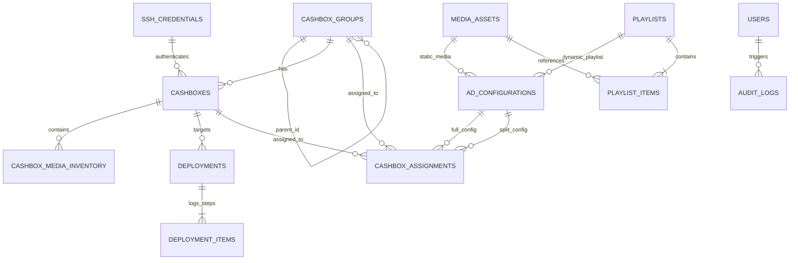

# Data Model Specification: Centralized Advertising Content Management for UCS GuestScreen

**Feature**: `004-gs-ad-content-management`  
**Database**: PostgreSQL 16 (Authoritative Source of Truth)  
**ORM**: SQLAlchemy 2.x (Async Declarative Base + asyncpg)  
**Spec Reference**: [spec.md](./spec.md) | [research.md](./research.md)

---

## 1. Entity-Relationship Diagram (Mermaid)

---

## 2. Table Schemas & Data Types

### 2.1 `ssh_credentials`
Stores encrypted credentials for accessing cashbox monoblocks. Plaintext is never stored.

| Column | Type | Constraints | Description |
| :--- | :--- | :--- | :--- |
| `id` | UUID | PK, DEFAULT gen_random_uuid() | Unique credential identifier |
| `name` | VARCHAR(100) | NOT NULL | Human-readable label |
| `auth_type` | VARCHAR(20) | NOT NULL, CHECK in ('PASSWORD', 'SSH_KEY') | Authentication mechanism |
| `username` | VARCHAR(100) | NOT NULL | Windows POS OS username |
| `encrypted_secret` | BYTEA | NOT NULL | AES-256-GCM encrypted secret payload |
| `secret_iv` | BYTEA | NULLABLE | 12-byte initialization vector / nonce |
| `passphrase_encrypted` | BYTEA | NULLABLE | Encrypted private key passphrase if applicable |
| `key_fingerprint` | VARCHAR(100) | NULLABLE | SHA256 fingerprint for public key identification |
| `created_at` | TIMESTAMPTZ | NOT NULL, DEFAULT NOW() | Record creation timestamp |
| `updated_at` | TIMESTAMPTZ | NOT NULL, DEFAULT NOW() | Last update timestamp |

### 2.2 `system_settings`
System-wide operational parameters.

| Column | Type | Constraints | Description |
| :--- | :--- | :--- | :--- |
| `key` | VARCHAR(100) | PK | Setting key (e.g. `concurrency_settings`) |
| `value` | JSONB | NOT NULL | Value payload (e.g. `{"default_concurrency_pool": 4}`) |
| `description` | TEXT | NULLABLE | Description of purpose |
| `updated_at` | TIMESTAMPTZ | NOT NULL, DEFAULT NOW() | Last modification timestamp |

### 2.3 `cashbox_groups`
Hierarchical tree of cashbox locations (City → Branch / Restaurant).

| Column | Type | Constraints | Description |
| :--- | :--- | :--- | :--- |
| `id` | UUID | PK, DEFAULT gen_random_uuid() | Group ID |
| `name` | VARCHAR(100) | NOT NULL | Group name (e.g. "Ташкент - Чиланзар") |
| `parent_id` | UUID | FK -> cashbox_groups(id) ON DELETE SET NULL | Parent group for nested hierarchies |
| `created_at` | TIMESTAMPTZ | NOT NULL, DEFAULT NOW() | Creation timestamp |
| `updated_at` | TIMESTAMPTZ | NOT NULL, DEFAULT NOW() | Update timestamp |

### 2.4 `cashboxes`
Physical Windows POS cashier registers.

| Column | Type | Constraints | Description |
| :--- | :--- | :--- | :--- |
| `id` | UUID | PK, DEFAULT gen_random_uuid() | Cashbox identifier |
| `name` | VARCHAR(100) | NOT NULL | Cashbox name (e.g. "Касса 01") |
| `group_id` | UUID | FK -> cashbox_groups(id) ON DELETE RESTRICT | Assigned group / restaurant branch |
| `ip_address` | VARCHAR(45) | NOT NULL, UNIQUE | IPv4 address |
| `hostname` | VARCHAR(100) | NULLABLE | DNS hostname |
| `ssh_port` | INTEGER | NOT NULL, DEFAULT 22 | OpenSSH server port |
| `ssh_credential_id` | UUID | FK -> ssh_credentials(id) ON DELETE RESTRICT | Bound SSH credential |
| `guest_screen_version`| VARCHAR(50) | DEFAULT '3.1.1.0' | Detected GuestScreen software version |
| `os_info` | VARCHAR(150) | NULLABLE | Detected Windows build / edition |
| `status` | VARCHAR(20) | NOT NULL, DEFAULT 'OFFLINE' | `ONLINE`, `OFFLINE`, `UNREACHABLE` |
| `sync_status` | VARCHAR(30) | NOT NULL, DEFAULT 'PENDING_UPDATE' | `SYNCHRONIZED`, `PENDING_UPDATE`, `IN_PROGRESS`, `ERROR` |
| `current_full_version`| INTEGER | DEFAULT 0 | Currently active Full Screen version on cashier |
| `current_split_version`| INTEGER | DEFAULT 0 | Currently active 50/50 version on cashier |
| `last_seen_at` | TIMESTAMPTZ | NULLABLE | Timestamp of last successful SSH contact |
| `created_at` | TIMESTAMPTZ | NOT NULL, DEFAULT NOW() | Creation timestamp |
| `updated_at` | TIMESTAMPTZ | NOT NULL, DEFAULT NOW() | Update timestamp |

### 2.5 `media_assets`
Metadata for uploaded promotional imagery stored in the central filesystem.

| Column | Type | Constraints | Description |
| :--- | :--- | :--- | :--- |
| `id` | UUID | PK, DEFAULT gen_random_uuid() | Asset identifier |
| `original_filename` | VARCHAR(255) | NOT NULL | Name of uploaded file |
| `storage_filename` | VARCHAR(255) | NOT NULL, UNIQUE | Sanitized safe name (`^[a-zA-Z0-9_\-\.]+$`) |
| `storage_path` | VARCHAR(512) | NOT NULL | Path in central media filesystem |
| `file_size_bytes` | BIGINT | NOT NULL | Exact byte length |
| `mime_type` | VARCHAR(100) | NOT NULL, CHECK in ('image/jpeg', 'image/png', 'image/webp') | Validated image MIME |
| `sha256_hash` | CHAR(64) | NOT NULL, INDEX | Hex-encoded SHA-256 digest |
| `width` | INTEGER | NOT NULL | Resolution width (1024 or 512) |
| `height` | INTEGER | NOT NULL | Resolution height (768) |
| `status` | VARCHAR(30) | NOT NULL, DEFAULT 'ACTIVE' | `ACTIVE`, `ARCHIVED` |
| `created_at` | TIMESTAMPTZ | NOT NULL, DEFAULT NOW() | Upload timestamp |
| `updated_at` | TIMESTAMPTZ | NOT NULL, DEFAULT NOW() | Update timestamp |

### 2.6 `playlists` & `playlist_items`
Reusable dynamic rotation playlists.

**`playlists`**:
- `id` (UUID, PK)
- `name` (VARCHAR(100))
- `description` (TEXT)
- `display_type` (VARCHAR(20), CHECK in ('FULL_SCREEN', 'SPLIT_50_50'))
- `default_interval_sec` (INTEGER, NOT NULL, DEFAULT 5)
- `version` (INTEGER, NOT NULL, DEFAULT 1)
- `created_at`, `updated_at` (TIMESTAMPTZ)

**`playlist_items`**:
- `id` (UUID, PK)
- `playlist_id` (UUID, FK -> playlists(id) ON DELETE CASCADE)
- `media_asset_id` (UUID, FK -> media_assets(id) ON DELETE RESTRICT)
- `sort_order` (INTEGER, NOT NULL)
- `duration_sec` (INTEGER, NULLABLE)
- UNIQUE (`playlist_id`, `sort_order`)

### 2.7 `ad_configurations`
Discrete advertising configurations for Full Screen or 50/50.

- `id` (UUID, PK)
- `name` (VARCHAR(100), NOT NULL)
- `mode` (VARCHAR(20), NOT NULL, CHECK in ('FULL_SCREEN', 'SPLIT_50_50'))
- `content_type` (VARCHAR(20), NOT NULL, CHECK in ('STATIC', 'DYNAMIC'))
- `media_asset_id` (UUID, NULLABLE, FK -> media_assets(id))
- `playlist_id` (UUID, NULLABLE, FK -> playlists(id))
- `version` (INTEGER, NOT NULL, DEFAULT 1)
- `is_published` (BOOLEAN, NOT NULL, DEFAULT FALSE)
- `created_at`, `updated_at` (TIMESTAMPTZ)
- *Constraint*: `CHECK ((content_type = 'STATIC' AND media_asset_id IS NOT NULL AND playlist_id IS NULL) OR (content_type = 'DYNAMIC' AND playlist_id IS NOT NULL AND media_asset_id IS NULL))`

### 2.8 `cashbox_assignments`
Mapping configurations to individual cashboxes or groups.

- `id` (UUID, PK)
- `cashbox_id` (UUID, NULLABLE, FK -> cashboxes(id) ON DELETE CASCADE)
- `group_id` (UUID, NULLABLE, FK -> cashbox_groups(id) ON DELETE CASCADE)
- `full_configuration_id` (UUID, FK -> ad_configurations(id))
- `split_configuration_id` (UUID, FK -> ad_configurations(id))
- `assigned_at` (TIMESTAMPTZ)
- *Constraint*: `CHECK ((cashbox_id IS NOT NULL AND group_id IS NULL) OR (group_id IS NOT NULL AND cashbox_id IS NULL))`

### 2.9 `cashbox_media_inventory`
Live inventory of actual files residing on the cashbox filesystem (`C:\UCS\GuestScreen\Front\media\uploads\`).

- `id` (UUID, PK)
- `cashbox_id` (UUID, FK -> cashboxes(id) ON DELETE CASCADE)
- `filename` (VARCHAR(255), NOT NULL)
- `file_size_bytes` (BIGINT, NOT NULL)
- `sha256_hash` (CHAR(64), NOT NULL)
- `modified_at` (TIMESTAMPTZ, NOT NULL)
- `scanned_at` (TIMESTAMPTZ, NOT NULL, DEFAULT NOW())
- UNIQUE (`cashbox_id`, `filename`)

### 2.10 `deployments` & `deployment_items`
Persistent deployment records with state machine transitions and audit steps.

**`deployments`**:
- `id` (UUID, PK)
- `cashbox_id` (UUID, FK -> cashboxes(id) ON DELETE RESTRICT)
- `target_full_version` (INTEGER)
- `target_split_version` (INTEGER)
- `status` (VARCHAR(30), CHECK in ('PENDING', 'RUNNING', 'VERIFYING', 'SUCCESS', 'FAILED', 'ROLLING_BACK', 'ROLLED_BACK', 'CANCELLED', 'FAILED_MANUAL_INTERVENTION', 'NO_OP'))
- `error_message` (TEXT, NULLABLE)
- `rollback_reason` (TEXT, NULLABLE)
- `previous_state_snapshot` (JSONB, NOT NULL)
- `started_at` (TIMESTAMPTZ, NOT NULL, DEFAULT NOW())
- `completed_at` (TIMESTAMPTZ, NULLABLE)

**`deployment_items`**:
- `id` (UUID, PK)
- `deployment_id` (UUID, FK -> deployments(id) ON DELETE CASCADE)
- `step_number` (INTEGER, NOT NULL)
- `step_name` (VARCHAR(50), NOT NULL)
- `status` (VARCHAR(20), CHECK in ('SUCCESS', 'FAILED', 'SKIPPED'))
- `duration_ms` (INTEGER, NOT NULL, DEFAULT 0)
- `log_output` (TEXT, NULLABLE)
- `created_at` (TIMESTAMPTZ, NOT NULL, DEFAULT NOW())

### 2.11 `audit_logs`
Immutable compliance audit trail.

- `id` (BIGSERIAL, PK)
- `user_id` (UUID, NULLABLE)
- `action` (VARCHAR(100), NOT NULL)
- `entity_type` (VARCHAR(50), NOT NULL)
- `entity_id` (VARCHAR(100), NOT NULL)
- `details` (JSONB)
- `ip_address` (VARCHAR(45))
- `timestamp` (TIMESTAMPTZ, NOT NULL, DEFAULT NOW())