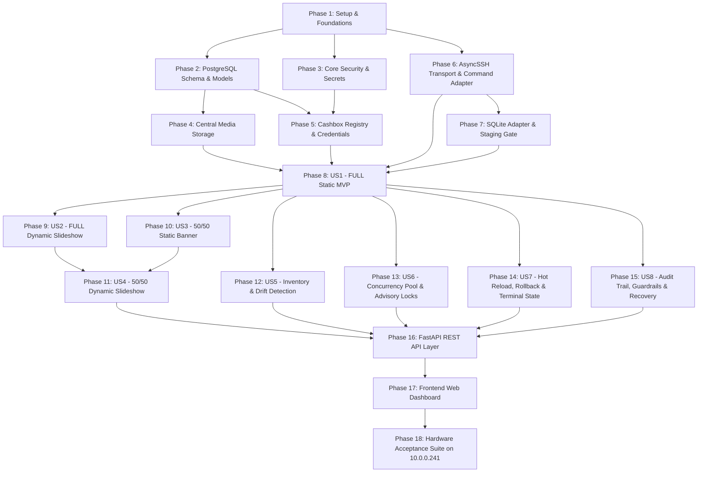

# Implementation Tasks: Centralized UCS GuestScreen Advertising Content Management

**Feature Identifier**: `004-gs-ad-content-management`  
**Central Server Host**: Dedicated On-Premise Host `10.0.0.111`  
**Operating System**: Linux Host (Server) / Windows 10/11 Monoblocks (Cashboxes)  
**Database**: PostgreSQL 16 (Authoritative Persistent Source of Truth)  
**Backend Framework**: Python 3.13 | FastAPI | Pydantic v2 | SQLAlchemy 2.x | asyncpg | AsyncSSH  
**Target Cashier Fleet**: 200+ POS Monoblocks running UCS GuestScreen v3.1.1.0  
**Acceptance Test Cashier**: `10.0.0.241` (Physical Cashbox with GuestScreen 3.1.1.0)  
**Spec References**: [spec.md](./spec.md) | [plan.md](./plan.md) | [data-model.md](./data-model.md) | [research.md](./research.md) | [contracts/api.yaml](./contracts/api.yaml) | [contracts/cashbox-command-adapter.md](./contracts/cashbox-command-adapter.md) | [quickstart.md](./quickstart.md)  
**Status**: Ready for Implementation (Tasks Generation Stage)

---

## Strict Scope Boundaries & Retail Safety Constraints

Before undertaking any implementation task, all developers, autonomous subagents, and test runners MUST adhere to the following inviolable retail safety boundaries:

1. **Advertising-Only Scope**: The system centrally manages **ONLY** advertising media and scene metadata for:
   - **FULL SCREEN** standby mode (`1024×768`, Scene GUID `2509359c-2d71-4344-9be4-7d90dd453083`).
   - **50/50 Promo Block** during active customer orders (`512×768`, Scene GUID `68906ed2-49a3-4dc3-bb8a-6fa7943f39c3`).
2. **Zero Cashbox Database Replacement**: The system MUST NEVER copy, replace, recreate, or overwrite `C:\UCS\GuestScreen\gs.db` in its entirety.
3. **Protected Cashbox Tables**: Modifying `licenses`, `screens`, `scenarios`, `settings`, or r_keeper/order tables in `gs.db` is strictly prohibited. Modifying `gs.db` is permitted ONLY via surgical, parameterized SQL UPDATE against the two advertising scene GUIDs.
4. **No Remote Arbitrary Shell**: All cashbox SSH operations are strictly restricted to typed, pre-authorized command definitions in `CashboxCommandAdapter`. Arbitrary bash/cmd/PowerShell strings are strictly blocked.
5. **No Master Key Leakage**: `APP_MASTER_KEY` / `GS_MASTER_KEY` is loaded exclusively from process environment variables or a restricted root key file. It is NEVER written to PostgreSQL, Git, logs, or API responses.
6. **No Production Code in Planning/Tasks**: This document defines actionable engineering work. Execution proceeds sequentially task-by-task.

---

## Phase 1: Setup & Project Foundation (Shared Infrastructure)

**Purpose**: Establish repository structure, dependencies, foundational configurations, structured logging, and test harness.

- [x] T001 Initialize Python 3.13 backend repository structure and dependency management in `backend/pyproject.toml`
  - **Title**: Initialize Backend Repository Layout and Dependencies
  - **Purpose**: Bootstrap Python 3.13 project structure with strict dependency locks and environment templates per plan.md Section 4.
  - **Requirement References**: FR-001, NFR-001; plan.md Section 4
  - **Dependencies**: None
  - **Files Expected**: `backend/pyproject.toml`, `backend/requirements.txt`, `backend/.env.example`, `backend/.gitignore`, `backend/src/__init__.py`
  - **Implementation Notes**: Include `fastapi>=0.115.0`, `uvicorn>=0.30.0`, `sqlalchemy>=2.0.32`, `asyncpg>=0.29.0`, `asyncssh>=2.17.0`, `pydantic>=2.8.0`, `pydantic-settings>=2.4.0`, `cryptography>=43.0.0`, `alembic>=1.13.2`, `pillow>=10.4.0`, `pytest>=8.3.0`, `pytest-asyncio>=0.23.8`.
  - **Acceptance Criteria**: Running `pip install -r backend/requirements.txt` succeeds; Python 3.13 runtime imports all libraries without version conflicts.
  - **Tests Required**: Smoke test verifying module imports in `backend/tests/test_bootstrap.py`.

- [x] T002 [P] Implement core configuration module using Pydantic v2 Settings in `backend/src/core/config.py`
  - **Title**: Core Settings and Environment Configuration
  - **Purpose**: Strongly typed configuration class loading PostgreSQL DSN, secret key paths, storage root, timeouts, and concurrency pool sizes.
  - **Requirement References**: FR-023, FR-024; plan.md Section 3, Section 4
  - **Dependencies**: T001
  - **Files Expected**: `backend/src/core/config.py`
  - **Implementation Notes**: Define `Settings` class with `POSTGRES_HOST`, `POSTGRES_PORT`, `POSTGRES_DB`, `POSTGRES_USER`, `POSTGRES_PASSWORD`, `GS_MASTER_KEY`, `GS_MASTER_KEY_FILE`, `MEDIA_STORAGE_PATH`, `DEFAULT_CONCURRENCY_LIMIT` (default 4), `HOT_RELOAD_TIMEOUT_SEC` (default 15). Validate paths on startup.
  - **Acceptance Criteria**: Config parses valid environment variables and falls back to safe defaults; missing database credentials raise validation errors.
  - **Tests Required**: Unit tests in `backend/tests/unit/test_config.py` verifying fallback defaults and validation constraints.

- [x] T003 [P] Define domain, safety, and security exceptions hierarchy in `backend/src/core/exceptions.py`
  - **Title**: Domain Exceptions and Safety Guardrail Errors
  - **Purpose**: Centralize strongly typed exceptions across security, transport, SQLite, validation, and rollback domains.
  - **Requirement References**: FR-008, FR-012, FR-015, FR-024; plan.md Section 4, Section 22
  - **Dependencies**: T001
  - **Files Expected**: `backend/src/core/exceptions.py`
  - **Implementation Notes**: Create `GuestScreenError` base exception; subclass `SafetyBoundaryViolationError`, `UnauthorizedCommandError`, `MasterKeyMissingError`, `CashboxOfflineError`, `StagingVerificationFailedError`, `SQLiteBusyTimeoutError`, `ProcessCrashDetectedError`, `RollbackFailedError`, `IdempotentNoOpException`.
  - **Acceptance Criteria**: All business exceptions inherit from `GuestScreenError` and serialize cleanly to JSON error payloads.
  - **Tests Required**: Unit tests in `backend/tests/unit/test_exceptions.py`.

- [x] T004 [P] Implement structured JSON logger and secret masking filters in `backend/src/core/logging.py`
  - **Title**: Structured Logging Engine with Secret Redaction
  - **Purpose**: Emit structured JSON logs with correlation IDs while guaranteeing that passwords, private keys, and `APP_MASTER_KEY` are never logged.
  - **Requirement References**: FR-024, FR-028; plan.md Section 10.4, Section 22
  - **Dependencies**: T001, T002
  - **Files Expected**: `backend/src/core/logging.py`
  - **Implementation Notes**: Build custom logging filter `SecretMaskingFilter` that regex-matches key fields (`password`, `private_key`, `secret`, `authorization`, `master_key`) and replaces their values with `***REDACTED***`.
  - **Acceptance Criteria**: Log output contains timestamps, log levels, correlation IDs, and masks all sensitive credential patterns.
  - **Tests Required**: Unit tests in `backend/tests/unit/test_logging.py` asserting that injected secrets are masked in log outputs.

- [x] T005 [P] Setup pytest test harness, fixtures, and async event loop configuration in `backend/tests/conftest.py`
  - **Title**: Pytest Test Infrastructure and Common Fixtures
  - **Purpose**: Provide reusable async test fixtures for SQLite in-memory, mock SSH sessions, temporary directories, and sample scenes.
  - **Requirement References**: NFR-004; plan.md Section 23
  - **Dependencies**: T001, T002, T003
  - **Files Expected**: `backend/tests/conftest.py`, `backend/pytest.ini`
  - **Implementation Notes**: Configure `@pytest_asyncio.fixture` for async database sessions, mock cashbox environments, and sample 1024×768 / 512×768 JPEG binary fixtures.
  - **Acceptance Criteria**: `pytest` executes without warnings and supports async tests with clean teardown.
  - **Tests Required**: Bootstrap test passing in `backend/tests/test_bootstrap.py`.

---

## Phase 2: PostgreSQL 16 Schema, Migrations & Domain Models (Foundational)

**Purpose**: Implement PostgreSQL 16 connection engine, 15 declarative SQLAlchemy 2.x domain models, constraints, and initial Alembic migration.

- [x] T006 Implement async SQLAlchemy 2.x database engine and session factory in `backend/src/core/database.py`
  - **Title**: Async Database Engine and Session Management
  - **Purpose**: Establish persistent connection pool to PostgreSQL 16 with asyncpg driver, transaction management, and advisory lock helpers.
  - **Requirement References**: FR-001, FR-021; plan.md Section 5.1
  - **Dependencies**: T001, T002
  - **Files Expected**: `backend/src/core/database.py`
  - **Implementation Notes**: Use `create_async_engine`, pool size 20, max overflow 10, `async_sessionmaker(expire_on_commit=False)`. Provide `get_db_session` dependency for FastAPI.
  - **Acceptance Criteria**: Engine establishes async connections to PostgreSQL 16; session automatically rolls back uncommitted transactions on exception.
  - **Tests Required**: Integration test verifying connection and session rollback in `backend/tests/integration/test_database.py`.

- [x] T007 Define DeclarativeBase, UUID primary keys, and timestamp mixins in `backend/src/models/base.py`
  - **Title**: Base Model Classes and Mixins
  - **Purpose**: Provide standardized primary keys (`UUIDv4`) and automated UTC `created_at` / `updated_at` fields across all domain entities.
  - **Requirement References**: plan.md Section 5.1
  - **Dependencies**: T006
  - **Files Expected**: `backend/src/models/base.py`, `backend/src/models/__init__.py`
  - **Implementation Notes**: Define `Base(AsyncAttrs, DeclarativeBase)`, `UUIDPrimaryKeyMixin` with `server_default=text("gen_random_uuid()")`, and `TimestampMixin`.
  - **Acceptance Criteria**: All models inherit unified timestamp and UUID behavior.
  - **Tests Required**: Unit tests verifying model inheritance in `backend/tests/unit/test_models_base.py`.

- [x] T008 [P] Implement Location, CashboxGroup, and Cashbox models in `backend/src/models/cashbox.py`
  - **Title**: Cashbox Fleet Domain Models
  - **Purpose**: Model locations (cities/regions), cashbox groups, and individual cashier nodes with IP, versions, and connection parameters.
  - **Requirement References**: FR-001, FR-019; plan.md Section 5.1
  - **Dependencies**: T007
  - **Files Expected**: `backend/src/models/cashbox.py`
  - **Implementation Notes**: Table `locations` (`code`, `name`), `cashbox_groups` (`code`, `name`), `cashboxes` (`ip_address`, `screen_resolution`, `gs_version`, `status`, `desired_version`, `actual_version`, `last_inventory_at`, `last_deployment_at`). Enforce `status` enum (`ACTIVE`, `MAINTENANCE`, `OFFLINE`, `UNREACHABLE`). Unique constraint on `ip_address`.
  - **Acceptance Criteria**: Relationship `cashboxes.location` and `cashboxes.group` properly mapped with cascade rules.
  - **Tests Required**: Integration test creating and querying cashboxes in `backend/tests/integration/test_cashbox_models.py`.

- [x] T009 [P] Implement SSHCredential model with ciphertext and salt storage in `backend/src/models/credential.py`
  - **Title**: SSH Credential Storage Model
  - **Purpose**: Persist encrypted SSH passwords and private keys with initialization vectors (IV/nonce) and authentication tags.
  - **Requirement References**: FR-024; plan.md Section 5.1, Section 10
  - **Dependencies**: T007
  - **Files Expected**: `backend/src/models/credential.py`
  - **Implementation Notes**: Fields: `auth_type` (`PASSWORD` or `KEY`), `username`, `ciphertext` (binary), `nonce` (12 bytes), `tag` (16 bytes), `key_fingerprint`. NEVER store plaintext secrets.
  - **Acceptance Criteria**: Model stores encrypted binary fields; plaintext representation is impossible without cryptographic key.
  - **Tests Required**: Integration test in `backend/tests/integration/test_credential_model.py`.

- [x] T010 [P] Implement MediaAsset model with SHA-256 and MIME metadata in `backend/src/models/media.py`
  - **Title**: Media Asset Entity Model
  - **Purpose**: Track centrally uploaded advertising images with SHA-256 digests, dimensions, MIME types, and storage paths.
  - **Requirement References**: FR-005, FR-006; plan.md Section 5.1
  - **Dependencies**: T007
  - **Files Expected**: `backend/src/models/media.py`
  - **Implementation Notes**: Fields: `filename`, `storage_path`, `sha256` (char 64, UNIQUE index), `file_size_bytes`, `mime_type`, `width`, `height`, `aspect_ratio`, `ad_mode` (`FULL`, `SPLIT`, `BOTH`).
  - **Acceptance Criteria**: Unique constraint prevents duplicate SHA-256 entries in media catalog.
  - **Tests Required**: Unit and integration tests in `backend/tests/integration/test_media_model.py`.

- [x] T011 [P] Implement Playlist, PlaylistItem, AdConfiguration, and ConfigurationAssignment models in `backend/src/models/playlist.py` and `backend/src/models/configuration.py`
  - **Title**: Playlist and Ad Configuration Domain Models
  - **Purpose**: Represent reusable playlists (static/dynamic), ordered items with intervals, versioned configurations, and entity assignments.
  - **Requirement References**: FR-002, FR-003, FR-004; plan.md Section 5.1
  - **Dependencies**: T007, T010
  - **Files Expected**: `backend/src/models/playlist.py`, `backend/src/models/configuration.py`
  - **Implementation Notes**: `playlists` (`ad_mode`, `is_dynamic`, `name`), `playlist_items` (`position`, `duration_seconds` default 5), `ad_configurations` (`version` integer, `full_playlist_id`, `split_playlist_id`), `configuration_assignments` (`cashbox_id`, `group_id`, `location_id`). Unique constraint on `(playlist_id, position)`.
  - **Acceptance Criteria**: Cascading deletes protect playlist-to-media integrity; configuration versioning is monotonically incrementable.
  - **Tests Required**: Integration test validating playlist item ordering constraints in `backend/tests/integration/test_playlist_models.py`.

- [x] T012 [P] Implement CashboxInventory model in `backend/src/models/inventory.py`
  - **Title**: Cashbox Inventory and Actual State Model
  - **Purpose**: Persist snapshot of actual files, hashes, scene versions, and unexpected files discovered on cashboxes during audits.
  - **Requirement References**: FR-007, FR-019; plan.md Section 5.1, Section 6
  - **Dependencies**: T007, T008
  - **Files Expected**: `backend/src/models/inventory.py`
  - **Implementation Notes**: Fields: `cashbox_id` (FK), `gs_db_sha256`, `sync_version_timestamp`, `full_scene_raw` (JSONB), `split_scene_raw` (JSONB), `media_files` (JSONB array of `{filename, sha256, size}`), `unexpected_files` (JSONB array), `audited_at`.
  - **Acceptance Criteria**: Provides complete relational model for diffing Desired State vs Actual State.
  - **Tests Required**: Integration test in `backend/tests/integration/test_inventory_model.py`.

- [x] T013 [P] Implement Deployment, DeploymentStep, and RollbackSnapshot models with CHECK constraints in `backend/src/models/deployment.py`
  - **Title**: Deployment Pipeline, Execution Steps, and Rollback Snapshot Models
  - **Purpose**: Model 17-step deployment execution, per-step timing, live step statuses, and immutable scene snapshots for rollback.
  - **Requirement References**: FR-008, FR-012, FR-013, FR-015; plan.md Section 5.1, Section 14
  - **Dependencies**: T007, T008, T011
  - **Files Expected**: `backend/src/models/deployment.py`
  - **Implementation Notes**: Enum `DeploymentStatus` (`PENDING`, `RUNNING`, `VERIFYING`, `SUCCESS`, `FAILED`, `ROLLING_BACK`, `ROLLED_BACK`, `CANCELLED`, `FAILED_MANUAL_INTERVENTION`, `NO_OP`). Table `deployment_steps` (`step_number` 1-17, `step_name`, `status`, `started_at`, `finished_at`, `error_message`). Table `rollback_snapshots` (`previous_full_scene`, `previous_split_scene`, `previous_version`). Check constraint ensuring valid status transitions.
  - **Acceptance Criteria**: Deployment entity captures full step execution history and links directly to rollback snapshots.
  - **Tests Required**: State transition constraint test in `backend/tests/integration/test_deployment_models.py`.

- [x] T014 Implement Immutable AuditLog and SystemSetting models, and generate initial Alembic migration in `backend/alembic/versions/0001_initial_schema.py`
  - **Title**: Audit Trail, System Settings Models, and Initial Alembic Migration
  - **Purpose**: Define audit log and system settings tables, and construct the complete initial database migration revision for all 15 tables.
  - **Requirement References**: FR-023, FR-027, FR-028; plan.md Section 5.1
  - **Dependencies**: T008, T009, T010, T011, T012, T013
  - **Files Expected**: `backend/src/models/audit.py`, `backend/alembic.ini`, `backend/alembic/env.py`, `backend/alembic/script.py.mako`, `backend/alembic/versions/0001_initial_schema.py`
  - **Implementation Notes**: Table `audit_logs` (`actor`, `action`, `entity_type`, `entity_id`, `details` JSONB, `ip_address`, `created_at`). Table `system_settings` (`key` PK, `value` JSONB, `description`). Include Alembic migration DDL with PostgreSQL triggers blocking `UPDATE` or `DELETE` on `audit_logs`.
  - **Acceptance Criteria**: Running `alembic upgrade head` creates all 15 tables, indexes, check constraints, and triggers in PostgreSQL 16 without errors.
  - **Tests Required**: Migration roundtrip test (`upgrade head` -> `downgrade base` -> `upgrade head`) in `backend/tests/integration/test_migrations.py`.

---

## Phase 3: Core Security, Secret Management & RBAC (Foundational)

**Purpose**: Implement AES-256-GCM encryption for SSH credentials, zero-leak master key provider, operator password hashing, and role-based access control.

- [x] T015 Implement master key provider loading APP_MASTER_KEY / GS_MASTER_KEY from env or file in `backend/src/core/security.py`
  - **Title**: Master Key Provider with Zero-Leakage Guarantee
  - **Purpose**: Provide cryptographic key loader that enforces 32-byte key length and prevents key exposure to logs, Git, or PostgreSQL.
  - **Requirement References**: FR-024; plan.md Section 10.1, Section 10.4
  - **Dependencies**: T002, T003
  - **Files Expected**: `backend/src/core/security.py`
  - **Implementation Notes**: Check `GS_MASTER_KEY` environment variable; if unset, read from file pointed to by `GS_MASTER_KEY_FILE`. Decode Base64/Hex to exactly 32 bytes. If key is missing or invalid, raise `MasterKeyMissingError` on startup. Exclude key from all `__repr__` and string formatters.
  - **Acceptance Criteria**: Key loads securely; missing key causes immediate startup failure with clear diagnostic; key cannot be printed via `str()` or `repr()`.
  - **Tests Required**: Unit tests in `backend/tests/unit/test_security_master_key.py`.

- [x] T016 [P] Implement AES-256-GCM encryption/decryption service for SSH credentials in `backend/src/core/crypto.py`
  - **Title**: AES-256-GCM Symmetric Cryptography Service
  - **Purpose**: Encrypt and decrypt SSH passwords and private keys using AES-256 in GCM mode with a fresh 12-byte initialization vector (nonce) per operation.
  - **Requirement References**: FR-024; plan.md Section 10.2
  - **Dependencies**: T015
  - **Files Expected**: `backend/src/core/crypto.py`
  - **Implementation Notes**: Use `cryptography.hazmat.primitives.ciphers.aead.AESGCM`. Function `encrypt_secret(plaintext: str) -> tuple[bytes, bytes, bytes]` returning `(ciphertext, nonce, tag)`. Function `decrypt_secret(ciphertext: bytes, nonce: bytes, tag: bytes) -> str`.
  - **Acceptance Criteria**: Encrypting the same plaintext twice produces different nonces and ciphertexts; tampering with tag or ciphertext raises decryption exception.
  - **Tests Required**: Unit tests in `backend/tests/unit/test_crypto_aes.py`.

- [x] T017 [P] Implement operator password hashing (PBKDF2/Argon2) and JWT token service in `backend/src/services/auth_service.py`
  - **Title**: Operator Authentication and JWT Token Generator
  - **Purpose**: Authenticate web operators, hash administrative passwords securely, and issue signed Bearer JWT tokens.
  - **Requirement References**: FR-026; plan.md Section 21.1
  - **Dependencies**: T006, T007, T015
  - **Files Expected**: `backend/src/services/auth_service.py`, `backend/src/models/user.py`
  - **Implementation Notes**: User entity (`username`, `password_hash`, `role`, `is_active`). Hash passwords with Argon2 or PBKDF2-HMAC-SHA256 (600,000 iterations). Issue JWT tokens with 12-hour expiration, signing with `HS256`.
  - **Acceptance Criteria**: Valid credentials return JWT token; incorrect password fails with 401; expired tokens are rejected.
  - **Tests Required**: Unit tests in `backend/tests/unit/test_auth_service.py`.

- [x] T018 [P] Implement FastAPI security dependencies and RBAC middleware in `backend/src/api/deps.py`
  - **Title**: RBAC Authentication Dependencies and Guards
  - **Purpose**: Inject authenticated user context into FastAPI routes and enforce role boundaries (`Admin` vs `Operator`).
  - **Requirement References**: FR-026; plan.md Section 21.1
  - **Dependencies**: T017
  - **Files Expected**: `backend/src/api/deps.py`
  - **Implementation Notes**: Define `get_current_user`, `require_admin`, `require_operator`. Extract Bearer token from `Authorization` header, decode JWT, query active user.
  - **Acceptance Criteria**: Unauthenticated requests to protected endpoints receive 401 Unauthorized; non-admin users attempting admin actions receive 403 Forbidden.
  - **Tests Required**: Unit tests in `backend/tests/unit/test_api_deps_rbac.py`.

- [x] T019 Implement comprehensive security test suite covering encryption, zero-leak master key, and auth guards in `backend/tests/unit/test_security.py`
  - **Title**: Security Verification Test Suite
  - **Purpose**: Ensure automated regression testing for all cryptographic guarantees, credential isolation, and role authorization.
  - **Requirement References**: FR-024, FR-026; plan.md Section 21, Section 23
  - **Dependencies**: T015, T016, T017, T018
  - **Files Expected**: `backend/tests/unit/test_security.py`
  - **Implementation Notes**: Test vectors for AES-256-GCM, corrupted ciphertext rejection, token tampering, and privilege escalation prevention.
  - **Acceptance Criteria**: 100% of security unit tests pass; no secret credentials leak into stdout or log records.
  - **Tests Required**: Execute `pytest backend/tests/unit/test_security.py`.

---

## Phase 4: Central Media Storage & Upload Service (Foundational)

**Purpose**: Implement decoupled media storage provider, central image upload, streaming SHA-256 calculation, image validation, and deduplication.

- [x] T020 Define StorageProvider Protocol in `backend/src/adapters/media_storage.py`
  - **Title**: Decoupled Storage Provider Protocol Definition
  - **Purpose**: Provide abstract storage interface allowing seamless substitution of local filesystem with S3/MinIO in future iterations.
  - **Requirement References**: FR-006; plan.md Section 7.1
  - **Dependencies**: T001
  - **Files Expected**: `backend/src/adapters/media_storage.py`
  - **Implementation Notes**: Define `@typing.runtime_checkable` class `StorageProvider(typing.Protocol)` with async methods `save(file_bytes: bytes, filename: str) -> str`, `get(storage_path: str) -> bytes`, `exists(storage_path: str) -> bool`, `delete(storage_path: str) -> bool`.
  - **Acceptance Criteria**: Protocol defines pure async interface; zero cloud SDK dependencies imported into domain logic.
  - **Tests Required**: Unit tests verifying protocol type compatibility in `backend/tests/unit/test_storage_protocol.py`.

- [x] T021 [P] Implement LocalFileSystemStorageProvider with path traversal protection in `backend/src/adapters/local_storage.py`
  - **Title**: Local Filesystem Media Storage Adapter
  - **Purpose**: Persist media binaries to local directory with strict path sanitization preventing directory traversal attacks.
  - **Requirement References**: FR-006, FR-024; plan.md Section 7.2
  - **Dependencies**: T002, T020
  - **Files Expected**: `backend/src/adapters/local_storage.py`
  - **Implementation Notes**: Check configured storage root path (`Settings.MEDIA_STORAGE_PATH`). Use `os.path.commonpath` or `pathlib.Path.resolve()` to ensure target file remains strictly inside root directory. Raise `SafetyBoundaryViolationError` on `../` escapes.
  - **Acceptance Criteria**: Files saved to disk cleanly; malicious filenames with relative paths (`../../etc/passwd`) are rejected with security errors.
  - **Tests Required**: Unit tests in `backend/tests/unit/test_local_storage.py`.

- [x] T022 [P] Implement media validation engine in `backend/src/services/media_validator.py`
  - **Title**: Image Format, Magic Bytes, and Resolution Validator
  - **Purpose**: Validate that uploaded media files are authentic JPEG or PNG images and verify pixel dimensions against supported modes (FULL 1024×768 vs 512×768).
  - **Requirement References**: FR-005, FR-006; plan.md Section 7.4
  - **Dependencies**: T003
  - **Files Expected**: `backend/src/services/media_validator.py`
  - **Implementation Notes**: Inspect file magic bytes (`FF D8 FF` for JPEG, `89 50 4E 47` for PNG). Use Pillow (`PIL.Image`) to parse image headers (`width`, `height`, `format`). Support FULL mode (strictly 1024×768 or 4:3) and SPLIT mode (strictly 512×768). Reject executables, scripts, SVGs, or corrupt files.
  - **Acceptance Criteria**: Valid 1024×768 JPEGs and 512×768 PNGs pass; animated GIFs, scripts disguised as images, and mismatched dimensions raise validation exceptions.
  - **Tests Required**: Unit tests in `backend/tests/unit/test_media_validator.py` with valid and invalid image byte arrays.

- [x] T023 Implement MediaService for upload, streaming SHA-256 calculation, and duplicate detection in `backend/src/services/media_service.py`
  - **Title**: Central Media Asset Management Service
  - **Purpose**: Coordinate upload validation, compute SHA-256 digests, detect duplicates in PostgreSQL catalog, and persist records.
  - **Requirement References**: FR-005, FR-006; plan.md Section 7.3
  - **Dependencies**: T006, T010, T020, T021, T022
  - **Files Expected**: `backend/src/services/media_service.py`
  - **Implementation Notes**: Method `upload_media(file_stream, filename, ad_mode) -> MediaAsset`. Calculate SHA-256 via `hashlib.sha256()` in chunks (64 KB). Check PostgreSQL for existing SHA-256. If found, return existing record (deduplication) without storing a second copy. Otherwise, save to storage and commit new `media_assets` row.
  - **Acceptance Criteria**: Identical file uploaded twice returns existing asset ID and SHA; distinct files are saved with unique storage paths.
  - **Tests Required**: Integration test verifying deduplication and database persistence in `backend/tests/integration/test_media_service.py`.

- [x] T024 [P] Implement media metadata and dimensions extractor in `backend/src/services/media_metadata.py`
  - **Title**: Media Metadata Extraction Utilities
  - **Purpose**: Extract detailed image metadata (bit depth, color space, filesize, orientation) for display in management dashboard.
  - **Requirement References**: FR-005; plan.md Section 7.4
  - **Dependencies**: T022
  - **Files Expected**: `backend/src/services/media_metadata.py`
  - **Implementation Notes**: Use Pillow to extract EXIF data (if present), normalize orientation, and return typed `MediaMetadata` dataclass.
  - **Acceptance Criteria**: Returns complete metadata dataclass without modifying original binary.
  - **Tests Required**: Unit tests in `backend/tests/unit/test_media_metadata.py`.

- [x] T025 Implement media unit and integration test suite in `backend/tests/unit/test_media_service.py`
  - **Title**: Media Service Test Suite
  - **Purpose**: Automate regression testing for image validation, storage, deduplication, and corruption handling.
  - **Requirement References**: FR-005, FR-006; plan.md Section 23
  - **Dependencies**: T020, T021, T022, T023, T024
  - **Files Expected**: `backend/tests/unit/test_media_service.py`
  - **Implementation Notes**: Test boundary cases: 0-byte upload, oversized files (> 50 MB), non-image binaries, and duplicate hashes.
  - **Acceptance Criteria**: All media service tests pass.
  - **Tests Required**: Execute `pytest backend/tests/unit/test_media_service.py`.

---

## Phase 5: Cashbox Registry & SSH Credential Management (Foundational)

**Purpose**: Implement cashbox fleet registry, geographical locations, cashbox groups, encrypted SSH credential management, and status tracking.

- [x] T026 Implement CashboxService for fleet management in `backend/src/services/cashbox_service.py`
  - **Title**: Cashbox Fleet Management Service
  - **Purpose**: Create, read, update, and organize cashier nodes, groups, and locations with IP address uniqueness enforcement.
  - **Requirement References**: FR-001, FR-019; plan.md Section 5.1, Section 6
  - **Dependencies**: T006, T008
  - **Files Expected**: `backend/src/services/cashbox_service.py`
  - **Implementation Notes**: Methods: `create_cashbox(...)`, `get_cashbox(id)`, `list_cashboxes(filter)`, `update_cashbox(id, ...)`, `delete_cashbox(id)`. Maintain unique IP constraint and foreign keys to `locations` and `cashbox_groups`.
  - **Acceptance Criteria**: CRUD operations succeed; duplicate IP registration raises a conflict exception.
  - **Tests Required**: Integration test in `backend/tests/integration/test_cashbox_service.py`.

- [x] T027 [P] Implement CredentialService for SSH keys and passwords in `backend/src/services/credential_service.py`
  - **Title**: Encrypted SSH Credential Service
  - **Purpose**: Provide secure interface for storing and retrieving cashbox SSH credentials, encrypting on write and decrypting on read via `SecretManager`.
  - **Requirement References**: FR-024; plan.md Section 10
  - **Dependencies**: T006, T009, T016
  - **Files Expected**: `backend/src/services/credential_service.py`
  - **Implementation Notes**: Method `create_credential(username, secret, auth_type) -> SSHCredential`. Encrypt secret via `crypto.encrypt_secret` before inserting into PostgreSQL. Method `get_decrypted_secret(credential_id) -> str`.
  - **Acceptance Criteria**: Plaintext password is never saved in the database; retrieved credential decrypts back to original string.
  - **Tests Required**: Integration test verifying encrypted credential roundtrip in `backend/tests/integration/test_credential_service.py`.

- [x] T028 [P] Implement cashbox status lifecycle and version tracking in `backend/src/services/cashbox_status_service.py`
  - **Title**: Cashbox Status and Version Synchronization Engine
  - **Purpose**: Track active, maintenance, and offline states, recording `desired_version`, `actual_version`, and synchronization drift.
  - **Requirement References**: FR-001, FR-007, FR-019; plan.md Section 6
  - **Dependencies**: T008, T026
  - **Files Expected**: `backend/src/services/cashbox_status_service.py`
  - **Implementation Notes**: Methods to transition statuses (`ACTIVE`, `MAINTENANCE`, `OFFLINE`, `UNREACHABLE`). Track whether `desired_version == actual_version` to identify out-of-sync cashboxes across the fleet.
  - **Acceptance Criteria**: State transitions update timestamps and trigger fleet statistics recalculation.
  - **Tests Required**: Unit tests in `backend/tests/unit/test_cashbox_status.py`.

- [x] T029 Implement SystemSettingService for global runtime parameters in `backend/src/services/setting_service.py`
  - **Title**: Dynamic System Settings Service
  - **Purpose**: Manage dynamic operational settings stored in PostgreSQL (default concurrency limit, timeouts, retry counts) without requiring service restarts.
  - **Requirement References**: FR-020, FR-023; plan.md Section 15.2
  - **Dependencies**: T006, T014
  - **Files Expected**: `backend/src/services/setting_service.py`
  - **Implementation Notes**: Methods `get_setting(key, default)`, `set_setting(key, value)`. Fall back to environment settings when key is not present in PostgreSQL.
  - **Acceptance Criteria**: Changing concurrency limit in PostgreSQL takes effect on subsequent deployment worker loops.
  - **Tests Required**: Integration test in `backend/tests/integration/test_setting_service.py`.

- [x] T030 Implement Cashbox registry integration test suite in `backend/tests/integration/test_cashbox_registry.py`
  - **Title**: Cashbox Registry and Grouping Integration Tests
  - **Purpose**: Validate fleet grouping, credential assignment, and filtering across locations.
  - **Requirement References**: FR-001, FR-019; plan.md Section 23
  - **Dependencies**: T026, T027, T028, T029
  - **Files Expected**: `backend/tests/integration/test_cashbox_registry.py`
  - **Implementation Notes**: Verify cascading group reassignments and credential association.
  - **Acceptance Criteria**: Full suite passes.
  - **Tests Required**: Execute `pytest backend/tests/integration/test_cashbox_registry.py`.

---

## Phase 6: AsyncSSH Transport & Typed Command Allowlist Adapter (Foundational)

**Purpose**: Implement AsyncSSH connection pool, SFTP client, and strict typed command adapter preventing shell injection.

- [x] T031 Implement SSHConnectionPool with keep-alive and timeout control in `backend/src/adapters/ssh_client.py`
  - **Title**: AsyncSSH Client Connection Pool
  - **Purpose**: Maintain robust asynchronous SSH connections to Windows POS monoblocks with automatic reconnects and connection reuse.
  - **Requirement References**: FR-010, FR-024; plan.md Section 8.1
  - **Dependencies**: T002, T003, T027
  - **Files Expected**: `backend/src/adapters/ssh_client.py`
  - **Implementation Notes**: Wrap `asyncssh.connect`. Configure connection options: `known_hosts=None` (with pinned fingerprint checking), `client_keys`, `password`, `connect_timeout=10`, `keepalive_interval=30`. Method `get_connection(cashbox_id) -> asyncssh.SSHClientConnection`.
  - **Acceptance Criteria**: Reuses existing connections when healthy; gracefully reconnects when TCP connection drops.
  - **Tests Required**: Mock connection tests in `backend/tests/unit/test_ssh_client.py`.

- [x] T032 Implement SFTPStorageClient for staging uploads and remote file operations in `backend/src/adapters/sftp_storage.py`
  - **Title**: SFTP Remote Transfer Adapter
  - **Purpose**: Manage remote directories and stream advertising media files directly into cashier staging folders.
  - **Requirement References**: FR-010, FR-011; plan.md Section 8.2
  - **Dependencies**: T031
  - **Files Expected**: `backend/src/adapters/sftp_storage.py`
  - **Implementation Notes**: Wrap `asyncssh.SFTPClient`. Methods: `upload_file(local_path, remote_path)`, `mkdir_p(remote_dir)`, `exists(remote_path)`, `remove(remote_path)`, `stat(remote_path)`. Ensure remote directory permissions allow read/write for GuestScreen.
  - **Acceptance Criteria**: Uploads binary files cleanly to remote Windows paths (`C:\UCS\GuestScreen\...`); creates missing parent directories automatically.
  - **Tests Required**: Integration tests against mock SFTP server in `backend/tests/unit/test_sftp_storage.py`.

- [x] T033 Implement CashboxCommandAdapter with strict typed allowlist in `backend/src/adapters/command_adapter.py`
  - **Title**: Typed Cashbox Command Allowlist Adapter
  - **Purpose**: Guarantee that only pre-authorized commands can be executed on cashboxes, making arbitrary remote command execution impossible.
  - **Requirement References**: FR-025; plan.md Section 9, contracts/cashbox-command-adapter.md
  - **Dependencies**: T003, T031
  - **Files Expected**: `backend/src/adapters/command_adapter.py`
  - **Implementation Notes**: Implement 8 typed methods:
    1. `ping()` -> `echo ping`
    2. `inventory()` -> inspects `gs.db`, `sync_version.txt`, and lists files in `media\uploads\`
    3. `hash_verify(remote_path, expected_sha)` -> `CertUtil -hashfile ... SHA256`
    4. `staging_move(source_path, target_path)` -> `move /Y ...`
    5. `sqlite_read(guid)` -> reads scene JSON from `gs.db`
    6. `sqlite_update(guid, json_payload)` -> executes surgical UPDATE in `gs.db`
    7. `touch_reload()` -> updates `sync_version.txt` with current timestamp
    8. `proc_inspect()` -> queries PID, StartTime, and status of `GuestScreen.exe` via PowerShell
  - **Acceptance Criteria**: Calling any method not in allowlist or passing malformed arguments raises `UnauthorizedCommandError`; shell metacharacters (`&`, `|`, `;`, `` ` ``, `$`) are strictly escaped or rejected.
  - **Tests Required**: Unit tests in `backend/tests/unit/test_command_adapter.py`.

- [x] T034 [P] Implement remote response parsers for CertUtil, WMI, and directory listings in `backend/src/adapters/command_parsers.py`
  - **Title**: Windows CLI Response Parsing Utilities
  - **Purpose**: Parse raw stdout/stderr outputs from Windows tools (`CertUtil`, PowerShell process inspectors, dir commands) into typed dataclasses.
  - **Requirement References**: FR-011, FR-014; plan.md Section 9.2
  - **Dependencies**: T003
  - **Files Expected**: `backend/src/adapters/command_parsers.py`
  - **Implementation Notes**: Parse `CertUtil -hashfile` output to extract 64-character SHA-256 hash. Parse WMI process output (`Id`, `StartTime`, `ProcessName`). Handle Windows CRLF line endings robustly.
  - **Acceptance Criteria**: Extracts clean hex hashes and process metadata; handles non-zero exit codes with actionable error messages.
  - **Tests Required**: Unit tests with sample Windows CLI output strings in `backend/tests/unit/test_command_parsers.py`.

- [x] T035 [P] Setup AsyncSSH mock server test harness in `backend/tests/mock_ssh/mock_server.py`
  - **Title**: AsyncSSH In-Memory Mock Server Harness
  - **Purpose**: Provide a fast, self-contained SSH/SFTP server for unit and integration testing without requiring a physical cashbox.
  - **Requirement References**: NFR-004; plan.md Section 23
  - **Dependencies**: T005, T031, T032, T033
  - **Files Expected**: `backend/tests/mock_ssh/mock_server.py`, `backend/tests/mock_ssh/__init__.py`
  - **Implementation Notes**: Use `asyncssh.create_server` listening on localhost with virtual filesystem representing `C:\UCS\GuestScreen\`. Emulate `CertUtil`, `echo`, and SQLite CLI outputs.
  - **Acceptance Criteria**: Mock server accepts SSH/SFTP connections, receives uploaded files, and responds to allowlist commands.
  - **Tests Required**: Smoke test verifying mock server lifecycle in `backend/tests/mock_ssh/test_mock_server.py`.

- [x] T036 Implement command allowlist verification test suite in `backend/tests/unit/test_command_adapter.py`
  - **Title**: Command Allowlist Security and Injection Prevention Tests
  - **Purpose**: Verify that arbitrary shell strings, command concatenation, and unauthorized executables are strictly rejected.
  - **Requirement References**: FR-025; plan.md Section 9.3
  - **Dependencies**: T033, T034, T035
  - **Files Expected**: `backend/tests/unit/test_command_adapter.py`
  - **Implementation Notes**: Inject attacks: `cmd.exe /c calc`, `powershell Start-Process`, `rmdir /s /q`, SQL injection strings in filenames. Assert all are blocked.
  - **Acceptance Criteria**: 100% of injection attempts raise `UnauthorizedCommandError` or validation errors before transmission.
  - **Tests Required**: Execute `pytest backend/tests/unit/test_command_adapter.py`.

---

## Phase 7: SQLite Advertising Scene Adapter & Staging Gate (Foundational)

**Purpose**: Implement surgical, parameter-driven SQLite updates for `gs.db`, busy retry logic, staging directory management, and safety boundary guards.

- [x] T037 Implement surgical SQLite command builder and executor in `backend/src/adapters/sqlite_adapter.py`
  - **Title**: Surgical SQLite Scene Adapter
  - **Purpose**: Execute precise, parameterized UPDATE statements on `gs.db` using the cashbox's local `sqlite3.exe`, targeting ONLY advertising GUIDs.
  - **Requirement References**: FR-008, FR-012; plan.md Section 11.1
  - **Dependencies**: T033
  - **Files Expected**: `backend/src/adapters/sqlite_adapter.py`
  - **Implementation Notes**: Command template: `sqlite3.exe "C:\UCS\GuestScreen\gs.db" "PRAGMA journal_mode=WAL; PRAGMA busy_timeout=10000; UPDATE ... WHERE guid = '...';"`. Restrict GUIDs strictly to FULL (`2509359c-2d71-4344-9be4-7d90dd453083`) and 50/50 (`68906ed2-49a3-4dc3-bb8a-6fa7943f39c3`).
  - **Acceptance Criteria**: Parameterized query modifies only the targeted scene row; fails immediately if any other GUID or table is supplied.
  - **Tests Required**: Integration test against local sqlite fixture in `backend/tests/unit/test_sqlite_adapter.py`.

- [x] T038 [P] Implement scene JSON serializers and deserializers in `backend/src/adapters/scene_serializer.py`
  - **Title**: GuestScreen Scene JSON Codec
  - **Purpose**: Parse, validate, and serialize the JSON document stored in the `raw` column of `gs.db` for FULL SCREEN and 50/50 promo scenes.
  - **Requirement References**: FR-002, FR-003, FR-004; plan.md Section 1.1, Section 11.2
  - **Dependencies**: T003
  - **Files Expected**: `backend/src/adapters/scene_serializer.py`
  - **Implementation Notes**: Define Pydantic models for GuestScreen scene elements (image elements, playlist containers, intervals, aspect ratios). Generate compliant JSON matching UCS GuestScreen 3.1.1.0 specifications.
  - **Acceptance Criteria**: Serializes valid scene JSON for single images and dynamic playlists; preserves internal GuestScreen schema attributes.
  - **Tests Required**: Unit tests roundtripping sample scenes from production cashboxes in `backend/tests/unit/test_scene_serializer.py`.

- [x] T039 [P] Implement SQLite bounded retry engine for lock contention in `backend/src/adapters/sqlite_retry.py`
  - **Title**: Bounded SQLite Busy Contention Retry Engine
  - **Purpose**: Handle rare `SQLITE_BUSY` or `database is locked` events gracefully with a 3-attempt exponential backoff schedule (200ms, 500ms, 1000ms).
  - **Requirement References**: FR-012; plan.md Section 11.3
  - **Dependencies**: T003
  - **Files Expected**: `backend/src/adapters/sqlite_retry.py`
  - **Implementation Notes**: Retry loop catching `SQLITE_BUSY` exit code or stderr text. If locked after 3 retries (total elapsed ~11.7s including internal busy_timeout), abort transaction cleanly and raise `SQLiteBusyTimeoutError`.
  - **Acceptance Criteria**: Retries transient locks; fails deterministically without hanging indefinitely.
  - **Tests Required**: Unit test mocking locked database in `backend/tests/unit/test_sqlite_retry.py`.

- [x] T040 [P] Implement staging directory manager and atomic file mover in `backend/src/adapters/staging_manager.py`
  - **Title**: Staging Directory Gate and Atomic File Mover
  - **Purpose**: Manage isolated per-deployment staging folders (`.staging\<deployment_id>\`) on the cashbox and move verified media to `uploads\`.
  - **Requirement References**: FR-010, FR-011; plan.md Section 13.2
  - **Dependencies**: T032, T033
  - **Files Expected**: `backend/src/adapters/staging_manager.py`
  - **Implementation Notes**: Remote path builder: `C:\UCS\GuestScreen\Front\media\uploads\.staging\<deployment_id>\`. Method `move_verified_files(filenames)` invoking `CMD_STAGING_MOVE`. Method `cleanup_staging()`.
  - **Acceptance Criteria**: Files staged in isolation; verified files moved atomically to destination; staging directory cleaned up after completion or error.
  - **Tests Required**: Mock tests verifying path generation and move commands in `backend/tests/unit/test_staging_manager.py`.

- [x] T041 Implement retail safety boundary validator in `backend/src/core/safety_guard.py`
  - **Title**: Retail Database Safety Boundary Guard
  - **Purpose**: Programmatically intercept and verify that no central operation ever targets forbidden tables or replaces `gs.db`.
  - **Requirement References**: FR-008, FR-012; plan.md Section 2
  - **Dependencies**: T003
  - **Files Expected**: `backend/src/core/safety_guard.py`
  - **Implementation Notes**: Validate SQL statements and file paths before execution. Intercept any query containing `licenses`, `screens`, `scenarios`, `settings`, `orders`, `checks`, or `DROP`/`REPLACE` operations and raise `SafetyBoundaryViolationError`.
  - **Acceptance Criteria**: Any attempt to touch non-advertising tables is intercepted and blocked with critical safety alert.
  - **Tests Required**: Unit tests asserting immediate block of prohibited SQL in `backend/tests/unit/test_safety_guard.py`.

- [x] T042 Implement SQLite adapter and staging integration test suite in `backend/tests/unit/test_sqlite_adapter.py`
  - **Title**: SQLite Adapter Test Suite
  - **Purpose**: Ensure robust unit test coverage for surgical scene updates, readbacks, and retry mechanisms.
  - **Requirement References**: FR-008, FR-012; plan.md Section 23
  - **Dependencies**: T037, T038, T039, T040, T041
  - **Files Expected**: `backend/tests/unit/test_sqlite_adapter.py`
  - **Implementation Notes**: Test with real SQLite database created in temporary directory mimicking `gs.db` schema.
  - **Acceptance Criteria**: All surgical update tests pass without data corruption.
  - **Tests Required**: Execute `pytest backend/tests/unit/test_sqlite_adapter.py`.

---

## Phase 8: User Story 1 (P1) — FULL SCREEN Static Banner Deployment [MVP]

**Goal**: Centrally deploy a single static full-screen advertising banner (`1024×768`, 4:3) to a cashier node, verify display without interrupting POS operations, and support `NO_OP` idempotency.

**Independent Test**:
1. Upload a 1024×768 JPEG banner (`summer_promo.jpg`).
2. Assign it as FULL SCREEN static configuration for cashbox `10.0.0.241`.
3. Trigger deployment. Verify step execution (1 through 17).
4. Inspect cashbox: banner file exists in `C:\UCS\GuestScreen\Front\media\uploads\`, scene `2509359c...` in `gs.db` points to `summer_promo.jpg`, `GuestScreen.exe` process is stable.
5. Re-run deployment immediately: verify it completes in < 1s with status `NO_OP`.

### Tests for User Story 1

- [x] T043 [P] [US1] Implement contract tests for FULL static configuration and deployment endpoints in `backend/tests/contracts/test_full_static_api.py`
  - **Title**: FULL Static API Contract Verification
  - **Purpose**: Verify that request/response schemas for creating static playlists, assigning configurations, and initiating deployments adhere to `contracts/api.yaml`.
  - **Requirement References**: FR-002, FR-008; plan.md Section 19.2
  - **Dependencies**: T018, T023
  - **Files Expected**: `backend/tests/contracts/test_full_static_api.py`
  - **Implementation Notes**: Assert valid HTTP status codes (200, 201, 400, 404, 422) and JSON schema formats for static ad deployment.
  - **Acceptance Criteria**: Contract tests pass when mocked endpoints are called.
  - **Tests Required**: Execute `pytest backend/tests/contracts/test_full_static_api.py`.

- [x] T048 [P] [US1] Implement integration test for FULL static deployment happy path in `backend/tests/integration/test_full_static_deploy.py`
  - **Title**: FULL Static End-to-End Deployment Flow Test
  - **Purpose**: Test the complete 17-step pipeline on an in-memory database and mock SSH cashbox.
  - **Requirement References**: FR-002, FR-008, FR-010, FR-011, FR-012, FR-014; plan.md Section 13
  - **Dependencies**: T035, T042
  - **Files Expected**: `backend/tests/integration/test_full_static_deploy.py`
  - **Implementation Notes**: Mock cashbox responses for CertUtil, file moving, SQLite UPDATE, and process inspection. Verify all 17 steps record status `SUCCESS`.
  - **Acceptance Criteria**: Pipeline runs from Step 1 to Step 17 without errors; deployment transitions to `SUCCESS`.
  - **Tests Required**: Execute `pytest backend/tests/integration/test_full_static_deploy.py`.

- [x] T049 [P] [US1] Implement integration test for FULL static idempotency NO_OP verification in `backend/tests/integration/test_full_static_noop.py`
  - **Title**: FULL Static Zero-Impact NO-OP Test
  - **Purpose**: Ensure that re-deploying an already active static banner produces `NO_OP` with 0 bytes transferred and 0 database writes.
  - **Requirement References**: FR-009, SC-004; plan.md Section 16
  - **Dependencies**: T048
  - **Files Expected**: `backend/tests/integration/test_full_static_noop.py`
  - **Implementation Notes**: Perform initial deployment (SUCCESS). Run second deployment with identical configuration. Assert `NO_OP` status, total duration < 1.0s, zero SFTP calls, zero SQLite updates.
  - **Acceptance Criteria**: Returns `NO_OP` immediately when desired equals actual and SHA matches.
  - **Tests Required**: Execute `pytest backend/tests/integration/test_full_static_noop.py`.

- [x] T050 [P] [US1] Implement integration test for missing media and SHA mismatch failures in `backend/tests/integration/test_full_static_failures.py`
  - **Title**: Staging Failure and SHA Mismatch Recovery Test
  - **Purpose**: Test that corrupted file uploads or SHA-256 mismatches in `.staging\` abort the deployment before any changes are made to `gs.db`.
  - **Requirement References**: FR-011, FR-015; plan.md Section 13.2, Section 18
  - **Dependencies**: T048
  - **Files Expected**: `backend/tests/integration/test_full_static_failures.py`
  - **Implementation Notes**: Simulate SHA-256 calculation mismatch during `CertUtil` verification. Assert pipeline halts at Step 8, no move occurs, `gs.db` is untouched, and deployment is marked `FAILED`.
  - **Acceptance Criteria**: Deployment stops safely at staging gate on SHA mismatch.
  - **Tests Required**: Execute `pytest backend/tests/integration/test_full_static_failures.py`.

### Implementation for User Story 1

- [x] T044 [P] [US1] Implement PlaylistService static playlist compiler in `backend/src/services/playlist_service.py`
  - **Title**: Static Playlist Domain Logic
  - **Purpose**: Create single-media static playlists for FULL SCREEN mode and validate image dimensions (1024×768).
  - **Requirement References**: FR-002, FR-005; plan.md Section 5.1
  - **Dependencies**: T011, T023
  - **Files Expected**: `backend/src/services/playlist_service.py`
  - **Implementation Notes**: Method `create_static_playlist(name, media_asset_id, ad_mode="FULL") -> Playlist`. Ensure playlist contains exactly 1 item with infinite/default duration.
  - **Acceptance Criteria**: Creates static playlist referencing valid MediaAsset; rejects non-FULL media.
  - **Tests Required**: Unit tests in `backend/tests/unit/test_playlist_service_static.py`.

- [x] T045 [P] [US1] Implement AdConfigurationService for FULL SCREEN scene binding in `backend/src/services/config_service.py`
  - **Title**: Ad Configuration Versioning and Assignment Service
  - **Purpose**: Bind static playlist to an `AdConfiguration`, increment version number, and assign to target cashbox.
  - **Requirement References**: FR-001, FR-002; plan.md Section 5.1
  - **Dependencies**: T011, T026, T044
  - **Files Expected**: `backend/src/services/config_service.py`
  - **Implementation Notes**: Method `create_configuration(full_playlist_id, split_playlist_id) -> AdConfiguration`. Assign to cashbox, updating `cashboxes.desired_version`.
  - **Acceptance Criteria**: Increments version; links cashbox desired state to target configuration.
  - **Tests Required**: Unit tests in `backend/tests/unit/test_config_service.py`.

- [x] T046 [US1] Implement 17-step deployment orchestrator for FULL Static in `backend/src/services/deployment_service.py`
  - **Title**: 17-Step Deployment Orchestrator Engine
  - **Purpose**: Execute end-to-end deployment pipeline: validation, SSH handshake, diff, staging upload, SHA verify, atomic move, snapshot, SQLite UPDATE, touch reload, 15s observe, and final commit.
  - **Requirement References**: FR-008, FR-010, FR-011, FR-012, FR-013, FR-014; plan.md Section 13, Section 14
  - **Dependencies**: T031, T032, T033, T037, T038, T040, T044, T045
  - **Files Expected**: `backend/src/services/deployment_service.py`
  - **Implementation Notes**: Class `DeploymentOrchestrator`. Sequential execution of Steps 1-17. On any step failure, log structured error, abort execution, and invoke rollback if `gs.db` was modified. Update `deployment_steps` and `deployments` status in PostgreSQL at each transition.
  - **Acceptance Criteria**: Executes all 17 steps in strict sequence; halts immediately upon first encountered error.
  - **Tests Required**: Unit tests mocking step transitions in `backend/tests/unit/test_deployment_orchestrator.py`.

- [x] T047 [US1] Implement idempotency evaluator returning NO_OP on matching version and hash in `backend/src/services/idempotency_service.py`
  - **Title**: Deployment Idempotency Service
  - **Purpose**: Compare cashbox actual state against target configuration; return NO_OP if already satisfied.
  - **Requirement References**: FR-009, SC-004; plan.md Section 16
  - **Dependencies**: T012, T045
  - **Files Expected**: `backend/src/services/idempotency_service.py`
  - **Implementation Notes**: Method `evaluate_idempotency(cashbox, target_config) -> bool`. Checks if `cashbox.actual_version == target_config.version` and all required media file SHA-256 hashes already exist in cashbox inventory.
  - **Acceptance Criteria**: Accurately flags identical state and prevents redundant SFTP/SQLite operations.
  - **Tests Required**: Unit tests in `backend/tests/unit/test_idempotency_service.py`.

- [x] T051 [US1] Execute Hardware Acceptance Test for FULL static banner on physical cashbox 10.0.0.241 in `backend/tests/acceptance/test_hw_full_static.py`
  - **Title**: Physical Cashbox Acceptance Test: FULL Static Banner
  - **Purpose**: Validate live deployment of static banner to target cashier monoblock `10.0.0.241` running GuestScreen 3.1.1.0.
  - **Requirement References**: FR-002, SC-001, SC-002, SC-007; plan.md Section 23.3
  - **Dependencies**: T046, T047
  - **Files Expected**: `backend/tests/acceptance/test_hw_full_static.py`
  - **Implementation Notes**: Connect via real SSH to `10.0.0.241`, upload test banner `banner_1024x768.jpg`, execute surgical update on scene `2509359c...`, trigger reload, verify screen updates within 15 seconds, and verify GuestScreen process stability.
  - **Acceptance Criteria**: GuestScreen 3.1.1.0 on `10.0.0.241` displays the new banner without restarting the application; second run returns `NO_OP`.
  - **Tests Required**: Execute `pytest backend/tests/acceptance/test_hw_full_static.py -m live_cashbox`.

---

## Phase 9: User Story 2 (P1) — FULL SCREEN Dynamic Slideshow Deployment

**Goal**: Centrally deploy a multi-image dynamic slideshow to FULL SCREEN mode with configurable slide intervals (5, 7, or 10s), ensuring seamless sequence rotation without POS disruption.

**Independent Test**:
1. Upload 3 banners (`slide1.jpg`, `slide2.jpg`, `slide3.jpg`, 1024×768).
2. Create dynamic playlist with 5-second interval and order: slide1 -> slide2 -> slide3.
3. Deploy to `10.0.0.241`. Verify all 3 files staged and moved.
4. Verify `gs.db` scene `2509359c...` contains all 3 slides with `Interval: 5`.
5. Observe display: banners rotate automatically every 5 seconds.

### Tests for User Story 2

- [x] T052 [P] [US2] Implement contract tests for FULL dynamic slideshow API in `backend/tests/contracts/test_full_dynamic_api.py`
  - **Title**: FULL Dynamic API Contract Verification
  - **Purpose**: Validate OpenAPI endpoints for creating dynamic playlists, reordering items, and setting slide durations.
  - **Requirement References**: FR-003, FR-004; plan.md Section 19.2
  - **Dependencies**: T043
  - **Files Expected**: `backend/tests/contracts/test_full_dynamic_api.py`
  - **Implementation Notes**: Test schemas for `POST /api/v1/playlists`, reordering items via `PUT /api/v1/playlists/{id}/items`.
  - **Acceptance Criteria**: Endpoints conform to contract specification.
  - **Tests Required**: Execute `pytest backend/tests/contracts/test_full_dynamic_api.py`.

- [x] T056 [P] [US2] Implement integration test for multi-banner dynamic slideshow deployment in `backend/tests/integration/test_full_dynamic_deploy.py`
  - **Title**: Multi-Banner Dynamic Deployment Integration Test
  - **Purpose**: Test end-to-end deployment of a 3-banner dynamic slideshow to a mock cashbox.
  - **Requirement References**: FR-003, FR-004, FR-010, FR-011; plan.md Section 13
  - **Dependencies**: T046, T054, T055
  - **Files Expected**: `backend/tests/integration/test_full_dynamic_deploy.py`
  - **Implementation Notes**: Verify that all 3 files are staged in `.staging\<id>\`, verified via `CertUtil`, moved to `uploads\`, and that scene JSON contains proper items array.
  - **Acceptance Criteria**: Deployment transitions to `SUCCESS`; scene readback confirms 3 items with configured durations.
  - **Tests Required**: Execute `pytest backend/tests/integration/test_full_dynamic_deploy.py`.

- [x] T057 [P] [US2] Implement integration test for partial upload failure cleanup in `backend/tests/integration/test_full_dynamic_staging_cleanup.py`
  - **Title**: Dynamic Staging Partial Upload Failure Cleanup Test
  - **Purpose**: Verify that if the 2nd of 3 files fails to upload over SFTP, all staged files in `.staging\<id>\` are removed and `gs.db` remains unchanged.
  - **Requirement References**: FR-010, FR-015; plan.md Section 13.2
  - **Dependencies**: T056
  - **Files Expected**: `backend/tests/integration/test_full_dynamic_staging_cleanup.py`
  - **Implementation Notes**: Simulate network drop on file 2. Assert `.staging\<deployment_id>\` is deleted; no files are moved to `media\uploads\`; scene in `gs.db` is untouched.
  - **Acceptance Criteria**: Zero partial files left on cashbox; deployment marked `FAILED`.
  - **Tests Required**: Execute `pytest backend/tests/integration/test_full_dynamic_staging_cleanup.py`.

### Implementation for User Story 2

- [x] T053 [P] [US2] Implement dynamic playlist compiler with interval and ordering support in `backend/src/services/playlist_compiler.py`
  - **Title**: Dynamic Slideshow Playlist Compiler
  - **Purpose**: Compile ordered lists of media assets with configurable durations (e.g. 5, 7, 10s) into domain playlist structures.
  - **Requirement References**: FR-003, FR-004; plan.md Section 1.1, Section 5.1
  - **Dependencies**: T044
  - **Files Expected**: `backend/src/services/playlist_compiler.py`
  - **Implementation Notes**: Enforce sequential positioning (`position` 1..N), validate duration limits (min 1s, max 300s, default 5s). Provide reorder method swapping positions atomically.
  - **Acceptance Criteria**: Compiles playlist preserving exact item sequence and individual slide durations.
  - **Tests Required**: Unit tests in `backend/tests/unit/test_playlist_compiler.py`.

- [x] T054 [US2] Implement multi-file staging transfer and batch SHA verification in `backend/src/services/multi_media_transfer.py`
  - **Title**: Batch SFTP Media Staging Engine
  - **Purpose**: Transfer multiple media assets to cashbox staging folder and verify all remote SHA-256 hashes before moving.
  - **Requirement References**: FR-010, FR-011; plan.md Section 13.2
  - **Dependencies**: T032, T033, T040
  - **Files Expected**: `backend/src/services/multi_media_transfer.py`
  - **Implementation Notes**: Method `stage_and_verify_media(cashbox, media_list, deployment_id)`. Stream files in parallel or sequence; compute SHA on cashbox for each file; if all match, atomically move all to `uploads\`.
  - **Acceptance Criteria**: All files verified prior to moving; single file failure aborts the entire batch.
  - **Tests Required**: Unit tests in `backend/tests/unit/test_multi_media_transfer.py`.

- [x] T055 [US2] Implement FULL Dynamic scene JSON generation and SQLite update in `backend/src/services/scene_builder.py`
  - **Title**: FULL Dynamic Scene Builder and Injection
  - **Purpose**: Generate UCS GuestScreen compliant JSON for dynamic standby scene and inject via `CashboxCommandAdapter`.
  - **Requirement References**: FR-003, FR-012; plan.md Section 1.1, Section 11.2
  - **Dependencies**: T037, T038, T053
  - **Files Expected**: `backend/src/services/scene_builder.py`
  - **Implementation Notes**: Build scene JSON for GUID `2509359c-2d71-4344-9be4-7d90dd453083`. Embed playlist array with file references and slide durations.
  - **Acceptance Criteria**: Generates valid UCS scene document; updates `gs.db` cleanly.
  - **Tests Required**: Unit tests in `backend/tests/unit/test_scene_builder_full.py`.

- [x] T058 [US2] Execute Hardware Acceptance Test for FULL dynamic slideshow on physical cashbox 10.0.0.241 in `backend/tests/acceptance/test_hw_full_dynamic.py`
  - **Title**: Physical Cashbox Acceptance Test: FULL Dynamic Slideshow
  - **Purpose**: Validate 3-banner slideshow rotation with 5-second intervals on live cashbox `10.0.0.241`.
  - **Requirement References**: FR-003, FR-004, SC-001, SC-002; plan.md Section 23.3
  - **Dependencies**: T046, T054, T055
  - **Files Expected**: `backend/tests/acceptance/test_hw_full_dynamic.py`
  - **Implementation Notes**: Deploy 3 images to `10.0.0.241`, trigger reload, observe screen for 20 seconds, confirm all 3 slides cycle in order.
  - **Acceptance Criteria**: Screen cycles through all 3 images with 5s timing; GuestScreen.exe remains stable without memory leak or crashes.
  - **Tests Required**: Execute `pytest backend/tests/acceptance/test_hw_full_dynamic.py -m live_cashbox`.

---

## Phase 10: User Story 3 (P1) — 50/50 Static Order-Screen Banner Deployment

**Goal**: Centrally deploy a single promotional banner (`512×768`) to the 50/50 promo block displayed alongside customer receipts during active orders, with zero interference with r_keeper order processing.

**Independent Test**:
1. Upload a 512×768 JPEG banner (`combo_upsell.jpg`).
2. Assign it to 50/50 Static configuration for cashbox `10.0.0.241`.
3. Open an active order on the cashier monoblock via r_keeper.
4. Deploy configuration. Verify promo block updates to `combo_upsell.jpg`.
5. Verify order receipt items, modifiers, totals, and cashier input remain 100% unaffected.

### Tests for User Story 3

- [x] T059 [P] [US3] Implement contract tests for 50/50 static promo configuration API in `backend/tests/contracts/test_split_static_api.py`
  - **Title**: 50/50 Static API Contract Verification
  - **Purpose**: Validate REST API contracts for 50/50 static promo banner assignment and deployment.
  - **Requirement References**: FR-002, FR-008; plan.md Section 19.2
  - **Dependencies**: T043
  - **Files Expected**: `backend/tests/contracts/test_split_static_api.py`
  - **Implementation Notes**: Assert valid schemas for assigning 50/50 static playlists to cashbox configurations.
  - **Acceptance Criteria**: Pass schema validation tests.
  - **Tests Required**: Execute `pytest backend/tests/contracts/test_split_static_api.py`.

- [x] T063 [P] [US3] Implement integration test for 50/50 static banner deployment in `backend/tests/integration/test_split_static_deploy.py`
  - **Title**: 50/50 Static Deployment Integration Test
  - **Purpose**: Verify deployment flow specifically targeting Scene GUID `68906ed2-49a3-4dc3-bb8a-6fa7943f39c3`.
  - **Requirement References**: FR-002, FR-008, FR-012; plan.md Section 13
  - **Dependencies**: T046, T060, T061
  - **Files Expected**: `backend/tests/integration/test_split_static_deploy.py`
  - **Implementation Notes**: Mock cashbox responses. Assert update targets only GUID `68906ed2...` and leaves FULL scene GUID `2509359c...` untouched.
  - **Acceptance Criteria**: 50/50 scene updated; FULL screen scene preserved.
  - **Tests Required**: Execute `pytest backend/tests/integration/test_split_static_deploy.py`.

- [x] T064 [P] [US3] Implement integration test for 50/50 idempotency NO_OP verification in `backend/tests/integration/test_split_static_noop.py`
  - **Title**: 50/50 Static NO-OP Idempotency Test
  - **Purpose**: Ensure that repeated deployment of 50/50 static banner yields immediate `NO_OP`.
  - **Requirement References**: FR-009, SC-004; plan.md Section 16
  - **Dependencies**: T063
  - **Files Expected**: `backend/tests/integration/test_split_static_noop.py`
  - **Implementation Notes**: Re-deploy same 50/50 configuration. Assert `NO_OP` status and duration < 1s.
  - **Acceptance Criteria**: Immediate NO_OP return.
  - **Tests Required**: Execute `pytest backend/tests/integration/test_split_static_noop.py`.

### Implementation for User Story 3

- [x] T060 [P] [US3] Implement 50/50 Static scene builder with 512×768 resolution validation in `backend/src/services/split_scene_builder.py`
  - **Title**: 50/50 Static Promo Scene Builder
  - **Purpose**: Generate scene JSON targeting Scene GUID `68906ed2-49a3-4dc3-bb8a-6fa7943f39c3` and enforce 512×768 dimensions.
  - **Requirement References**: FR-002, FR-005; plan.md Section 1.1, Section 11.2
  - **Dependencies**: T038
  - **Files Expected**: `backend/src/services/split_scene_builder.py`
  - **Implementation Notes**: Method `build_split_static_scene(media_asset) -> dict`. Verify image width is 512 and height is 768. Structure JSON to fit right/left promo slot in order layout.
  - **Acceptance Criteria**: Generates compliant 50/50 promo JSON; rejects mismatched dimensions.
  - **Tests Required**: Unit tests in `backend/tests/unit/test_split_scene_builder.py`.

- [x] T061 [US3] Implement 50/50 deployment orchestrator maintaining retail order boundary in `backend/src/services/split_deploy_service.py`
  - **Title**: 50/50 Deployment Orchestration Service
  - **Purpose**: Coordinate staging, verification, and surgical SQLite update for 50/50 promo block while guaranteeing order data isolation.
  - **Requirement References**: FR-002, FR-008, FR-012; plan.md Section 2.1, Section 13
  - **Dependencies**: T046, T060
  - **Files Expected**: `backend/src/services/split_deploy_service.py`
  - **Implementation Notes**: Ensure pipeline updates ONLY scene GUID `68906ed2-49a3-4dc3-bb8a-6fa7943f39c3`. Verify that receipt panels and order item controls are preserved.
  - **Acceptance Criteria**: Deploys promo banner cleanly without interfering with active receipt panel.
  - **Tests Required**: Unit tests in `backend/tests/unit/test_split_deploy_service.py`.

- [x] T062 [US3] Implement order boundary safety validator in `backend/src/services/order_boundary_validator.py`
  - **Title**: Active Order Safety Boundary Inspector
  - **Purpose**: Inspect `gs.db` before and after 50/50 updates to certify that no order tables or receipt elements were modified.
  - **Requirement References**: FR-008, FR-012; plan.md Section 2.1
  - **Dependencies**: T037, T041
  - **Files Expected**: `backend/src/services/order_boundary_validator.py`
  - **Implementation Notes**: Compare table row counts and checksums across `gs.db` non-advertising tables (`screens`, `scenarios`, etc.) before and after deployment. If any non-ad row changed, raise `SafetyBoundaryViolationError`.
  - **Acceptance Criteria**: 100% non-ad table immutability verified.
  - **Tests Required**: Integration test in `backend/tests/unit/test_order_boundary_validator.py`.

- [x] T065 [US3] Execute Hardware Acceptance Test for 50/50 static banner on physical cashbox 10.0.0.241 in `backend/tests/acceptance/test_hw_split_static.py`
  - **Title**: Physical Cashbox Acceptance Test: 50/50 Static Banner
  - **Purpose**: Deploy static 50/50 promo banner to `10.0.0.241` during active r_keeper order session and verify visual layout.
  - **Requirement References**: FR-002, SC-001, SC-002, SC-008; plan.md Section 23.3
  - **Dependencies**: T061, T062
  - **Files Expected**: `backend/tests/acceptance/test_hw_split_static.py`
  - **Implementation Notes**: Run deployment against `10.0.0.241`. Verify promo block displays `combo_upsell.jpg` and receipt area functions continuously.
  - **Acceptance Criteria**: 50/50 promo displays cleanly; cashier operations in r_keeper suffer zero disruption.
  - **Tests Required**: Execute `pytest backend/tests/acceptance/test_hw_split_static.py -m live_cashbox`.

---

## Phase 11: User Story 4 (P1) — 50/50 Dynamic Slideshow Deployment

**Goal**: Centrally deploy a multi-image promotional slideshow to the 50/50 screen block during active orders, rotating promo banners at configured intervals (5, 7, 10s) without interrupting cashier workflow.

**Independent Test**:
1. Upload 2 promo banners (`promo_drink.png`, `promo_dessert.png`, 512×768).
2. Create 50/50 dynamic playlist with 7-second interval.
3. Deploy to `10.0.0.241`.
4. Open an active order on cashbox. Verify promo block rotates between drink and dessert every 7 seconds while order items remain clearly visible.

### Tests for User Story 4

- [ ] T066 [P] [US4] Implement contract tests for 50/50 dynamic slideshow API in `backend/tests/contracts/test_split_dynamic_api.py`
  - **Title**: 50/50 Dynamic API Contract Verification
  - **Purpose**: Validate OpenAPI contracts for creating and assigning 50/50 dynamic slideshows.
  - **Requirement References**: FR-003, FR-004; plan.md Section 19.2
  - **Dependencies**: T059
  - **Files Expected**: `backend/tests/contracts/test_split_dynamic_api.py`
  - **Implementation Notes**: Verify schema validation for dynamic playlists in `SPLIT` mode.
  - **Acceptance Criteria**: Pass contract tests.
  - **Tests Required**: Execute `pytest backend/tests/contracts/test_split_dynamic_api.py`.

- [ ] T069 [P] [US4] Implement integration test for 50/50 dynamic slideshow deployment in `backend/tests/integration/test_split_dynamic_deploy.py`
  - **Title**: 50/50 Dynamic Slideshow Deployment Test
  - **Purpose**: Verify end-to-end multi-image transfer and scene injection for Scene GUID `68906ed2...`.
  - **Requirement References**: FR-003, FR-004, FR-012; plan.md Section 13
  - **Dependencies**: T054, T067, T068
  - **Files Expected**: `backend/tests/integration/test_split_dynamic_deploy.py`
  - **Implementation Notes**: Assert all 512×768 images are staged, verified, moved, and scene JSON includes slideshow container.
  - **Acceptance Criteria**: Deployment status `SUCCESS`; scene readback confirms items and 7s intervals.
  - **Tests Required**: Execute `pytest backend/tests/integration/test_split_dynamic_deploy.py`.

- [ ] T070 [P] [US4] Implement integration test for mixed deployment (FULL dynamic + 50/50 dynamic) in `backend/tests/integration/test_mixed_deploy.py`
  - **Title**: Mixed Full Screen & 50/50 Concurrent Configuration Deployment Test
  - **Purpose**: Test deployment of a configuration containing BOTH a FULL dynamic slideshow and a 50/50 dynamic slideshow simultaneously.
  - **Requirement References**: FR-001, FR-003, FR-012; plan.md Section 1.1
  - **Dependencies**: T069
  - **Files Expected**: `backend/tests/integration/test_mixed_deploy.py`
  - **Implementation Notes**: Ensure both scene GUIDs (`2509359c...` and `68906ed2...`) are updated cleanly in a single deployment session.
  - **Acceptance Criteria**: Both scenes updated successfully; version increments to target.
  - **Tests Required**: Execute `pytest backend/tests/integration/test_mixed_deploy.py`.

- [ ] T071 [P] [US4] Implement integration test for invalid dimensions rejection in 50/50 mode in `backend/tests/integration/test_split_dimension_check.py`
  - **Title**: 50/50 Media Dimension Enforcement Test
  - **Purpose**: Ensure that attempting to add a 1024×768 image to a 50/50 playlist is rejected with a clear validation error.
  - **Requirement References**: FR-005; plan.md Section 7.4
  - **Dependencies**: T067
  - **Files Expected**: `backend/tests/integration/test_split_dimension_check.py`
  - **Implementation Notes**: Attempt to compile 50/50 playlist with 1024×768 image. Assert HTTP 422 / domain validation error.
  - **Acceptance Criteria**: Rejects incompatible aspect ratios.
  - **Tests Required**: Execute `pytest backend/tests/integration/test_split_dimension_check.py`.

### Implementation for User Story 4

- [ ] T067 [P] [US4] Implement 50/50 Dynamic playlist compiler in `backend/src/services/split_playlist_compiler.py`
  - **Title**: 50/50 Dynamic Playlist Compiler
  - **Purpose**: Compile multi-item playlists restricted to 512×768 media with per-slide or global rotation intervals.
  - **Requirement References**: FR-003, FR-004; plan.md Section 5.1
  - **Dependencies**: T053, T060
  - **Files Expected**: `backend/src/services/split_playlist_compiler.py`
  - **Implementation Notes**: Validate all items against 512×768 resolution. Build playlist structure with interval settings.
  - **Acceptance Criteria**: Compiles valid 50/50 dynamic playlist.
  - **Tests Required**: Unit tests in `backend/tests/unit/test_split_playlist_compiler.py`.

- [ ] T068 [US4] Implement 50/50 Dynamic multi-item transfer and SQLite scene injection in `backend/src/services/split_dynamic_orchestrator.py`
  - **Title**: 50/50 Dynamic Multi-Item Deployment Engine
  - **Purpose**: Manage multi-file SFTP staging and surgical update of scene `68906ed2-49a3-4dc3-bb8a-6fa7943f39c3` with slideshow JSON.
  - **Requirement References**: FR-003, FR-010, FR-011, FR-012; plan.md Section 13
  - **Dependencies**: T054, T067
  - **Files Expected**: `backend/src/services/split_dynamic_orchestrator.py`
  - **Implementation Notes**: Wire multi-media staging, atomic move, and scene update for 50/50 dynamic playlist.
  - **Acceptance Criteria**: Executes 50/50 dynamic updates cleanly.
  - **Tests Required**: Unit tests in `backend/tests/unit/test_split_dynamic_orchestrator.py`.

- [ ] T072 [US4] Execute Hardware Acceptance Test for 50/50 dynamic slideshow on physical cashbox 10.0.0.241 in `backend/tests/acceptance/test_hw_split_dynamic.py`
  - **Title**: Physical Cashbox Acceptance Test: 50/50 Dynamic Slideshow
  - **Purpose**: Deploy 2-slide 50/50 dynamic slideshow (7-second interval) to live cashbox `10.0.0.241`.
  - **Requirement References**: FR-003, FR-004, SC-001, SC-002, SC-008; plan.md Section 23.3
  - **Dependencies**: T068
  - **Files Expected**: `backend/tests/acceptance/test_hw_split_dynamic.py`
  - **Implementation Notes**: Deploy to `10.0.0.241`, verify slides rotate every 7 seconds during order view on GuestScreen 3.1.1.0.
  - **Acceptance Criteria**: Smooth rotation alongside order receipt; zero crash or flicker.
  - **Tests Required**: Execute `pytest backend/tests/acceptance/test_hw_split_dynamic.py -m live_cashbox`.

---

## Phase 12: User Story 5 (P2) — Cashbox Inventory, Drift Detection & SHA-256 Integrity

**Goal**: Periodically inspect cashbox actual state via SSH, collect SHA-256 digests of all media files and `gs.db` scenes, detect drift against desired state in PostgreSQL, and flag unexpected files without deleting them.

**Independent Test**:
1. Run inventory audit on cashbox `10.0.0.241`.
2. Inspect `cashbox_inventory` table in PostgreSQL: verify exact file listings, sizes, and SHA-256 hashes match cashbox.
3. Add an unexpected file manually to `C:\UCS\GuestScreen\Front\media\uploads\test_manual.txt` on cashbox.
4. Run inventory audit again: verify `test_manual.txt` is recorded in `unexpected_files` JSON array in PostgreSQL.
5. Verify `test_manual.txt` was NOT deleted or modified on the cashbox (No Garbage Collection).

### Tests for User Story 5

- [ ] T073 [P] [US5] Implement contract tests for cashbox inventory audit and sync API in `backend/tests/contracts/test_inventory_api.py`
  - **Title**: Inventory and Drift API Contract Verification
  - **Purpose**: Validate REST endpoints for requesting on-demand inventory audits and querying cashbox drift status.
  - **Requirement References**: FR-007, FR-019; plan.md Section 19.2
  - **Dependencies**: T018, T028
  - **Files Expected**: `backend/tests/contracts/test_inventory_api.py`
  - **Implementation Notes**: Test `POST /api/v1/cashboxes/{id}/inventory` and `GET /api/v1/cashboxes/{id}/drift`.
  - **Acceptance Criteria**: Pass contract tests.
  - **Tests Required**: Execute `pytest backend/tests/contracts/test_inventory_api.py`.

- [ ] T077 [P] [US5] Implement integration test for inventory collection and drift report generation in `backend/tests/integration/test_inventory_service.py`
  - **Title**: Cashbox Inventory and Drift Reporting Integration Test
  - **Purpose**: Verify that missing files, hash mismatches, and unexpected files are correctly categorized in the drift report.
  - **Requirement References**: FR-007, FR-019; plan.md Section 6, Section 8.3
  - **Dependencies**: T074, T075, T076
  - **Files Expected**: `backend/tests/integration/test_inventory_service.py`
  - **Implementation Notes**: Mock cashbox with 1 missing banner, 1 corrupt banner, and 1 unexpected file. Assert drift engine generates exact diff without triggering deletions.
  - **Acceptance Criteria**: Drift accurately identified; unexpected files preserved; zero deletion commands sent.
  - **Tests Required**: Execute `pytest backend/tests/integration/test_inventory_service.py`.

### Implementation for User Story 5

- [ ] T074 [US5] Implement cashbox inventory collector executing CMD_INVENTORY in `backend/src/services/inventory_service.py`
  - **Title**: Cashbox Inventory Collector Service
  - **Purpose**: Connect via AsyncSSH, run `CMD_INVENTORY`, and retrieve remote file listings and scene contents from `gs.db`.
  - **Requirement References**: FR-007, FR-025; plan.md Section 8.3, Section 9.1
  - **Dependencies**: T031, T033, T034
  - **Files Expected**: `backend/src/services/inventory_service.py`
  - **Implementation Notes**: Parse output of remote directory listing in `C:\UCS\GuestScreen\Front\media\uploads\`, read `sync_version.txt`, and query current `raw` JSON of both advertising GUIDs from `gs.db`.
  - **Acceptance Criteria**: Returns structured `ActualState` object with all files, hashes, and scene payloads.
  - **Tests Required**: Unit tests in `backend/tests/unit/test_inventory_collector.py`.

- [ ] T075 [US5] Implement Drift Detection Engine comparing Desired State vs Actual State in `backend/src/services/drift_detector.py`
  - **Title**: Fleet Drift Detection Engine
  - **Purpose**: Calculate mathematical delta between central Desired State in PostgreSQL and Actual State collected from cashbox.
  - **Requirement References**: FR-007, FR-019; plan.md Section 6.2
  - **Dependencies**: T011, T074
  - **Files Expected**: `backend/src/services/drift_detector.py`
  - **Implementation Notes**: Output typed `DriftReport` indicating: `is_in_sync` (bool), `missing_media` (list of files needed), `corrupt_media` (files with hash mismatch), `unexpected_files` (unknown files on cashbox), `scene_drift` (scene JSON differences).
  - **Acceptance Criteria**: Accurately flags any deviation between central desired configuration and cashbox reality.
  - **Tests Required**: Unit tests in `backend/tests/unit/test_drift_detector.py`.

- [ ] T076 [US5] Implement inventory persistence in CashboxInventory with unexpected file protection in `backend/src/services/inventory_sync.py`
  - **Title**: Inventory Persistence and Non-Destructive Reporting
  - **Purpose**: Persist inventory snapshots in PostgreSQL while strictly prohibiting automatic deletion of unexpected files.
  - **Requirement References**: FR-007, FR-019; plan.md Section 6.3
  - **Dependencies**: T006, T012, T075
  - **Files Expected**: `backend/src/services/inventory_sync.py`
  - **Implementation Notes**: Save latest audit to `cashbox_inventory`. Update `cashboxes.last_inventory_at` and `cashboxes.actual_version`. Strictly omit any file deletion or cleanup logic for unexpected files.
  - **Acceptance Criteria**: Actual state recorded in PostgreSQL; unknown cashbox files are reported in UI/API but never removed from disk.
  - **Tests Required**: Integration test in `backend/tests/integration/test_inventory_sync.py`.

- [ ] T078 [US5] Execute Hardware Acceptance Test for inventory audit on physical cashbox 10.0.0.241 in `backend/tests/acceptance/test_hw_inventory.py`
  - **Title**: Physical Cashbox Acceptance Test: Live Inventory Audit
  - **Purpose**: Execute inventory collector against physical cashier `10.0.0.241` and verify accuracy against actual filesystem.
  - **Requirement References**: FR-007, SC-006; plan.md Section 23.3
  - **Dependencies**: T074, T076
  - **Files Expected**: `backend/tests/acceptance/test_hw_inventory.py`
  - **Implementation Notes**: Run inventory against `10.0.0.241`. Compare retrieved hashes and scene versions with real cashbox filesystem.
  - **Acceptance Criteria**: 100% hash and version match with physical cashbox.
  - **Tests Required**: Execute `pytest backend/tests/acceptance/test_hw_inventory.py -m live_cashbox`.

---

## Phase 13: User Story 6 (P2) — Concurrency Pool, Advisory Locking & Wave Deployments

**Goal**: Provide fleet-wide wave deployments across multiple cashbox groups and locations, serializing deployments per cashbox via PostgreSQL advisory locks while allowing up to 4 parallel cashbox deployments.

**Independent Test**:
1. Select a group of 8 cashboxes.
2. Trigger group deployment.
3. Verify that at any given second, at most 4 cashboxes are in status `RUNNING`.
4. Concurrently trigger a second deployment targeting one of the currently running cashboxes: verify the second deployment is immediately rejected or queued due to per-cashbox advisory lock.
5. All 8 cashboxes complete deployment successfully.

### Tests for User Story 6

- [ ] T082 [P] [US6] Implement integration test for per-cashbox advisory lock rejection in `backend/tests/integration/test_advisory_lock.py`
  - **Title**: Per-Cashbox Mutual Exclusion Advisory Lock Test
  - **Purpose**: Verify that simultaneous deployment attempts on the same cashbox are safely serialized or rejected.
  - **Requirement References**: FR-021, SC-005; plan.md Section 15.1
  - **Dependencies**: T079
  - **Files Expected**: `backend/tests/integration/test_advisory_lock.py`
  - **Implementation Notes**: Spawn two concurrent tasks attempting to deploy to `cashbox_id=1`. Assert that the first acquires `pg_try_advisory_xact_lock`, and the second fails with lock conflict exception.
  - **Acceptance Criteria**: Zero overlapping deployments on the same cashbox; lock releases immediately when transaction ends.
  - **Tests Required**: Execute `pytest backend/tests/integration/test_advisory_lock.py`.

- [ ] T083 [P] [US6] Implement integration test for concurrency pool limiting parallel executions to 4 in `backend/tests/integration/test_concurrency_pool.py`
  - **Title**: Fleet Concurrency Pool Limit Enforcement Test
  - **Purpose**: Ensure that fleet-wide deployments throttle active connections to the configured pool limit (default 4).
  - **Requirement References**: FR-020, SC-005; plan.md Section 15.2
  - **Dependencies**: T080
  - **Files Expected**: `backend/tests/integration/test_concurrency_pool.py`
  - **Implementation Notes**: Queue deployments for 10 simulated cashboxes. Monitor active workers over time. Assert that peak active worker count never exceeds 4.
  - **Acceptance Criteria**: Exactly 4 tasks run in parallel; remaining 6 wait in queue and execute as slots free up.
  - **Tests Required**: Execute `pytest backend/tests/integration/test_concurrency_pool.py`.

- [ ] T084 [P] [US6] Implement integration test for wave deployment progress tracking across 10 mock cashboxes in `backend/tests/integration/test_wave_deployments.py`
  - **Title**: Wave Deployment Fleet Progress Tracking Test
  - **Purpose**: Track live progress (percentage complete, success/failure counts) across multiple cashbox groups during a wave rollout.
  - **Requirement References**: FR-020; plan.md Section 15.3
  - **Dependencies**: T081
  - **Files Expected**: `backend/tests/integration/test_wave_deployments.py`
  - **Implementation Notes**: Simulate 10 cashboxes with 2 offline. Assert 8 succeed, 2 mark `FAILED`, wave deployment records aggregated statistics accurately.
  - **Acceptance Criteria**: Rollout completes with accurate failure reporting; healthy cashboxes are not blocked by offline nodes.
  - **Tests Required**: Execute `pytest backend/tests/integration/test_wave_deployments.py`.

### Implementation for User Story 6

- [ ] T079 [P] [US6] Implement per-cashbox serialization using pg_try_advisory_xact_lock in `backend/src/services/lock_manager.py`
  - **Title**: PostgreSQL Advisory Lock Manager
  - **Purpose**: Provide distributed transactional locking for cashbox operations using native PostgreSQL advisory locks.
  - **Requirement References**: FR-021; plan.md Section 15.1
  - **Dependencies**: T006
  - **Files Expected**: `backend/src/services/lock_manager.py`
  - **Implementation Notes**: Execute `SELECT pg_try_advisory_xact_lock(hashtext('cashbox:' || :id::text))` within the deployment transaction. If false, raise `ConcurrentDeploymentBlockedError`.
  - **Acceptance Criteria**: Prevents race conditions across multiple server processes or worker threads; locks automatically release on transaction commit or rollback.
  - **Tests Required**: Unit tests in `backend/tests/unit/test_lock_manager.py`.

- [ ] T080 [US6] Implement Concurrency Pool manager with dynamic limit in `backend/src/services/concurrency_pool.py`
  - **Title**: Dynamic Deployment Concurrency Pool
  - **Purpose**: Throttle fleet deployments using `asyncio.Semaphore` initialized from `system_settings` (default 4).
  - **Requirement References**: FR-020; plan.md Section 15.2
  - **Dependencies**: T029
  - **Files Expected**: `backend/src/services/concurrency_pool.py`
  - **Implementation Notes**: Wrap worker execution in `async with semaphore:`. Allow dynamic resizing of semaphore value when operator updates `concurrency_limit` setting in PostgreSQL.
  - **Acceptance Criteria**: Limits active deployments fleet-wide; dynamically adjusts capacity on setting changes.
  - **Tests Required**: Unit tests in `backend/tests/unit/test_concurrency_pool.py`.

- [ ] T081 [US6] Implement Wave Deployment coordinator for cashbox groups and locations in `backend/src/services/wave_deployment_service.py`
  - **Title**: Wave and Group Deployment Coordinator
  - **Purpose**: Schedule, batch, and monitor deployments across entire restaurant branches, cities, or custom cashbox groups.
  - **Requirement References**: FR-020; plan.md Section 15.3
  - **Dependencies**: T026, T046, T080
  - **Files Expected**: `backend/src/services/wave_deployment_service.py`
  - **Implementation Notes**: Method `deploy_to_group(group_id, config_id)`. Resolve all active cashboxes in group, create individual `deployments` rows with status `PENDING`, enqueue into worker queue, and return batch tracking ID.
  - **Acceptance Criteria**: Enqueues batch; handles individual cashbox failures without aborting other nodes in the wave.
  - **Tests Required**: Integration test in `backend/tests/integration/test_wave_deployment_service.py`.

- [ ] T085 [US6] Execute Hardware Acceptance Test for advisory locking on physical cashbox 10.0.0.241 in `backend/tests/acceptance/test_hw_concurrency.py`
  - **Title**: Physical Cashbox Acceptance Test: Advisory Lock Contention
  - **Purpose**: Launch two simultaneous deployment requests to `10.0.0.241` and verify that exactly one proceeds while the other is rejected with lock error.
  - **Requirement References**: FR-021, SC-005; plan.md Section 23.3
  - **Dependencies**: T079, T080
  - **Files Expected**: `backend/tests/acceptance/test_hw_concurrency.py`
  - **Implementation Notes**: Dispatch two deployments to `10.0.0.241` concurrently. Verify one completes normally and the second immediately returns HTTP 409 / Conflict.
  - **Acceptance Criteria**: Only 1 connection reaches the cashbox; zero lock contention on physical SQLite database.
  - **Tests Required**: Execute `pytest backend/tests/acceptance/test_hw_concurrency.py -m live_cashbox`.

---

## Phase 14: User Story 7 (P2) — 15s Hot Reload Verification, Rollback & Terminal State

**Goal**: Reliably trigger GuestScreen hot reload via `sync_version.txt`, observe process stability and screen update within a 15-second observable timeout, automatically rollback the advertising scene on failure, and flag terminal manual intervention states.

**Independent Test**:
1. Take snapshot of scene `2509359c...` on cashbox `10.0.0.241`.
2. Inject an intentionally malformed scene JSON payload.
3. Trigger reload. Verification loop detects readback or process stability error within 15 seconds.
4. Automatic rollback triggers: restores previous scene JSON from snapshot.
5. Verify `gs.db` is restored to original state, `GuestScreen.exe` remains running, and deployment records status `ROLLED_BACK`.

### Tests for User Story 7

- [ ] T091 [P] [US7] Implement integration test for automatic rollback trigger on process crash or timeout in `backend/tests/integration/test_rollback_trigger.py`
  - **Title**: Automatic Rollback Execution Integration Test
  - **Purpose**: Verify that hot reload verification failure (e.g. process crash or 15s timeout) triggers immediate restoration of the snapshot scene.
  - **Requirement References**: FR-013, FR-014, FR-015; plan.md Section 17, Section 18
  - **Dependencies**: T086, T087, T088, T089
  - **Files Expected**: `backend/tests/integration/test_rollback_trigger.py`
  - **Implementation Notes**: Mock cashbox with timeout on reload. Assert orchestrator invokes `RollbackService`, executes surgical restore of previous scene JSON, and sets status `ROLLED_BACK`.
  - **Acceptance Criteria**: Scene restored to original; status updated to `ROLLED_BACK`.
  - **Tests Required**: Execute `pytest backend/tests/integration/test_rollback_trigger.py`.

- [ ] T092 [P] [US7] Implement integration test for terminal state transition on catastrophic rollback failure in `backend/tests/integration/test_terminal_state.py`
  - **Title**: Terminal State FAILED_MANUAL_INTERVENTION Test
  - **Purpose**: Verify that if an automated rollback also fails (e.g. SSH disconnect during restore), the cashbox is marked `FAILED_MANUAL_INTERVENTION` and locked against future auto-deployments.
  - **Requirement References**: FR-015, FR-017; plan.md Section 17.3
  - **Dependencies**: T089, T090
  - **Files Expected**: `backend/tests/integration/test_terminal_state.py`
  - **Implementation Notes**: Simulate failure during rollback restore. Assert status transitions to `FAILED_MANUAL_INTERVENTION`; cashbox status set to `MAINTENANCE`; subsequent deploy requests blocked.
  - **Acceptance Criteria**: Cashbox locked; critical incident logged; further deployments rejected until manual clearance.
  - **Tests Required**: Execute `pytest backend/tests/integration/test_terminal_state.py`.

### Implementation for User Story 7

- [ ] T086 [US7] Implement ProcessStabilityInspector monitoring PID and StartTime in `backend/src/services/process_inspector.py`
  - **Title**: Cashbox Process Stability Inspector
  - **Purpose**: Verify that `GuestScreen.exe` remains running and does not crash or restart unexpectedly during reload.
  - **Requirement References**: FR-014; plan.md Section 12.2
  - **Dependencies**: T033, T034
  - **Files Expected**: `backend/src/services/process_inspector.py`
  - **Implementation Notes**: Query process via `CMD_PROC_INSPECT`. Record initial `(pid, start_time)`. In subsequent checks, ensure PID matches and process is responsive. If PID changed or process vanished, raise `ProcessCrashDetectedError`.
  - **Acceptance Criteria**: Detects process restarts, crashes, and frozen states immediately.
  - **Tests Required**: Unit tests in `backend/tests/unit/test_process_inspector.py`.

- [ ] T087 [P] [US7] Implement hot reload verification loop with 15-second observable timeout in `backend/src/services/hot_reload_service.py`
  - **Title**: Hot Reload Verification Engine
  - **Purpose**: Touch `sync_version.txt` and poll cashbox state every 1.5 seconds for up to 15 seconds to confirm stable scene readback.
  - **Requirement References**: FR-013, FR-014, SC-003; plan.md Section 12.1, Section 12.3
  - **Dependencies**: T033, T037, T086
  - **Files Expected**: `backend/src/services/hot_reload_service.py`
  - **Implementation Notes**: Method `trigger_and_verify(cashbox, target_guid, expected_json, initial_proc)`. Execute `CMD_TOUCH_RELOAD`. Loop for 15s (10 iterations @ 1.5s): verify PID stability and read back scene from `gs.db`. If matching before timeout, return success. If timeout reached, raise `HotReloadTimeoutError`.
  - **Acceptance Criteria**: Validates live reload in < 15 seconds; raises timeout error if display fails to synchronize.
  - **Tests Required**: Unit tests in `backend/tests/unit/test_hot_reload_service.py`.

- [ ] T088 [US7] Implement RollbackSnapshotManager capturing scene JSON prior to update in `backend/src/services/snapshot_manager.py`
  - **Title**: Rollback Snapshot Capture Service
  - **Purpose**: Query and persist exact raw advertising scene JSON from `gs.db` in `rollback_snapshots` table before any SQLite write.
  - **Requirement References**: FR-008, FR-015; plan.md Section 17.1
  - **Dependencies**: T006, T013, T033
  - **Files Expected**: `backend/src/services/snapshot_manager.py`
  - **Implementation Notes**: Method `capture_snapshot(deployment_id, cashbox, scene_guid)`. Read current scene JSON via `CMD_SQLITE_READ`. Persist in `rollback_snapshots` with current `actual_version`.
  - **Acceptance Criteria**: Snapshot stored in PostgreSQL before Step 11 of deployment pipeline.
  - **Tests Required**: Integration test in `backend/tests/integration/test_snapshot_manager.py`.

- [ ] T089 [US7] Implement Atomic Rollback Service reverting ONLY the affected advertising scene in `backend/src/services/rollback_service.py`
  - **Title**: Atomic Advertising Scene Rollback Service
  - **Purpose**: Revert ONLY the advertising scene row in `gs.db` using saved snapshot; never touch system tables or delete media files.
  - **Requirement References**: FR-015, FR-016; plan.md Section 17.2
  - **Dependencies**: T033, T037, T088
  - **Files Expected**: `backend/src/services/rollback_service.py`
  - **Implementation Notes**: Method `execute_rollback(deployment_id)`. Retrieve snapshot from PostgreSQL. Execute surgical `UPDATE` restoring previous raw JSON. Touch `sync_version.txt`. Do NOT delete media files from `media\uploads\`. Transition deployment status to `ROLLED_BACK`.
  - **Acceptance Criteria**: Scene reverted in `gs.db`; zero non-ad tables modified; media files preserved on cashbox.
  - **Tests Required**: Integration test in `backend/tests/integration/test_rollback_service.py`.

- [ ] T090 [US7] Implement Terminal State Handler for FAILED_MANUAL_INTERVENTION in `backend/src/services/terminal_state_handler.py`
  - **Title**: Terminal State and Incident Handler
  - **Purpose**: Lock cashbox against automated rollouts and generate high-priority incident records when rollback fails.
  - **Requirement References**: FR-015, FR-017; plan.md Section 17.3
  - **Dependencies**: T006, T008, T013
  - **Files Expected**: `backend/src/services/terminal_state_handler.py`
  - **Implementation Notes**: Transition deployment to `FAILED_MANUAL_INTERVENTION`. Set `cashboxes.status = 'MAINTENANCE'`. Log audit entry. Reject all subsequent automated deployments targeting this cashbox until an administrator explicitly clears the incident.
  - **Acceptance Criteria**: Terminal lock enforced in PostgreSQL; cashbox protected against further automated writes.
  - **Tests Required**: Unit tests in `backend/tests/unit/test_terminal_state_handler.py`.

- [ ] T093 [US7] Execute Hardware Acceptance Test for rollback on physical cashbox 10.0.0.241 in `backend/tests/acceptance/test_hw_rollback.py`
  - **Title**: Physical Cashbox Acceptance Test: Verified Rollback
  - **Purpose**: Induce intentional failure during deployment to `10.0.0.241` and verify that the cashbox rolls back to its original scene cleanly.
  - **Requirement References**: FR-015, SC-002, SC-007; plan.md Section 23.3
  - **Dependencies**: T087, T089
  - **Files Expected**: `backend/tests/acceptance/test_hw_rollback.py`
  - **Implementation Notes**: Deploy invalid scene JSON. Confirm verification fails, rollback restores previous banner, and GuestScreen continues displaying the original banner.
  - **Acceptance Criteria**: Scene cleanly restored on physical cashbox; GuestScreen process stable.
  - **Tests Required**: Execute `pytest backend/tests/acceptance/test_hw_rollback.py -m live_cashbox`.

---

## Phase 15: User Story 8 (P3) — Immutable Audit Trail, Security Guardrails & Crash Recovery

**Goal**: Enforce immutable PostgreSQL audit logging for all operations, prevent shell injection attacks, implement an in-memory worker queue backed by PostgreSQL truth, and reconcile interrupted tasks upon server restart.

**Independent Test**:
1. Perform operations (media upload, playlist edit, deployment, rollback).
2. Query `audit_logs` in PostgreSQL: verify all actions logged with actor, action, timestamp, and details.
3. Attempt to `UPDATE` or `DELETE` rows in `audit_logs`: verify PostgreSQL trigger blocks the operation.
4. Kill the central server process mid-deployment while status is `RUNNING`.
5. Restart central server: verify `ReconciliationEngine` discovers the interrupted deployment, queries the cashbox via SSH, and reconciles state to `FAILED` or `SUCCESS` without blind retries.

### Tests for User Story 8

- [ ] T098 [P] [US8] Implement integration test for audit log immutability and secret masking in `backend/tests/integration/test_audit_service.py`
  - **Title**: Audit Log Immutability and Secret Protection Test
  - **Purpose**: Verify that audit log records cannot be deleted or modified, and that credential secrets are masked before insertion.
  - **Requirement References**: FR-024, FR-028; plan.md Section 21.2
  - **Dependencies**: T014, T094
  - **Files Expected**: `backend/tests/integration/test_audit_service.py`
  - **Implementation Notes**: Insert audit log entry. Attempt direct SQL `DELETE` and `UPDATE`. Assert PostgreSQL raises exception via trigger. Verify secret values are masked in `details` JSONB.
  - **Acceptance Criteria**: Audit entries cannot be modified; passwords and private keys are never stored in audit logs.
  - **Tests Required**: Execute `pytest backend/tests/integration/test_audit_service.py`.

- [ ] T099 [P] [US8] Implement integration test for server crash recovery and SSH reconciliation in `backend/tests/integration/test_server_recovery.py`
  - **Title**: Server Crash Recovery and Reconciliation Test
  - **Purpose**: Verify that restarting central server resolves dangling `RUNNING` deployments by auditing actual cashbox state via SSH.
  - **Requirement References**: FR-018; plan.md Section 14.3
  - **Dependencies**: T096, T097
  - **Files Expected**: `backend/tests/integration/test_server_recovery.py`
  - **Implementation Notes**: Populate database with deployment in status `RUNNING`. Start reconciliation engine. Assert engine queries cashbox actual state, reconciles status to `SUCCESS` or `FAILED`, and never blindly re-executes the pipeline.
  - **Acceptance Criteria**: Dangling states resolved; zero duplicate operations sent to cashbox.
  - **Tests Required**: Execute `pytest backend/tests/integration/test_server_recovery.py`.

### Implementation for User Story 8

- [ ] T094 [P] [US8] Implement immutable AuditLog service in `backend/src/services/audit_service.py`
  - **Title**: Immutable Audit Trail Logging Service
  - **Purpose**: Record all configuration changes, deployments, rollbacks, and administrative logons to PostgreSQL.
  - **Requirement References**: FR-027, FR-028; plan.md Section 21.2
  - **Dependencies**: T004, T006, T014
  - **Files Expected**: `backend/src/services/audit_service.py`
  - **Implementation Notes**: Method `log_action(actor, action, entity_type, entity_id, details, ip_address)`. Filter sensitive fields through `SecretMaskingFilter` before writing to `audit_logs` table.
  - **Acceptance Criteria**: Writes immutable audit records; excludes passwords and keys.
  - **Tests Required**: Unit tests in `backend/tests/unit/test_audit_service.py`.

- [ ] T095 [US8] Implement security guardrail interceptor for commands and paths in `backend/src/core/security_guard.py`
  - **Title**: Security Interceptor and Guardrail Runner
  - **Purpose**: Validate all outgoing commands, SQL fragments, and filesystem paths before transmission to prevent any command injection or traversal.
  - **Requirement References**: FR-024, FR-025; plan.md Section 9.3
  - **Dependencies**: T003, T033, T041
  - **Files Expected**: `backend/src/core/security_guard.py`
  - **Implementation Notes**: Check all strings against strict regex. Intercept semicolons, backticks, pipe characters, redirection operators, and forbidden file extensions (`.bat`, `.ps1`, `.exe`, `.cmd`).
  - **Acceptance Criteria**: Rejects any non-compliant command string immediately.
  - **Tests Required**: Unit tests in `backend/tests/unit/test_security_guard.py`.

- [ ] T096 [US8] Implement in-memory worker queue dispatcher with PostgreSQL truth in `backend/src/services/worker_queue.py`
  - **Title**: Persistent Deployment Worker Queue Dispatcher
  - **Purpose**: Manage async background workers picking up `PENDING` deployments from PostgreSQL and executing them through the concurrency pool.
  - **Requirement References**: FR-018, FR-020; plan.md Section 14.2
  - **Dependencies**: T006, T013, T080
  - **Files Expected**: `backend/src/services/worker_queue.py`
  - **Implementation Notes**: Worker loop polling `deployments` table with `SELECT ... WHERE status = 'PENDING' ORDER BY created_at FOR UPDATE SKIP LOCKED`. Enqueue into `asyncio.Queue` worker pool.
  - **Acceptance Criteria**: PostgreSQL remains authoritative source of truth; worker restart loses zero queued deployments.
  - **Tests Required**: Unit tests in `backend/tests/unit/test_worker_queue.py`.

- [ ] T097 [US8] Implement Server Crash Recovery and Reconciliation Engine in `backend/src/services/recovery_engine.py`
  - **Title**: Central Server Startup Crash Recovery Engine
  - **Purpose**: On server startup, inspect all deployments marked `RUNNING` or `VERIFYING` and reconcile state against actual cashboxes via SSH.
  - **Requirement References**: FR-018; plan.md Section 14.3
  - **Dependencies**: T006, T013, T074, T096
  - **Files Expected**: `backend/src/services/recovery_engine.py`
  - **Implementation Notes**: Scan `deployments` for status in `('RUNNING', 'VERIFYING')`. For each, connect via SSH, run `inventory()`, compare scene JSON and file hashes. If target configuration is active, transition to `SUCCESS`. Otherwise, transition to `FAILED` with message `Interrupted by server restart; manual verification recommended`.
  - **Acceptance Criteria**: Resolves dangling deployments on startup; leaves cashbox in known state.
  - **Tests Required**: Unit tests in `backend/tests/unit/test_recovery_engine.py`.

- [ ] T100 [US8] Execute Hardware Acceptance Test for crash reconciliation on physical cashbox 10.0.0.241 in `backend/tests/acceptance/test_hw_recovery.py`
  - **Title**: Physical Cashbox Acceptance Test: Server Crash Recovery
  - **Purpose**: Simulate server restart during deployment against `10.0.0.241` and verify recovery engine properly audits and marks task.
  - **Requirement References**: FR-018, SC-006; plan.md Section 23.3
  - **Dependencies**: T097
  - **Files Expected**: `backend/tests/acceptance/test_hw_recovery.py`
  - **Implementation Notes**: Execute startup recovery against cashbox `10.0.0.241`. Verify deployment status updates accurately.
  - **Acceptance Criteria**: State cleanly reconciled.
  - **Tests Required**: Execute `pytest backend/tests/acceptance/test_hw_recovery.py -m live_cashbox`.

---

## Phase 16: FastAPI REST API & OpenAPI Routing Layer

**Purpose**: Implement strongly typed FastAPI REST API endpoints adhering to `contracts/api.yaml`, Pydantic v2 schemas, and dependency injection.

- [ ] T101 [P] Implement Pydantic v2 Request/Response DTO schemas matching contracts/api.yaml in `backend/src/schemas/`
  - **Title**: OpenAPI Contract Pydantic v2 Data Transfer Objects
  - **Purpose**: Define request/response serialization models for all entities in strict alignment with `contracts/api.yaml`.
  - **Requirement References**: FR-001, FR-002, FR-005, FR-008; plan.md Section 19.2
  - **Dependencies**: T001
  - **Files Expected**: `backend/src/schemas/auth.py`, `backend/src/schemas/cashbox.py`, `backend/src/schemas/media.py`, `backend/src/schemas/playlist.py`, `backend/src/schemas/configuration.py`, `backend/src/schemas/deployment.py`, `backend/src/schemas/audit.py`
  - **Implementation Notes**: Enforce strict validation: URL strings, UUIDs, integer ranges (durations 1-300s), enum validations (`FULL`, `SPLIT`), and snake_case to camelCase aliasing if required.
  - **Acceptance Criteria**: Models validate all sample payloads from OpenAPI spec; invalid inputs produce detailed 422 Unprocessable Entity errors.
  - **Tests Required**: Unit tests in `backend/tests/unit/test_pydantic_schemas.py`.

- [ ] T102 [P] Implement Auth endpoints (login, refresh, me) in `backend/src/api/v1/endpoints/auth.py`
  - **Title**: Authentication API Endpoints
  - **Purpose**: Expose `POST /api/v1/auth/login`, `POST /api/v1/auth/refresh`, and `GET /api/v1/auth/me`.
  - **Requirement References**: FR-026; plan.md Section 19.2
  - **Dependencies**: T017, T018, T101
  - **Files Expected**: `backend/src/api/v1/endpoints/auth.py`
  - **Implementation Notes**: Accept `OAuth2PasswordRequestForm` or JSON credentials. Return Bearer JWT token with user roles.
  - **Acceptance Criteria**: Authenticates valid users; returns 401 on bad password.
  - **Tests Required**: Integration test in `backend/tests/integration/test_auth_endpoints.py`.

- [ ] T103 [P] Implement Cashboxes & Groups endpoints in `backend/src/api/v1/endpoints/cashboxes.py`
  - **Title**: Cashbox Fleet Management API Endpoints
  - **Purpose**: Expose CRUD operations for cashboxes, locations, groups, and SSH credential binding.
  - **Requirement References**: FR-001, FR-019, FR-024; plan.md Section 19.2
  - **Dependencies**: T026, T027, T101
  - **Files Expected**: `backend/src/api/v1/endpoints/cashboxes.py`
  - **Implementation Notes**: Endpoints: `GET /api/v1/cashboxes`, `POST /api/v1/cashboxes`, `GET /api/v1/cashboxes/{id}`, `PUT /api/v1/cashboxes/{id}`, `DELETE /api/v1/cashboxes/{id}`, `POST /api/v1/cashboxes/{id}/test-connection`.
  - **Acceptance Criteria**: Endpoints perform filtering by group and location; test-connection verifies SSH reachability.
  - **Tests Required**: Integration test in `backend/tests/integration/test_cashbox_endpoints.py`.

- [ ] T104 [P] Implement Media upload and library endpoints in `backend/src/api/v1/endpoints/media.py`
  - **Title**: Media Asset Library API Endpoints
  - **Purpose**: Expose `POST /api/v1/media/upload`, `GET /api/v1/media`, `GET /api/v1/media/{id}`, `DELETE /api/v1/media/{id}`.
  - **Requirement References**: FR-005, FR-006; plan.md Section 19.2
  - **Dependencies**: T023, T101
  - **Files Expected**: `backend/src/api/v1/endpoints/media.py`
  - **Implementation Notes**: Handle multipart file uploads (`UploadFile`). Forward stream to `MediaService`. Return asset metadata including SHA-256 and dimensions.
  - **Acceptance Criteria**: Uploads image; returns deduplicated or newly created asset record.
  - **Tests Required**: Integration test in `backend/tests/integration/test_media_endpoints.py`.

- [ ] T105 [P] Implement Playlists and Configurations endpoints in `backend/src/api/v1/endpoints/playlists.py` and `backend/src/api/v1/endpoints/configurations.py`
  - **Title**: Playlist and Configuration Management Endpoints
  - **Purpose**: Expose endpoints for creating and managing reusable playlists, ordering slides, creating versioned configurations, and assigning to cashboxes.
  - **Requirement References**: FR-002, FR-003, FR-004; plan.md Section 19.2
  - **Dependencies**: T044, T045, T053, T101
  - **Files Expected**: `backend/src/api/v1/endpoints/playlists.py`, `backend/src/api/v1/endpoints/configurations.py`
  - **Implementation Notes**: Endpoints for playlists CRUD, item reordering (`PUT /items`), and configuration assignments (`POST /assignments`).
  - **Acceptance Criteria**: Full CRUD lifecycle supported for playlists and configurations.
  - **Tests Required**: Integration test in `backend/tests/integration/test_playlist_endpoints.py`.

- [ ] T106 [P] Implement Deployments and Rollback endpoints in `backend/src/api/v1/endpoints/deployments.py`
  - **Title**: Deployment Pipeline and Rollback Endpoints
  - **Purpose**: Expose endpoints to initiate deployments, monitor live step progress, cancel queued deployments, and trigger manual rollbacks.
  - **Requirement References**: FR-008, FR-015, FR-020; plan.md Section 19.2
  - **Dependencies**: T046, T081, T089, T101
  - **Files Expected**: `backend/src/api/v1/endpoints/deployments.py`
  - **Implementation Notes**: Endpoints: `POST /api/v1/deployments` (single or batch), `GET /api/v1/deployments/{id}`, `GET /api/v1/deployments/{id}/steps`, `POST /api/v1/deployments/{id}/rollback`.
  - **Acceptance Criteria**: Returns deployment status and detailed step timestamps; accepts rollback request for eligible deployments.
  - **Tests Required**: Integration test in `backend/tests/integration/test_deployment_endpoints.py`.

- [ ] T107 [P] Implement Audit and System Settings endpoints in `backend/src/api/v1/endpoints/audit.py` and `backend/src/api/v1/endpoints/settings.py`
  - **Title**: Audit Log and System Settings Endpoints
  - **Purpose**: Expose read-only audit log search and administrative settings modification (e.g. concurrency limit).
  - **Requirement References**: FR-023, FR-027, FR-028; plan.md Section 19.2
  - **Dependencies**: T029, T094, T101
  - **Files Expected**: `backend/src/api/v1/endpoints/audit.py`, `backend/src/api/v1/endpoints/settings.py`
  - **Implementation Notes**: `GET /api/v1/audit-logs` (with pagination, actor filter, date range). `GET /api/v1/settings`, `PUT /api/v1/settings/{key}` (restricted to `Admin`).
  - **Acceptance Criteria**: Audit logs searchable; setting changes update PostgreSQL immediately.
  - **Tests Required**: Integration test in `backend/tests/integration/test_audit_endpoints.py`.

- [ ] T108 Assemble FastAPI application factory, CORS, error handlers, and routers in `backend/src/main.py`
  - **Title**: FastAPI Application Assembly and Lifespan
  - **Purpose**: Wire all API routers, configure CORS, register exception handlers converting domain exceptions to HTTP errors, and attach startup/shutdown lifespans.
  - **Requirement References**: FR-001, FR-018; plan.md Section 19.1
  - **Dependencies**: T102, T103, T104, T105, T106, T107, T097
  - **Files Expected**: `backend/src/main.py`, `backend/src/api/v1/api.py`
  - **Implementation Notes**: Use `lifespan` context manager to initialize database connection pool and run startup crash recovery engine (`RecoveryEngine.reconcile()`). Register custom exception handlers for `SafetyBoundaryViolationError` (400), `CashboxOfflineError` (504), `ConcurrentDeploymentBlockedError` (409).
  - **Acceptance Criteria**: Application boots cleanly; `/docs` renders interactive OpenAPI UI; unhandled exceptions return structured JSON errors.
  - **Tests Required**: End-to-end API smoke test in `backend/tests/integration/test_api_app.py`.

---

## Phase 17: Frontend Web Dashboard (Strict Scope Lock React SPA)

**Purpose**: Build lightweight React 18 / TypeScript / Vite Single Page Application strictly locked to advertising media, playlists, cashbox monitoring, and deployments (ZERO raw SQL, terminal, or order editors).

- [ ] T109 Initialize Frontend project structure (React 18, TypeScript, Vite, TailwindCSS) in `frontend/package.json`
  - **Title**: Frontend SPA Initialization
  - **Purpose**: Bootstrap React 18 single page application with TailwindCSS, Lucide icons, and modern build tooling per plan.md Section 20.
  - **Requirement References**: FR-001; plan.md Section 20.1
  - **Dependencies**: None
  - **Files Expected**: `frontend/package.json`, `frontend/vite.config.ts`, `frontend/tsconfig.json`, `frontend/tailwind.config.js`, `frontend/src/App.tsx`, `frontend/src/main.tsx`
  - **Implementation Notes**: Install `react`, `react-dom`, `react-router-dom`, `@tanstack/react-query`, `axios`, `lucide-react`, `tailwindcss`.
  - **Acceptance Criteria**: `npm run build` succeeds; app serves cleanly on development port.
  - **Tests Required**: Frontend build verification test via `npm run build`.

- [ ] T110 [P] Implement strongly typed API client and auth context in `frontend/src/api/client.ts` and `frontend/src/context/AuthContext.tsx`
  - **Title**: Frontend HTTP Client and Authentication State
  - **Purpose**: Manage JWT Bearer tokens, axios interceptors with automatic token refresh, and login/logout state.
  - **Requirement References**: FR-026; plan.md Section 20.2
  - **Dependencies**: T109
  - **Files Expected**: `frontend/src/api/client.ts`, `frontend/src/context/AuthContext.tsx`, `frontend/src/types/api.ts`
  - **Implementation Notes**: Export typed client methods for all backend endpoints. Attach `Authorization: Bearer <token>` to requests. Redirect to `/login` on 401.
  - **Acceptance Criteria**: Stores auth token in secure storage; intercepts 401s; exposes `useAuth()` hook.
  - **Tests Required**: Frontend unit test in `frontend/src/api/__tests__/client.test.ts`.

- [ ] T111 [P] Implement Cashbox fleet view with status badges and filters in `frontend/src/views/CashboxesView.tsx`
  - **Title**: Cashbox Fleet Management Dashboard View
  - **Purpose**: Display all cashboxes in a responsive table with status badges (`ACTIVE`, `MAINTENANCE`, `OFFLINE`, `UNREACHABLE`), IP, location, version drift, and action buttons.
  - **Requirement References**: FR-001, FR-019; plan.md Section 20.2
  - **Dependencies**: T110
  - **Files Expected**: `frontend/src/views/CashboxesView.tsx`, `frontend/src/components/CashboxTable.tsx`
  - **Implementation Notes**: Include search by IP/name, filter by location and group. Provide "Test Connection" button calling backend ping endpoint.
  - **Acceptance Criteria**: Displays cashbox fleet with real-time status indicators; triggers connection test.
  - **Tests Required**: Component tests in `frontend/src/views/__tests__/CashboxesView.test.tsx`.

- [ ] T112 [P] Implement Media Asset manager with drag-and-drop upload in `frontend/src/views/MediaView.tsx`
  - **Title**: Media Asset Library Dashboard View
  - **Purpose**: Grid-based asset manager showing image thumbnails, dimensions (1024×768 vs 512×768), SHA-256 hashes, and drag-and-drop file uploader.
  - **Requirement References**: FR-005, FR-006; plan.md Section 20.2
  - **Dependencies**: T110
  - **Files Expected**: `frontend/src/views/MediaView.tsx`, `frontend/src/components/MediaDropzone.tsx`
  - **Implementation Notes**: Validate file type (JPEG/PNG) before upload. Display badge for `FULL` (1024×768) and `50/50` (512×768). Copy SHA-256 to clipboard button.
  - **Acceptance Criteria**: Uploads image with live progress bar; renders image gallery with metadata tags.
  - **Tests Required**: Component tests in `frontend/src/views/__tests__/MediaView.test.tsx`.

- [ ] T113 [P] Implement Playlist and Slideshow builder in `frontend/src/views/PlaylistsView.tsx`
  - **Title**: Playlist and Slideshow Builder View
  - **Purpose**: Interface for creating reusable playlists, reordering items via drag-and-drop, and selecting slide durations (5, 7, 10s).
  - **Requirement References**: FR-002, FR-003, FR-004; plan.md Section 20.2
  - **Dependencies**: T110, T112
  - **Files Expected**: `frontend/src/views/PlaylistsView.tsx`, `frontend/src/components/PlaylistItemList.tsx`
  - **Implementation Notes**: Support both STATIC mode (1 image) and DYNAMIC mode (multiple images with interval dropdown). Prevent mixing FULL and 50/50 images in the same playlist.
  - **Acceptance Criteria**: Creates valid playlists; saves slide sequence and intervals cleanly.
  - **Tests Required**: Component tests in `frontend/src/views/__tests__/PlaylistsView.test.tsx`.

- [ ] T114 [P] Implement FULL SCREEN and 50/50 configuration assignment views in `frontend/src/views/FullConfigView.tsx` and `frontend/src/views/SplitConfigView.tsx`
  - **Title**: Configuration Assignment and Target Selection Views
  - **Purpose**: Dedicated views for binding playlists to FULL SCREEN and 50/50 scenes and assigning them to cashboxes, groups, or locations.
  - **Requirement References**: FR-001, FR-002, FR-003; plan.md Section 20.2
  - **Dependencies**: T110, T113
  - **Files Expected**: `frontend/src/views/FullConfigView.tsx`, `frontend/src/views/SplitConfigView.tsx`
  - **Implementation Notes**: Select target (individual cashbox, entire group, or entire city). Select active playlist. Preview current vs target assignment.
  - **Acceptance Criteria**: Creates versioned configuration; assigns to target entities with confirmation prompt.
  - **Tests Required**: Component tests in `frontend/src/views/__tests__/ConfigViews.test.tsx`.

- [ ] T115 [P] Implement Deployment monitor with live step progress and rollback button in `frontend/src/views/DeploymentsView.tsx`
  - **Title**: Live Deployment Monitor and History View
  - **Purpose**: Real-time deployment tracking dashboard displaying active pipelines, step-by-step progress (Steps 1-17), timing, logs, and rollback action.
  - **Requirement References**: FR-008, FR-015, FR-020; plan.md Section 20.2
  - **Dependencies**: T110
  - **Files Expected**: `frontend/src/views/DeploymentsView.tsx`, `frontend/src/components/DeploymentStepTracker.tsx`
  - **Implementation Notes**: Poll deployment steps every 1s while active. Visual stepper for 17 steps. Color codes: green (success), blue (running), red (failed), orange (rolled back). Red "Emergency Rollback" button with confirmation modal.
  - **Acceptance Criteria**: Shows live step updates; triggers rollback on button click; displays failure error messages.
  - **Tests Required**: Component tests in `frontend/src/views/__tests__/DeploymentsView.test.tsx`.

- [ ] T116 [P] Implement Immutable Audit Log viewer and System Settings panel in `frontend/src/views/AuditView.tsx` and `frontend/src/views/SettingsView.tsx`
  - **Title**: Audit Trail Viewer and System Settings Views
  - **Purpose**: Searchable audit log interface and administrative configuration panel for concurrency limits and timeouts.
  - **Requirement References**: FR-020, FR-023, FR-027, FR-028; plan.md Section 20.2
  - **Dependencies**: T110
  - **Files Expected**: `frontend/src/views/AuditView.tsx`, `frontend/src/views/SettingsView.tsx`
  - **Implementation Notes**: Filter audit logs by date, actor, action. Display system settings with input validation (concurrency limit 1-16, timeout 5-60s). Restrict settings view to `Admin` role.
  - **Acceptance Criteria**: Audit trail viewable with details modal; settings editable by admin only.
  - **Tests Required**: Component tests in `frontend/src/views/__tests__/AuditView.test.tsx`.

---

## Phase 18: Hardware Acceptance Testing Suite on 10.0.0.241 & Polish

**Purpose**: Execute end-to-end acceptance tests on physical cashbox `10.0.0.241` (GuestScreen 3.1.1.0), verify zero retail disruption, build Docker Compose deployment bundle, and validate quickstart guide.

- [ ] T117 Implement acceptance test runner with live cashbox flags in `backend/tests/acceptance/runner.py`
  - **Title**: Dedicated Hardware Acceptance Test Runner
  - **Purpose**: Provide CLI runner for executing acceptance suites against physical cashier `10.0.0.241` with safety pre-checks.
  - **Requirement References**: SC-001, SC-002, SC-007, SC-008; plan.md Section 23.3
  - **Dependencies**: T046, T085, T093
  - **Files Expected**: `backend/tests/acceptance/runner.py`, `backend/tests/acceptance/conftest.py`
  - **Implementation Notes**: Check if host `10.0.0.241` is reachable via SSH before executing. If unreachable, skip live hardware tests gracefully with informative skip message. Enforce safety backup of `gs.db` prior to test run.
  - **Acceptance Criteria**: CLI runner executes acceptance tests cleanly against `10.0.0.241`; fails safely if cashbox is offline.
  - **Tests Required**: Smoke test of runner in dry-run mode.

- [ ] T118 Execute live E2E test for FULL Static banner on physical cashbox 10.0.0.241 in `backend/tests/acceptance/test_e2e_full_static.py`
  - **Title**: Live Acceptance: FULL Static Banner Display
  - **Purpose**: Verify end-to-end deployment of 1024×768 static banner to `10.0.0.241` and visual confirmation on GuestScreen 3.1.1.0.
  - **Requirement References**: FR-002, SC-001, SC-002; plan.md Section 23.3
  - **Dependencies**: T117
  - **Files Expected**: `backend/tests/acceptance/test_e2e_full_static.py`
  - **Implementation Notes**: Upload banner, deploy to `10.0.0.241`, wait for hot reload, inspect PID, verify scene readback.
  - **Acceptance Criteria**: Live screen displays new banner; PID unchanged; reload < 15s.
  - **Tests Required**: Run `pytest backend/tests/acceptance/test_e2e_full_static.py -m live_cashbox`.

- [ ] T119 Execute live E2E test for FULL Dynamic slideshow on physical cashbox 10.0.0.241 in `backend/tests/acceptance/test_e2e_full_dynamic.py`
  - **Title**: Live Acceptance: FULL Dynamic Slideshow Rotation
  - **Purpose**: Verify 3-slide rotation (5s interval) on live cashbox `10.0.0.241` without process restart.
  - **Requirement References**: FR-003, FR-004, SC-001, SC-002; plan.md Section 23.3
  - **Dependencies**: T117
  - **Files Expected**: `backend/tests/acceptance/test_e2e_full_dynamic.py`
  - **Implementation Notes**: Stage 3 files, move to uploads, update scene `2509359c...`, verify slides rotate seamlessly.
  - **Acceptance Criteria**: Continuous smooth rotation; zero POS flicker or crash.
  - **Tests Required**: Run `pytest backend/tests/acceptance/test_e2e_full_dynamic.py -m live_cashbox`.

- [ ] T120 Execute live E2E test for 50/50 Static banner during active order on physical cashbox 10.0.0.241 in `backend/tests/acceptance/test_e2e_split_static.py`
  - **Title**: Live Acceptance: 50/50 Static Promo alongside Active Order
  - **Purpose**: Deploy 512×768 promo banner to `10.0.0.241` while an order is open in r_keeper and verify zero receipt disruption.
  - **Requirement References**: FR-002, SC-001, SC-008; plan.md Section 23.3
  - **Dependencies**: T117
  - **Files Expected**: `backend/tests/acceptance/test_e2e_split_static.py`
  - **Implementation Notes**: Update scene `68906ed2...`, reload, inspect order screen layout on GuestScreen 3.1.1.0.
  - **Acceptance Criteria**: Promo banner displays on 50% split; customer receipt panel and cashier inputs remain 100% functional.
  - **Tests Required**: Run `pytest backend/tests/acceptance/test_e2e_split_static.py -m live_cashbox`.

- [ ] T121 Execute live E2E test for 50/50 Dynamic slideshow on physical cashbox 10.0.0.241 in `backend/tests/acceptance/test_e2e_split_dynamic.py`
  - **Title**: Live Acceptance: 50/50 Dynamic Slideshow during Active Order
  - **Purpose**: Deploy 2-slide dynamic promo rotation to `10.0.0.241` with 7-second interval.
  - **Requirement References**: FR-003, FR-004, SC-001, SC-008; plan.md Section 23.3
  - **Dependencies**: T117
  - **Files Expected**: `backend/tests/acceptance/test_e2e_split_dynamic.py`
  - **Implementation Notes**: Stage 2 promo images, inject slideshow JSON into scene `68906ed2...`, observe live screen for 20s.
  - **Acceptance Criteria**: Promo rotates while order is active; zero disruption to r_keeper receipt data.
  - **Tests Required**: Run `pytest backend/tests/acceptance/test_e2e_split_dynamic.py -m live_cashbox`.

- [ ] T122 Execute live E2E test for fault injection and verified rollback on physical cashbox 10.0.0.241 in `backend/tests/acceptance/test_e2e_faults.py`
  - **Title**: Live Acceptance: Fault Injection and Verified Atomic Rollback
  - **Purpose**: Induce SQLite busy contention and hot reload verification timeout on `10.0.0.241`, asserting verified atomic rollback.
  - **Requirement References**: FR-012, FR-014, FR-015, SC-002, SC-007; plan.md Section 23.3
  - **Dependencies**: T117
  - **Files Expected**: `backend/tests/acceptance/test_e2e_faults.py`
  - **Implementation Notes**: Inject corrupt JSON payload. Observe reload failure. Verify orchestrator catches error, triggers rollback, restores original scene, and GuestScreen continues without interruption.
  - **Acceptance Criteria**: Original scene completely restored; status marked `ROLLED_BACK`.
  - **Tests Required**: Run `pytest backend/tests/acceptance/test_e2e_faults.py -m live_cashbox`.

- [ ] T123 Execute live E2E test for advisory lock rejection and NO_OP idempotency on 10.0.0.241 in `backend/tests/acceptance/test_e2e_lock_noop.py`
  - **Title**: Live Acceptance: Advisory Lock Rejection and Zero-Impact NO-OP
  - **Purpose**: Verify concurrent deployment blocking and instant (< 1s) `NO_OP` completion on physical cashbox `10.0.0.241`.
  - **Requirement References**: FR-009, FR-021, SC-004, SC-005; plan.md Section 23.3
  - **Dependencies**: T117
  - **Files Expected**: `backend/tests/acceptance/test_e2e_lock_noop.py`
  - **Implementation Notes**: Re-deploy active configuration -> assert NO_OP (< 1s, 0 bytes). Launch 2 concurrent deployments -> assert exactly one executes.
  - **Acceptance Criteria**: NO_OP completes without SFTP/SQLite operations; concurrent execution properly blocked.
  - **Tests Required**: Run `pytest backend/tests/acceptance/test_e2e_lock_noop.py -m live_cashbox`.

- [ ] T124 [P] Configure production Docker Compose stack and validate quickstart scenarios in `docker-compose.yml` and `docs/deployment.md`
  - **Title**: Production Docker Compose Packaging and Quickstart Verification
  - **Purpose**: Package central system (FastAPI, PostgreSQL 16, Nginx, Volume mounts) into production Docker Compose setup and verify all scenarios in `quickstart.md`.
  - **Requirement References**: FR-001, NFR-001, SC-001; plan.md Section 4, quickstart.md
  - **Dependencies**: T108, T109
  - **Files Expected**: `docker-compose.yml`, `backend/Dockerfile`, `frontend/Dockerfile`, `nginx/nginx.conf`, `docs/deployment.md`
  - **Implementation Notes**: Multi-stage Dockerfiles for backend and frontend. Nginx reverse proxy serving static SPA assets and proxying `/api/` to FastAPI. Mount media storage volume. Execute `quickstart.md` curl scenarios against container stack.
  - **Acceptance Criteria**: `docker compose up -d` boots healthy system on host `10.0.0.111`; all quickstart curl flows succeed.
  - **Tests Required**: Run `docker compose config` and execute quickstart validation suite.

---

## Dependencies & Execution Order

### Phase Dependencies

### Critical Dependency Path (MVP Focus)

The shortest critical path to achieving a working, deployable Minimum Viable Product (MVP) is:
1. **T001** (Project Bootstrap) -> **T006** (DB Engine) -> **T007** (Base Models) -> **T010** (Media Model) -> **T014** (Alembic Migration).
2. **T015** (Master Key) -> **T016** (AES-256-GCM) -> **T027** (Credential Service).
3. **T020** (Storage Protocol) -> **T021** (Local Storage) -> **T023** (Media Service).
4. **T031** (SSH Pool) -> **T032** (SFTP Client) -> **T033** (Command Allowlist) -> **T037** (SQLite Adapter) -> **T040** (Staging Gate).
5. **T044** (Static Playlist) -> **T045** (Config Service) -> **T046** (Deployment Orchestrator) -> **T047** (Idempotency) -> **T051** (Live Acceptance on 10.0.0.241).

At the completion of **T051**, the system delivers an independently verified, production-grade MVP capable of centrally deploying static banners to cashboxes with zero POS downtime and instant NO_OP idempotency.

---

## Parallel Execution Opportunities

The following groups of tasks can be developed concurrently by multiple team members or subagents once their immediate phase dependencies are satisfied:

### Group A: Independent Core Services (Post Phase 2)
- **T016** (AES-256-GCM Cryptography) in `backend/src/core/crypto.py`
- **T021** (Local Media Storage) in `backend/src/adapters/local_storage.py`
- **T022** (Media Image Validator) in `backend/src/services/media_validator.py`
- **T024** (Media Metadata Extractor) in `backend/src/services/media_metadata.py`
- **T038** (Scene JSON Serializer) in `backend/src/adapters/scene_serializer.py`

### Group B: Adapter Implementations (Post Phase 3)
- **T032** (SFTP Remote Storage Client) in `backend/src/adapters/sftp_storage.py`
- **T034** (Windows CLI Response Parsers) in `backend/src/adapters/command_parsers.py`
- **T035** (AsyncSSH Mock Server Harness) in `backend/tests/mock_ssh/mock_server.py`
- **T039** (SQLite Bounded Retry Engine) in `backend/src/adapters/sqlite_retry.py`
- **T040** (Staging Directory Manager) in `backend/src/adapters/staging_manager.py`

### Group C: REST API Route Handlers (Phase 16)
- **T102** (Auth Endpoints) in `backend/src/api/v1/endpoints/auth.py`
- **T103** (Cashbox Endpoints) in `backend/src/api/v1/endpoints/cashboxes.py`
- **T104** (Media Endpoints) in `backend/src/api/v1/endpoints/media.py`
- **T105** (Playlist Endpoints) in `backend/src/api/v1/endpoints/playlists.py`
- **T106** (Deployment Endpoints) in `backend/src/api/v1/endpoints/deployments.py`
- **T107** (Audit & Settings Endpoints) in `backend/src/api/v1/endpoints/audit.py`

### Group D: Frontend Dashboard Views (Phase 17)
- **T111** (Cashbox Fleet View) in `frontend/src/views/CashboxesView.tsx`
- **T112** (Media Asset Manager) in `frontend/src/views/MediaView.tsx`
- **T113** (Playlist Builder) in `frontend/src/views/PlaylistsView.tsx`
- **T114** (Configuration Assignment Views) in `frontend/src/views/FullConfigView.tsx`
- **T115** (Live Deployment Monitor) in `frontend/src/views/DeploymentsView.tsx`
- **T116** (Audit Log Viewer) in `frontend/src/views/AuditView.tsx`

---

## Hardware Acceptance Coverage Matrix (10.0.0.241)

The dedicated hardware test cashier `10.0.0.241` (Windows POS Monoblock, UCS GuestScreen v3.1.1.0) is targeted by 13 dedicated acceptance tasks:

| Task ID | Feature Area | Scenario Tested on 10.0.0.241 |
| :--- | :--- | :--- |
| **T051** | US1 (MVP) | Deploy FULL SCREEN static banner (`1024×768`); verify display and NO_OP on second run. |
| **T058** | US2 | Deploy 3-slide dynamic slideshow (5s interval); verify sequence rotation. |
| **T065** | US3 | Deploy 50/50 static promo banner (`512×768`) during active r_keeper order session. |
| **T072** | US4 | Deploy 2-slide 50/50 dynamic slideshow (7s interval) alongside customer receipt view. |
| **T078** | US5 | Execute live inventory audit; verify file hashes, unexpected file detection, and zero deletion. |
| **T085** | US6 | Dispatch concurrent deployments to 10.0.0.241; assert advisory lock serializes execution. |
| **T093** | US7 | Inject corrupt scene JSON; observe 15s timeout and verify atomic rollback to original scene. |
| **T100** | US8 | Simulate server crash mid-deploy; verify startup recovery reconciles status via SSH audit. |
| **T118** | Acceptance Suite | E2E test: FULL static banner visual and process stability verification. |
| **T119** | Acceptance Suite | E2E test: FULL dynamic slideshow rotation verification. |
| **T120** | Acceptance Suite | E2E test: 50/50 static promo verification during active order. |
| **T121** | Acceptance Suite | E2E test: 50/50 dynamic slideshow rotation verification during active order. |
| **T122** | Acceptance Suite | E2E test: Multi-fault injection (SQLite busy, reload timeout, bad SHA) with verified rollback. |
| **T123** | Acceptance Suite | E2E test: Concurrency lock conflict rejection and sub-second NO_OP idempotency. |

---

## Requirements Traceability Matrix (spec.md to tasks.md)

Every single functional requirement (FR-001 through FR-028), non-functional requirement, and success criterion is mapped directly to implementing tasks:

| Requirement | Description | Implementing Tasks |
| :--- | :--- | :--- |
| **FR-001** | Cashbox Fleet Registry & Central Architecture | T001, T002, T008, T026, T028, T103, T111 |
| **FR-002** | Static Banner Deployment (FULL & 50/50) | T043, T044, T045, T046, T051, T060, T061, T065 |
| **FR-003** | Dynamic Slideshow Playlists (Sequence & Intervals) | T052, T053, T055, T058, T066, T067, T068, T072 |
| **FR-004** | Reusable Playlists & Item Reordering | T011, T053, T067, T105, T113 |
| **FR-005** | Media Asset Ingestion, Hashing & MIME Validation | T010, T022, T023, T024, T104, T112 |
| **FR-006** | Decoupled Storage Provider Architecture | T020, T021, T023, T025 |
| **FR-007** | Cashbox Actual State Inventory & Drift Detection | T012, T073, T074, T075, T076, T078 |
| **FR-008** | 17-Step Deployment Pipeline Orchestration | T013, T046, T048, T106, T115 |
| **FR-009** | Full Idempotency Engine (Zero-Impact NO_OP) | T047, T049, T064, T123 |
| **FR-010** | Staging Directory Gate (`.staging\<id>\`) | T032, T040, T054, T057 |
| **FR-011** | SHA-256 Remote Verification & Atomic Move | T033, T034, T040, T050, T054 |
| **FR-012** | Surgical SQLite Parameterized UPDATE in `gs.db` | T037, T038, T039, T042, T061 |
| **FR-013** | Hot Reload Trigger via `sync_version.txt` | T033, T046, T087 |
| **FR-014** | 15-Second Observable Verification & Process Check | T086, T087, T091 |
| **FR-015** | Atomic Advertising Scene Rollback | T013, T088, T089, T091, T093, T122 |
| **FR-016** | Non-Destructive Rollback (Retain Media Files) | T089, T091 |
| **FR-017** | Terminal Incident State (`FAILED_MANUAL_INTERVENTION`) | T013, T090, T092 |
| **FR-018** | Worker Queue & Server Crash Recovery Engine | T096, T097, T099, T100, T108 |
| **FR-019** | Cashbox Grouping & Multi-Cashier Assignments | T008, T026, T081, T111, T114 |
| **FR-020** | Concurrency Pool (Default Limit 4) & Wave Deploy | T029, T080, T081, T083, T084 |
| **FR-021** | Per-Cashbox PostgreSQL Advisory Locking | T006, T079, T082, T085, T123 |
| **FR-022** | Non-Interference with r_keeper Active Orders | T041, T061, T062, T065, T120, T121 |
| **FR-023** | Authoritative PostgreSQL 16 Persistence | T006, T007, T013, T014, T096 |
| **FR-024** | AES-256-GCM Secret Management (APP_MASTER_KEY) | T009, T015, T016, T019, T027 |
| **FR-025** | CashboxCommandAdapter Typed Allowlist | T033, T034, T036, T095 |
| **FR-026** | Operator Authentication & Role-Based Access Control | T017, T018, T102, T110 |
| **FR-027** | Structured Logging & Secret Redaction | T004, T094, T098 |
| **FR-028** | Immutable PostgreSQL Audit Trail | T014, T094, T098, T107, T116 |

---

## Definition of Done (DoD) for Each Task

To ensure consistent high quality and prevent technical debt, a task is marked complete (`[x]`) ONLY when:
1. **Implementation Complete**: Code conforms to repository structure, typing rules, and architectural boundaries.
2. **Automated Tests**: Unit, integration, or contract tests written and passing (`pytest`).
3. **Retail Safety Enforced**: Zero raw SQL strings outside typed adapters; zero replacement of `gs.db`; zero interference with `licenses`, `screens`, `scenarios`, `settings`, or order tables.
4. **Security Verified**: Zero secret leakage in logs, API responses, or exceptions; AES-256-GCM encryption used for all credentials.
5. **Observability**: Structured logs emitted with correlation IDs and masked secrets.
6. **Traceability**: Code links directly to requirement ID and plan.md section.
